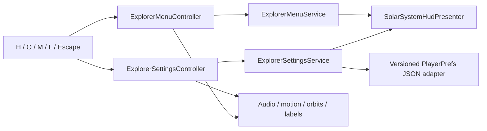

# Explorer Menu and Settings Validation

**Project:** Solar System Simulation  
**Owner:** Tanvir  
**Validation date:** 2026-07-25  
**Unity:** 6000.5.3f1  
**Status:** Commit candidate implemented and validated; awaiting owner approval

## Purpose

This slice completes the release-facing keyboard/mouse UX baseline with one
coherent Help, Settings, and Credits & Sources surface. It also removes
competing Escape ownership and persists presentation preferences without
mixing them into scientific simulation state.

## Implemented scope

- Unified Explorer Menu with Help, Settings, and Credits & Sources pages.
- First-launch orientation that remains reopenable after completion.
- Versioned local persistence for four audio channels, mute, motion mode,
  orbit guides, projected labels, and onboarding completion.
- Restore Release Defaults without resetting onboarding completion.
- Numeric audio percentages beside every slider.
- `H` Help/menu and `O` orbit-guide actions in the generated Input System map.
- Modal input gating while the menu is open.
- One contextual Escape route: menu, tour, comparison, focus, then Help.
- Responsive observatory styling with no new third-party media.

## Architecture



The services are plain C# state owners. Unity-specific persistence stays behind
`IExplorerSettingsStore`. Existing camera, tour, comparison, audio, orbit, and
navigation services remain authoritative for their own domains.

## Interaction contract

Escape is evaluated in this order:

1. close the Explorer Menu;
2. cancel a cinematic tour;
3. cancel guided physical-scale comparison;
4. cancel focus or an in-progress focus transition;
5. open Help from free flight.

When the menu is visible, explorer interactions are disabled except Help and
Escape. UI controls and keyboard shortcuts call the same services, preventing
duplicate state or drift.

## Persistent settings contract

| Setting | Release default | Runtime owner |
|---|---:|---|
| Master volume | 65% | `AudioDirector` |
| Music volume | 18% | `AudioDirector` |
| Interface volume | 45% | `AudioDirector` |
| Celestial ambience | 22% | `AudioDirector` |
| Mute | Off | `AudioDirector` |
| Motion | Full Motion | `PresentationMotionPreferenceService` |
| Orbit guides | On | `CelestialOrbitPathVisibilityController` |
| Projected labels | On | `CelestialNavigationService` |

The JSON payload is versioned and stored under a project-owned key. Invalid or
missing data falls back to release defaults. Audio sliders are clamped to
normalized `[0, 1]` values. Scientific data, orbital evaluation, and
simulation time are never serialized by this feature.

## Automated validation

| Gate | Verified result |
|---|---|
| Focused input/UI rebuild | Successful |
| Unity script compilation | Successful |
| Edit Mode | 183 passed, 0 failed, 0 skipped, 0 inconclusive in 5.397 seconds |
| Play Mode | 25 passed, 0 failed, 0 skipped, 0 inconclusive in 35.974 seconds |
| Console | 0 errors, 0 warnings |

Coverage includes:

- settings defaults, clamping, effective changes, persistence, and reset;
- menu open, page changes, close, and no-op behavior;
- generated `H` and `O` input actions and bindings;
- required UXML elements and responsive USS rules;
- first-launch Help and onboarding completion;
- modal input ownership and contextual Escape priority;
- real-scene audio, motion, orbit-guide, and label synchronization;
- persistence across a fresh runtime composition.

## Visual audit

Fresh Play Mode initialization was reviewed for Help, Settings, and Credits &
Sources. The Settings page shows all controls and four numeric values without
clipping. Credits remain scannable and distinguish concise runtime attribution
from the full versioned ledgers.

Ignored local QA captures:

```text
Temp/ExplorerUxHelp1280.png
Temp/ExplorerUxSettingsFresh.png
Temp/ExplorerUxCredits.png
```

The temporary malformed hot-reload state observed after changing UXML during
Play Mode disappeared on a fresh Play Mode initialization and is not present
in the compiled runtime result.

## Repository preflight

| Gate | Verified result |
|---|---|
| Reviewed staged paths | 40 intended slice paths |
| Generated/local paths staged | 0 |
| Unrelated `ProjectSettings` staged | 0 |
| Scene or prefab paths staged | 0 |
| Missing file/folder/orphaned Unity `.meta` partners | 0 / 0 / 0 |
| Duplicate Unity GUID groups | 0 |
| Staged files at least 1 MiB | 0 |
| Strong-signature secret matches | 0 |
| Git LFS pointer integrity | `git lfs fsck --pointers` passed |
| Staged whitespace/error check | `git diff --cached --check` passed |

## Remaining release work

- Owner listening and final audio-mix approval.
- Licensed typography/icon decision, if the default runtime font is replaced.
- Formal profiler capture on the approved reference PC.
