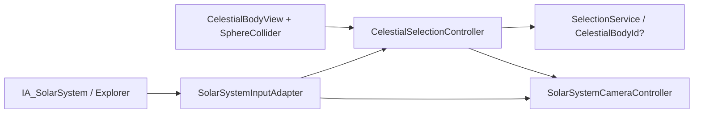

# Slice 3 Interaction Proof Validation

**Project:** Solar System Simulation  
**Owner:** Tanvir  
**Validation date:** 2026-07-23  
**Unity version:** 6000.5.3f1  
**Input System:** 1.20.0  
**Result:** Passed

## Validated Scope

- Project-owned `IA_SolarSystem` Input System asset and `Explorer` action map.
- Input adapter as the sole owner of action-name resolution and callbacks.
- Stable-ID selection state independent from camera focus.
- Screen-space raycast selection through body-owned projected-radius colliders.
- Damped free flight with pointer look, elevation, and temporary boost.
- Smooth body-relative focus, orbit, zoom, cancellation, and target redirection.
- Unscaled camera time while deterministic simulation time remains independently pausable.
- Explicit interaction composition with no runtime scene search or global singleton.
- Reproducible editor build of all serialized interaction assets and scene wiring.

## Architecture Contract



Selection does not move the camera. Left click updates the selected stable ID;
F sends a separate focus request. Escape cancels the transition or returns from
focused mode while preserving the current camera pose.

## Serialized Scene Contract

```text
SolarSystem
  _Application
    SolarSystemCompositionRoot
    SolarSystemInteractionRoot
      SolarSystemInputAdapter
      CelestialSelectionController
      SolarSystemInteractionCompositionRoot
  _Simulation
    CelestialBodies
      Sun / Earth / Moon / Jupiter
        SphereCollider
        Visual
  _Environment
    Main Camera
      SolarSystemCameraController
```

The project builder produced one interaction root, four celestial views, four
body-owned selection colliders, and ten actions in the `Explorer` map.

## Unity Validation Results

| Check | Result |
|---|---|
| Runtime, editor, and test assembly compilation | Pass |
| Unity Console errors | Pass: 0 |
| Unity Console warnings | Pass: 0 |
| Complete Edit Mode suite | Pass: 52 |
| Edit Mode failures, skipped, or inconclusive | Pass: 0 |
| Real-scene Play Mode suite | Pass: 2 |
| Play Mode failures, skipped, or inconclusive | Pass: 0 |
| Interaction composition roots | Pass: 1 |
| Celestial body views | Pass: 4 |
| Body-owned selection colliders | Pass: 4 |
| Project input actions | Pass: 10 |

The new Edit Mode cases verify event de-duplication, selection replacement and
clear behavior, required action names, and critical keyboard/mouse bindings.
The new Play Mode journey loads the actual enabled scene, selects Earth through
a camera raycast, focuses Earth, redirects focus to Jupiter, returns to free
flight, and verifies deterministic movement input. The existing scene journey
continues to verify celestial motion, pause behavior, orbit paths, and framing.

## Repository Candidate Preflight

| Check | Verified result |
|---|---|
| Staged paths | 39, all scoped to Slice 3 implementation or owner documentation |
| Generated Unity, IDE, build, or user-state paths | 0 |
| Missing `.meta` partners | 0 |
| Orphan `.meta` files | 0 |
| Duplicate Unity GUID groups | 0 |
| Files at or above 1 MiB | 0 |
| Strong-signature secret matches | 0 |
| Staged whitespace errors | 0 |
| Git LFS pointer integrity | Pass: `git lfs fsck --pointers` |
| Unstaged or unexplained changes | 0 |

## Remaining Slice 3 Work

- Add simulation pause and speed input/application commands.
- Implement and explain the guided scale comparison.
- Add representative HUD, help, units, and selection feedback.
- Add reduced-motion or instant-transition accessibility behavior.
- Tune context-sensitive free-flight speed after hands-on UX review.
- Add selection highlighting without coupling the selection service to visuals.

No commit or push was performed as part of this validation.
