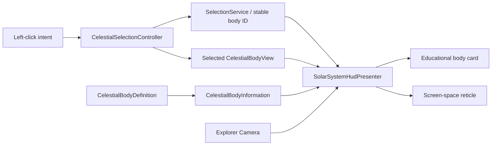

# Slice 3 Selection and Body Information Validation

**Project:** Solar System Simulation  
**Owner:** Tanvir  
**Validation date:** 2026-07-23  
**Unity version:** 6000.5.3f1  
**UI technology:** Runtime UI Toolkit  
**Result:** Passed

## Validated Scope

- Authored educational summaries for the representative Sun, Earth, Moon, and
  Jupiter definitions.
- Display-only formatting of verified physical and orbital values with explicit
  units and bounded precision.
- A right-side selected-body card containing classification, summary, parent,
  radius, mass, rotation, axial tilt, average orbit distance, orbital period,
  scale disclosure, and scientific source-record ID.
- A non-color-only four-corner reticle that follows the selected body's
  screen-space position and projected presentation radius.
- Immediate target, card, and reticle feedback after selection without
  implicitly moving the camera.
- Automatic reticle hiding for invalid or off-screen targets without clearing
  the authoritative selection.
- A compact quick-control strip that presents each key and action as an
  independent group, uses five distinct keycap accents, and changes the Space
  action between `PAUSE` and `RESUME`.

## Architecture Contract

`SelectionService` remains the sole owner of selected identity. The controller
resolves the selected Unity view, the formatter converts authored values into
display text, and the presenter controls UI visibility and camera projection.
No UI class performs orbital evaluation or mutates simulation state.

## Scientific Presentation Contract

- Numeric facts originate in the validated celestial definition assets.
- Educational summaries are authored data, not generated at runtime.
- Values use invariant formatting, explicit units, and precision appropriate
  to the source data.
- Catalog-root bodies label parent and orbit fields as not applicable.
- Retrograde rotation is stated explicitly when the signed source value is
  negative.
- The panel always discloses that body sizes and distances are adjusted for
  readability.
- The source-record ID remains visible so the claim can be traced to the
  project science ledger.

## Unity Validation Results

| Check | Result |
|---|---|
| Runtime, editor, and test assembly compilation | Pass |
| Final Unity Console errors | Pass: 0 |
| Complete Edit Mode suite | Pass: 66 |
| Edit Mode failures, skipped, or inconclusive | Pass: 0 |
| Real-scene Play Mode suite | Pass: 3 |
| Play Mode failures, skipped, or inconclusive | Pass: 0 |
| Representative authored summaries | Pass: 4 |
| Selected-body information formatter cases | Pass: 2 |
| Required body-information UI elements | Pass |
| Real-scene Earth card and reticle journey | Pass |
| Quick-control grouping and five-key color differentiation | Pass |
| Contextual Space pause/resume label | Pass |

The Edit Mode suite validates Earth formatting, catalog-root behavior, the
expanded UXML contract, and the authored data field. The Play Mode journey
loads the real enabled scene, selects Earth, and verifies visible panel and
reticle state together with the expected name, radius, and source record.

## Visual Inspection

The Game view was inspected at 16:9 in Play Mode. Clicking the Sun immediately
changed `TARGET / NONE` to `TARGET / SUN`, displayed a cyan four-corner reticle
around the visible body, and opened the right-side information card. The card
remained readable over black space, preserved the primary system composition,
and showed the summary, facts, scale note, and source record without obscuring
the selected Sun.

The bottom-left quick-control strip was also inspected at the same aspect
ratio. `CLICK`, `F`, `WHEEL`, `SPACE`, and `[ / ]` render as separate bordered
keycaps with cyan, violet, green, amber, and rose accents. Each action appears
on its own line beneath the key, so the controls no longer read as one
sentence. The design remains understandable without color because keycaps and
action labels are structurally paired.

The current Unity runtime sans-serif remains a deliberate placeholder pending
licensed typography selection during visual production.

## Repository Candidate Preflight

| Check | Result |
|---|---|
| Intended staged files | Pass: 24 |
| Staged diff whitespace and patch validity | Pass |
| Generated Unity folders in staged paths | Pass: 0 |
| Missing `.meta` files for added Unity assets | Pass: 0 |
| Orphaned `.meta` files for added Unity assets | Pass: 0 |
| Files larger than 5 MB in the staged candidate | Pass: 0 |
| Secret-pattern matches in added lines | Pass: 0 |
| Unresolved merge-conflict markers | Pass: 0 |
| Git LFS pointer integrity | Pass |

The staged candidate intentionally excludes the non-semantic scene rewrite
produced when the deterministic builder was re-run for validation. It also
excludes the pre-existing `PackageManagerSettings.asset` Unity schema migration
and Unity's whitespace-only `ProjectSettings.asset` serialization touch. None
of these working-tree changes is required by this feature.

## Slice Outcome

Slice 3 is complete. The project now has a validated system overview,
keyboard/mouse selection, separate camera focus, free-flight and focused camera
behavior, bounded simulation-time controls, visible selection feedback, and a
representative educational information experience.

Guided scale comparison, navigator, complete Help/settings, licensed typography,
and reduced-motion options remain approved release work. They do not block the
start of the visual/content production slice.

No commit or push was performed as part of this validation.
