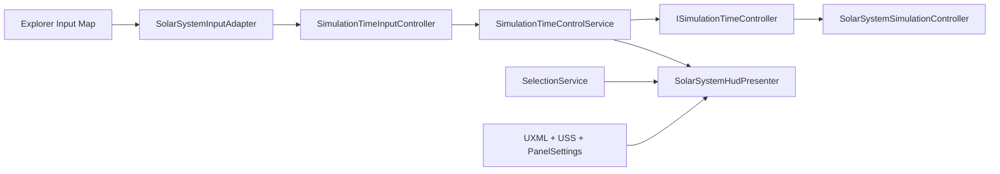

# Slice 3 Simulation Time and HUD Validation

**Project:** Solar System Simulation  
**Owner:** Tanvir  
**Validation date:** 2026-07-23  
**Unity version:** 6000.5.3f1  
**Input System:** 1.20.0  
**UI technology:** Runtime UI Toolkit  
**Result:** Passed

## Validated Scope

- Explicit application boundary between input intent and simulation-clock commands.
- Read-only simulation-time snapshot exposed to presentation.
- Space pause/resume and bracket-key slower/faster actions.
- Bounded `1x`, `10x`, `100x`, `1,000x`, and `10,000x` presets.
- Provisional `1x = 1 simulated day / real second` baseline and `10x` startup rate.
- UI Toolkit status card for run state, time rate, selected body, and control hints.
- Project-owned UXML, USS, PanelSettings, presenter, and reproducible scene wiring.
- UI lifecycle behavior across arbitrary Unity `Awake` and `OnEnable` ordering.

The numeric baseline, presets, and startup rate remain product-tuning proposals.
This validation approves the bounded command architecture, explicit units,
presentation contract, and proof implementation—not final UX tuning.

## Architecture Contract



The input layer emits intent but cannot access the simulation clock. The
application service owns preset validation and bounded commands. The HUD reads
service and selection state, performs no orbital calculations, and cannot
mutate the simulation directly.

## Serialized Scene Contract

```text
SolarSystem
  _Application
    SolarSystemCompositionRoot
    SolarSystemInteractionRoot
      SolarSystemInputAdapter
      CelestialSelectionController
      SimulationTimeInputController
      SolarSystemInteractionCompositionRoot
  _Interface
    ExplorerHUD
      UIDocument
      SolarSystemHudPresenter
```

The input asset contains 13 actions. The HUD uses a project-owned panel at a
1920x1080 Scale With Screen Size reference and a sorting order of 100.

## Unity Validation Results

| Check | Result |
|---|---|
| Runtime, editor, and test assembly compilation | Pass |
| Final Unity Console errors | Pass: 0 |
| Final Unity Console warnings | Pass: 0 |
| Complete Edit Mode suite | Pass: 64 |
| Edit Mode failures, skipped, or inconclusive | Pass: 0 |
| Real-scene Play Mode suite | Pass: 3 |
| Play Mode failures, skipped, or inconclusive | Pass: 0 |
| Project input actions | Pass: 13 |
| HUD labels required by presenter contract | Pass: 4 |
| Simulation-time presets | Pass: 5, bounded without wrapping |
| Runtime UI Toolkit panel reference | Pass: 1920x1080 |

The new Edit Mode coverage verifies initial-preset validation, pause semantics,
effective-change events, adjacent speed commands, non-wrapping bounds, invalid
indices, unsupported initial rates, input bindings, UI assets, required labels,
and panel scaling. The new Play Mode journey selects Earth, observes immediate
HUD feedback, pauses motion, raises the rate while paused, verifies visible
state updates, resumes, and observes motion again.

## Visual Inspection

The real Game view was inspected at 16:9 in Play Mode. The top-left status card
remained readable over space, used restrained cyan/green accents, preserved
celestial framing, and separated high-priority state from low-priority control
hints at bottom left. The card did not obscure the Sun, Earth-Moon system,
Jupiter, or their principal orbit paths.

The current Unity runtime sans-serif is a deliberate placeholder. Font
selection, licensing, tabular numerals, broader responsive testing, and
reduced-motion transitions remain future art/interface gates.

## Issues Exposed and Resolved

The first full Play Mode run exposed Unity component lifecycle ordering:
`SolarSystemInteractionCompositionRoot.Awake` could initialize before
`UIDocument` created its root visual element. The presenter now stores its
dependencies and connects when both the document and application state are
ready, independent of `Awake`/`OnEnable` order. The full suite then passed.

A separate Package Manager window cancellation appeared during manual editor
inspection. It had no project stack and was unrelated to compilation or
runtime behavior. The transient entry was cleared through Unity, after which
the final Console audit returned zero errors and zero warnings.

## Repository Candidate Preflight

| Check | Verified result |
|---|---|
| Staged SolarSystem paths | 47, all scoped to implementation, tests, UI assets, scene, repository policy, or owner documentation |
| Generated Unity, IDE, build, or user-state paths | 0 |
| Missing `.meta` partners | 0 |
| Orphan `.meta` files | 0 |
| Duplicate Unity GUID groups | 0 |
| Files at or above 1 MiB | 0 |
| Strong-signature secret matches | 0 |
| Staged whitespace errors | 0 |
| Git LFS pointer integrity | Pass: `git lfs fsck --pointers` |
| Unstaged or unexplained SolarSystem changes | 0 |

Staging the first UXML and USS assets exposed missing explicit LF normalization
for Unity UI Toolkit text formats. The project `.gitattributes` now covers
`.tss`, `.uss`, and `.uxml`; the shared Efficient Unity template was updated
with the same `.tss` rule.

## Reusable Workflow Integration

The project-proven lifecycle rule was integrated into the central Efficient
Unity database:

- `Efficient Unity Technical Architecture Standard.md` version `1.1.0` now
  defines the dependency/document readiness handshake and real-Game-view gate.
- `2026-07-23 Efficient Unity UI Toolkit Lifecycle Decision.md` records the
  originating failure, decision, required validation, and consequences.
- The reusable `Unity.gitattributes` template now normalizes `.tss`, `.uss`,
  and `.uxml` as LF text.

These central workflow files are intentionally outside the SolarSystem
repository and are not part of this project's staged commit candidate.

## Remaining Slice 3 Work

- Implement the guided scale comparison and always-visible scale-mode state.
- Add full contextual body information, Help, settings, and onboarding.
- Add visual selection highlighting without coupling state to rendering.
- Select and license the final font and icon family.
- Add reduced-motion or instant-transition accessibility behavior.
- Tune time presets and startup rate through owner UX review.

No commit or push was performed as part of this validation.
