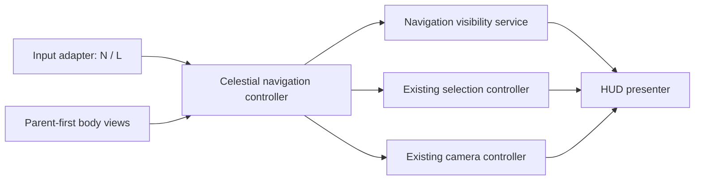

# Slice 4 Celestial Navigator and World Labels Validation

**Project:** Solar System Simulation  
**Owner:** Tanvir  
**Validation date:** 2026-07-25  
**Unity:** 6000.5.3f1  
**Status:** Implemented and validated

## Purpose

This slice makes every authored body reachable without enlarging bodies or
duplicating simulation, selection, or camera logic. It also adds restrained
projected body labels that remain useful from the system overview through
focused exploration.

## Implemented scope

- Added `N` and `L` to the project-owned `Explorer` Input System map.
- Added an event-driven `CelestialNavigationService` for navigator and label
  visibility state.
- Added a `CelestialNavigationController` that validates one unique
  parent-first `CelestialBodyView` list.
- Routed navigator activation through the existing selection and focus
  controllers.
- Added a scrollable UI Toolkit navigator for the complete 16-body catalog.
- Indented moon rows and identified each moon's parent.
- Synchronized selected state across the navigator, projected label, reticle,
  status card, and educational body card.
- Added one cached projected-label element per body.
- Prioritized the selected body, then non-moons, then moons.
- Suppressed off-screen labels, label-to-label overlap, and collisions with
  status, hint, body-information, and navigator safe areas.
- Reduced labels to the focused target in focus mode.
- Closed and locked the navigator and hid labels during guided comparison.
- Added responsive panel offsets and wrapped quick-control hints.
- Added no third-party font, icon, texture, audio, or licensing dependency.

## Architecture review

The slice preserves the existing manual-composition boundary:

The navigator never evaluates orbits, changes time, creates scientific data, or
owns camera movement. The HUD creates buttons, labels, display strings, and
overlap rectangles once during initialization. The per-frame projection pass
reuses those caches and introduces no deliberate steady-state managed
allocation.

## Behavioral acceptance

- Catalog order is exactly:
  `Sun, Mercury, Venus, Earth, Moon, Mars, Jupiter, Io, Europa, Ganymede,
  Callisto, Saturn, Titan, Uranus, Neptune, Triton`.
- Every moon appears after its parent.
- Opening or closing the navigator does not alter simulation pause state.
- Activating an entry selects and focuses that body, then closes the navigator.
- Unknown IDs and navigation attempts during guided comparison are rejected.
- `L` changes only the user-facing label preference.
- Labels do not change body transforms, radii, colliders, orbital data, or
  physical source records.
- Focus mode accepts only one projected label.
- Guided comparison accepts no projected labels.

## Responsive visual evidence

Exact render-texture captures were generated from the live scene at:

- `1280 x 720` — status card, navigator, quick controls, labels, and viewport
  remained inside the frame.
- `2560 x 1440` — the same hierarchy retained its safe areas and readable
  density without stretching or overlap.

The initial exact 1280 x 720 capture revealed that the navigator header began
before the status card ended. The navigator top offset was corrected from
`190` to `250` logical pixels, and the compact offset from `175` to `245`.
Both exact-resolution captures were regenerated and visually inspected after
the correction. Final results show a clean boundary between the status and
navigator panels and a clear boundary above the quick-control panel.

The captures remain under Unity's ignored `Temp` folder as local QA evidence;
they are not repository assets or portfolio screenshots.

## Automated validation

| Gate | Verified result |
|---|---|
| Unity content rebuild | Successful |
| Unity script compilation | Successful |
| Edit Mode | 162 passed, 0 failed, 0 skipped, 0 inconclusive |
| Play Mode final full run | 22 passed, 0 failed, 0 skipped, 0 inconclusive |
| Console after final validation | 0 errors, 0 warnings |

One first full Play Mode run recorded a timing-only timeout while the existing
Saturn focus test remained in `FocusTransition`. No product code or timeout was
changed. The complete suite was immediately rerun and all 22 cases passed,
which classifies the event as a transient Editor/test-runner stall rather than
a reproducible regression.

## Regression coverage added

- Navigation service defaults and effective-change notifications.
- Input asset action and binding contracts for `N` and `L`.
- Required UXML navigator, label layer, status, and keycap elements.
- Deterministic 16-body parent-first navigator order.
- Navigator selection/focus routing and pause-state preservation.
- Label preference, focus-mode reduction, and guided-mode suppression.
- Navigator containment inside the runtime HUD bounds.

## Repository preflight

| Gate | Verified result |
|---|---|
| Reviewed staged paths | 26 |
| Unrelated `ProjectSettings` paths staged | 0 |
| Generated/local paths staged | 0 |
| Missing Unity `.meta` partners | 0 |
| Duplicate Unity GUIDs | 0 across 310 `.meta` files |
| Strong-signature secret matches | 0 |
| Staged files at or above 1 MiB | 0 |
| Git LFS pointer integrity | Pass: `git lfs fsck --pointers` |
| Staged whitespace/error check | Pass: `git diff --cached --check` |

The three pre-existing local `ProjectSettings` modifications remain unstaged
and outside this candidate.

## Remaining work

- Final licensed typography and icon decisions remain open in the Art Bible.
- Help, settings, credits, and source-browser surfaces remain pending.
- Reduced-motion or instant-focus preferences remain pending.
- World labels are deliberately read-only; direct label activation can be
  considered later only if it preserves unobstructed body picking.
- Formal profiler evidence on the approved reference PC remains a release gate.
