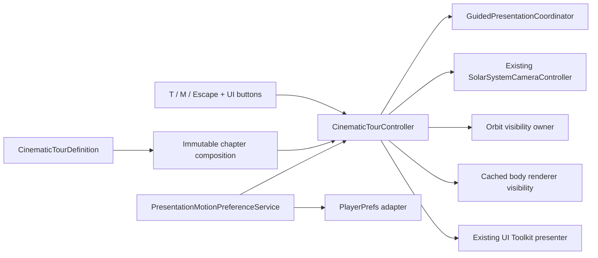

# Slice 4 Cinematic Tour Polish Validation

**Project:** Solar System Simulation  
**Owner:** Tanvir  
**Validation date:** 2026-07-25  
**Unity:** 6000.5.3f1  
**Status:** Commit candidate implemented, validated, staged, and ready for owner review

## Purpose

This candidate polishes the existing five-chapter cinematic tour without
introducing a second camera stack, changing authoritative simulation state, or
adding third-party media. It addresses shot composition, visual hierarchy,
motion accessibility, and exact state restoration as one reviewable slice.

## Implemented scope

- Expanded each authored chapter with a framing space, normalized screen
  offset, safety padding, transition duration, and deterministic easing.
- Added world, solar-radial, target-axis, and sunlit-target-axis composition.
- Made multi-body framing phase-robust by keeping the widest target axis in the
  screen plane while choosing the most sunward available viewing direction.
- Added reversible tour-only orbit-guide suppression.
- Added a cached target-body renderer spotlight. Simulation, transforms, and
  audio continue; only renderer enabled state changes.
- Added a persisted Full Motion/Reduced Motion preference available through
  `M` and the visible Motion button.
- Kept the cinematic tour and guided scale comparison mutually exclusive
  through their existing shared presentation coordinator.
- Added no texture, font, icon, audio, or other third-party asset.

## Architecture



The pure preference and transition models have no Unity scene dependency.
Unity adapters remain in Runtime infrastructure/presentation boundaries. Body
renderer arrays and their original enabled values are cached once, preventing
steady-state allocations during chapter tracking.

## State contract

On entry, the tour captures the exact explorer camera and focus state,
navigator visibility, label preference, orbit-guide visibility, and every body
renderer's enabled state. Selection, pause state, time rate, and audio values
are not mutated.

On completion or cancellation, restoration occurs in this order:

1. finish the authored or instant camera restoration;
2. release tour-only orbit suppression;
3. restore every cached renderer enabled value;
4. re-enable interaction;
5. restore labels and navigator visibility.

The reduced-motion preference is intentionally persisted rather than rolled
back with explorer state.

## Motion-accessibility contract

| Mode | Chapter entry and advance | Exit and completion |
|---|---|---|
| Full Motion | Authored duration with deterministic SmoothStep/SmootherStep easing | Deterministic eased restore |
| Reduced Motion | Immediate pose application | Immediate restore |

The UI exposes the current mode as text, so meaning does not depend on the
yellow action color. Keyboard and mouse invoke the same service.

## Automated validation

| Gate | Verified result |
|---|---|
| Unity content rebuild | Successful |
| Unity script compilation | Successful |
| Edit Mode | 178 passed, 0 failed, 0 skipped, 0 inconclusive in 4.384 seconds |
| Play Mode | 24 passed, 0 failed, 0 skipped, 0 inconclusive in 30.116 seconds |
| Console | 0 errors, 0 warnings |

Coverage includes:

- preference load, effective changes, persistence, and toggle behavior;
- instant and deterministic eased transition evaluation;
- authored input action, binding, UI element, and chapter data;
- real-scene keyboard/mouse service wiring;
- target-only body renderer visibility during chapter changes;
- exact renderer and orbit-guide restoration after completion and cancellation;
- exact camera, focus, selection, time, label, and navigator restoration;
- mutual exclusion with guided comparison.

## Visual audit

### Baseline

All five chapters were first captured at both approved reference resolutions.
The baseline exposed excessive orbit-line competition, unrelated body
intrusion, fixed world-direction phase failures, and HUD/card competition.

### Final evidence

The final tested build was captured with live target tracking at:

- `1280 x 720`
- `2560 x 1440`

Every chapter was reviewed at both sizes for clipping, safe areas, hierarchy,
lighting, target separation, and panel/body competition. The authoritative
local evidence set is:

```text
Temp/CinematicTour_FinalVerifiedLive_1280x720_Chapter01.png
Temp/CinematicTour_FinalVerifiedLive_1280x720_Chapter02.png
Temp/CinematicTour_FinalVerifiedLive_1280x720_Chapter03.png
Temp/CinematicTour_FinalVerifiedLive_1280x720_Chapter04.png
Temp/CinematicTour_FinalVerifiedLive_1280x720_Chapter05.png
Temp/CinematicTour_FinalVerifiedLive_2560x1440_Chapter01.png
Temp/CinematicTour_FinalVerifiedLive_2560x1440_Chapter02.png
Temp/CinematicTour_FinalVerifiedLive_2560x1440_Chapter03.png
Temp/CinematicTour_FinalVerifiedLive_2560x1440_Chapter04.png
Temp/CinematicTour_FinalVerifiedLive_2560x1440_Chapter05.png
```

These ignored `Temp` artifacts are QA evidence, not release media.

The evidence harness keeps the tour controller active while the authoritative
simulation advances. Freezing only the controller would allow moving targets
to leave a stationary camera and would not represent runtime behavior. This
live-tracking rule is reusable for future guided-camera validation.

## Visual acceptance result

- Sun and Saturn retain strong unclipped hero silhouettes.
- Earth/Moon, Jupiter/moons, and Neptune/Triton remain separated in screen
  space across live orbital phases.
- No featured body overlaps the tour card.
- No tour panel clips at either reference resolution.
- Orbit guides and unrelated bodies do not compete with chapter subjects.
- Full and Reduced Motion states are visible and mouse accessible.

## Repository preflight

| Gate | Verified result |
|---|---|
| Reviewed staged paths | 42 intended slice paths |
| Unrelated `ProjectSettings` staged | 0 |
| Generated/local paths staged | 0 |
| Missing file/folder/orphaned Unity `.meta` partners | 0 / 0 / 0 |
| Duplicate Unity GUIDs | 0 across 326 `.meta` files |
| Staged files at least 1 MiB | 0 |
| Strong-signature secret matches | 0 |
| Git LFS pointer integrity | `git lfs fsck --pointers` passed |
| Staged whitespace/error check | `git diff --cached --check` passed |

The pre-existing modifications to
`ProjectSettings/PackageManagerSettings.asset`,
`ProjectSettings/ProjectSettings.asset`, and
`ProjectSettings/URPProjectSettings.asset` are outside this slice and must
remain unstaged.

## Remaining release work

- Final licensed typography and icon decisions.
- Help, settings, credits, and source-browser surfaces.
- Formal profiler evidence on the approved reference PC.
