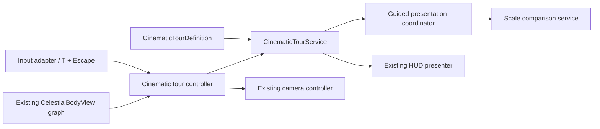

# Slice 4 Cinematic Tour Validation

**Project:** Solar System Simulation  
**Owner:** Tanvir  
**Validation date:** 2026-07-25  
**Unity:** 6000.5.3f1  
**Status:** Implemented and validated

## Purpose

This slice adds the first portfolio-ready cinematic-tour vertical slice without
duplicating the authoritative simulation, celestial views, camera stack,
selection model, time controls, audio director, or UI document.

## Implemented scope

- Added `T` to the project-owned `Explorer` Input System map.
- Added a five-chapter `CinematicTourDefinition` ScriptableObject.
- Added immutable runtime chapter data and deterministic unscaled timing.
- Authored chapters for the Sun, Earth-Moon system, Jupiter system, Saturn and
  rings, and an outer-system finale.
- Added exclusive guided-presentation arbitration shared with scale comparison.
- Reused the existing camera controller's transition and state-snapshot path.
- Added live multi-body group framing without per-frame collections or strings.
- Added keyboard and mouse-accessible chapter, next/finish, and exit UI.
- Preserved scientific motion and the persistent scale/time disclosure.
- Added no third-party media or licensing dependency.

## Architecture

The pure service owns only chapter index and unscaled elapsed time. The Unity
controller validates stable body IDs once, reuses cached views, computes a
bounding sphere, and supplies a struct camera pose. The camera captures and
restores position, rotation, clip planes, velocity, focus target and transition
state, focus direction/distance, yaw, pitch, and interaction mode.

## Behavioral acceptance

- `T` starts the first chapter and advances or finishes later chapters.
- Escape and the visible Exit button cancel from any chapter.
- The five chapter IDs and order are deterministic.
- A large unscaled tick carries correctly across chapter boundaries.
- Tour and scale comparison cannot own presentation simultaneously.
- Selection, pause state, time preset, and audio mix/mute remain unchanged.
- Camera/focus, navigator visibility, and label preference restore exactly.
- Free exploration behavior is unchanged while no guided feature is active.
- UI updates only on chapter/state transitions; live camera tracking introduces
  no steady-state managed allocation.

## Responsive visual evidence

Exact live camera and UI Toolkit render targets were generated and visually
inspected at:

- `1280 x 720` — compact status and tour cards remained fully contained, with
  readable chapter copy and separate Next/Exit actions.
- `2560 x 1440` — the centered lower-third retained its hierarchy and safe
  areas without overlap or clipping.

Evidence images are local QA artifacts under Unity's ignored `Temp` folder and
are not committed as project media.

## Automated validation

| Gate | Verified result |
|---|---|
| Unity content rebuild | Successful |
| Unity script compilation | Successful |
| Edit Mode | 169 passed, 0 failed, 0 skipped, 0 inconclusive |
| Play Mode | 23 passed, 0 failed, 0 skipped, 0 inconclusive |
| Console | 0 errors, 0 warnings |

The first new-tour Play Mode run exposed a timing-only transition timeout. A
rerun then exposed that restoring a focused camera to a moving body's old
world position caused a visible snap. The camera snapshot was strengthened to
translate saved position and in-progress focus state by the focused target's
live displacement. The test was also corrected to start through the real
controller path used by `T` and UI buttons and to sample focused state after
`LateUpdate`. The unchanged complete suite then passed all 23 cases.

## Repository preflight

| Gate | Verified result |
|---|---|
| Reviewed staged paths | 41 intended slice paths |
| Unrelated `ProjectSettings` staged | 0 |
| Generated/local paths staged | 0 |
| Missing/orphaned Unity `.meta` partners | 0 / 0 |
| Duplicate Unity GUIDs | 0 across 318 `.meta` files |
| Staged files at least 1 MiB | 0 |
| Strong-signature secret matches | 0 |
| Git LFS pointer integrity | `git lfs fsck --pointers` passed |
| Staged whitespace/error check | `git diff --cached --check` passed |

The three pre-existing local `ProjectSettings` modifications must remain
unstaged and outside this candidate.

The final rebuild also migrated the Input System contract from v4 to v5
in-place. Existing action and binding identifiers were preserved; the staged
asset adds only the `CinematicTour` action, its `T` binding, and the v5 label.
After that rebuild, the complete suites passed again: 169 Edit Mode tests in
4.896 seconds and 23 Play Mode tests in 30.688 seconds, with an empty warning
and error Console query.

## Remaining release work

- Reduced-motion or instant-transition preference.
- Final licensed typography and icon decisions.
- Help, settings, credits, and source-browser surfaces.
- Formal profiler evidence on the approved reference PC.
