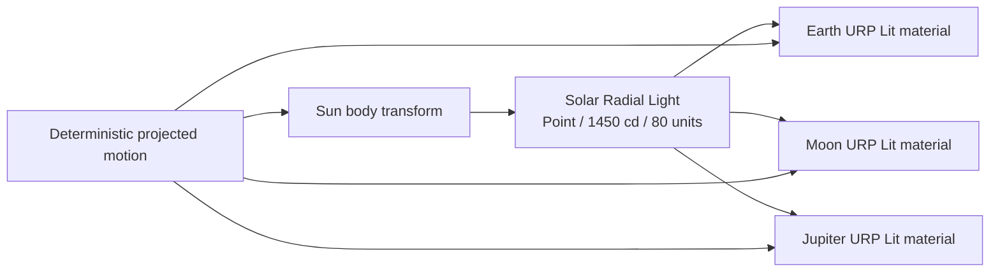

# Slice 4 Sun-Origin Illumination Validation

**Project:** Solar System Simulation  
**Owner:** Tanvir  
**Validation date:** 2026-07-23  
**Unity version:** 6000.5.3f1  
**Render pipeline:** URP 17.5.0  
**Result:** Passed

## Corrected Problem

The first visual-foundation scene used one directional light at a fixed
rotation. A live audit found that its ray direction was unrelated to the
current Sun-to-Earth vector and could approach the opposite direction. The
result violated the project rule that the hemisphere facing the Sun is day and
the opposing hemisphere is night.

## Implemented Contract

| Setting | Validated value |
|---|---|
| Light name | `Solar Radial Light` |
| Type | Realtime Point |
| Parent | Authored `Sun` body |
| Local position / rotation | Zero / identity |
| Display unit / native intensity | Candela / `1450 cd` |
| Range | `80` presentation units |
| Color temperature | `5600 K` |
| Realtime shadows | Off |
| `RenderSettings.sun` | Unset |

The intensity and range are calibrated presentation values for compressed
distances, not literal solar photometry. The point source is nevertheless
geometrically honest: each URP Lit surface receives an incident vector from
the live Sun position.

Realtime point shadows are intentionally excluded. They require six-face
shadow rendering, while exaggerated body radii and compressed distances would
also produce misleading eclipses. Eclipse visualization requires a separate
scientific, visual, and performance decision.

## Live Scene Evidence

After authoring, the radial source was exactly co-located with the Sun. The
representative display distances were:

| Body | Distance from light | Inside range |
|---|---:|---|
| Earth | `32.56` units | Yes |
| Moon | `31.44` units | Yes |
| Jupiter | `43.07` units | Yes |

The close visual inspection showed a readable terminator on Earth: one
hemisphere receives motivated solar illumination while the opposing hemisphere
falls into night. The Moon receives the same radial source direction.

The focused visual builder was applied twice after correcting its profile
authoring path. The second application produced no `VP_SolarSystem` diff,
confirming that valid volume-component subasset IDs remain stable.

## Unity Validation Results

| Check | Result |
|---|---|
| Runtime, editor, and test assembly compilation | Pass |
| Final Unity Console errors | Pass: 0 |
| Final Unity Console warnings | Pass: 0 |
| Complete Edit Mode suite | Pass: 69 |
| Edit Mode failures, skipped, or inconclusive | Pass: 0 |
| Real-scene Play Mode suite | Pass: 5 |
| Play Mode failures, skipped, or inconclusive | Pass: 0 |
| Light remains parented and co-located with the Sun | Pass |
| Earth, Moon, and Jupiter remain inside the authored range | Pass |
| Repeated visual authoring preserves volume-profile subasset IDs | Pass |
| Existing motion, selection, camera, time, UI, and visual behavior | Pass |

## Repository Candidate Preflight

The exact ten-file candidate was staged independently of the two unrelated
Unity ProjectSettings serialization changes that remain unstaged.

| Check | Result |
|---|---|
| Staged files | Pass: 10 |
| Staged diff whitespace validation | Pass |
| Generated Unity paths | Pass: 0 |
| Missing Unity `.meta` files | Pass: 0 |
| Orphaned Unity `.meta` files | Pass: 0 |
| Files larger than 5 MB | Pass: 0 |
| Secret-pattern matches | Pass: 0 |
| Merge-conflict markers | Pass: 0 |
| Git LFS pointer validation | Pass |

The candidate deliberately excludes `ProjectSettings/PackageManagerSettings.asset`,
which contains Unity schema migration churn, and `ProjectSettings/ProjectSettings.asset`,
which contains only a whitespace serialization touch. Neither change belongs
to the illumination correction.

## Remaining Lighting Work

- Validate the full eight-planet content set against the 80-unit envelope.
- Profile additional-light cost on the recorded reference PC.
- Decide atmosphere, cloud, and nightside-emission techniques independently.
- Design eclipse behavior only with explicit scale and scientific disclosure.
- Introduce a custom body-to-Sun shader only if measured evidence justifies it.

No commit or push was performed as part of this validation.
