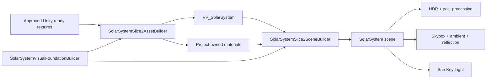

# Slice 4 Visual Foundation Validation

**Project:** Solar System Simulation  
**Owner:** Tanvir  
**Validation date:** 2026-07-23  
**Unity version:** 6000.5.3f1  
**Render pipeline:** URP 17.5.0  
**Result:** Passed

> **Historical baseline note:** This record captures the first visual-foundation
> candidate. Its fixed directional-light approximation was superseded by the
> validated Sun-origin point-light contract recorded in
> `Slice 4 Sun-Origin Illumination Validation.md`.

## Validated Scope

- Project-owned panoramic skybox using the approved Solar System Scope 2K
  Milky Way texture.
- Project-owned `VP_SolarSystem` volume profile containing only ACES,
  restrained bloom, fixed exposure/color shaping, and subtle vignette.
- HDR camera output with post-processing, NaN suppression, and dithering.
- Warm solar key light, low flat ambient fill, and restrained sky reflection.
- Tuned, instanced Sun, Earth, Moon, Jupiter, and orbit materials.
- Linear normal-map import and subtle surface detail for Earth.
- In-place visual-foundation authoring that preserves scene object identities.

## Architecture Contract

The full project builder and the focused visual builder use the same asset and
scene configuration functions. The focused command updates the existing scene
instead of recreating it, avoiding unrelated local-file-ID churn.

## Rendering Contract

| Setting | Validated value |
|---|---|
| Tonemapping | ACES |
| Bloom threshold / intensity / scatter | `1.10` / `0.32` / `0.55` |
| Post exposure / contrast / saturation | `-0.10 EV` / `+6` / `-2` |
| Vignette intensity / smoothness | `0.12` / `0.32` |
| Skybox exposure | `0.62` |
| Solar key temperature / intensity | `5600 K` / `1.35` |
| Sky reflection intensity | `0.18` |
| Earth normal strength | `0.28` |

Motion blur, film grain, chromatic aberration, automatic exposure, custom solar
animation, corona geometry, Earth nightside emission, clouds, and atmospheres
remain outside this baseline.

## Unity Validation Results

| Check | Result |
|---|---|
| Runtime, editor, and test assembly compilation | Pass |
| Final Unity Console errors | Pass: 0 |
| Final Unity Console warnings | Pass: 0 |
| Complete Edit Mode suite | Pass: 69 |
| Edit Mode failures, skipped, or inconclusive | Pass: 0 |
| Real-scene Play Mode suite | Pass: 4 |
| Play Mode failures, skipped, or inconclusive | Pass: 0 |
| Project-owned volume and skybox contract | Pass |
| Camera post-processing and environment contract | Pass |
| Representative material and texture-import contract | Pass |
| Existing deterministic motion, interaction, and UI behavior | Pass |

## Visual Inspection

The Game view was inspected at 16:9 in Play Mode. The starfield provides clear
depth without overpowering orbit lines or the observatory HUD. The Sun retains
large-scale surface variation inside a restrained warm bloom. Jupiter remains
readable at system-view scale, and the black-space composition preserves
silhouette contrast. The fixed exposure does not pump during motion.

The current 2K panoramic background shows expected softness when enlarged;
this is acceptable for the initial 1080p baseline. A 4K upgrade requires a
reviewed hero shot, measured benefit, license/provenance continuity, and VRAM
evidence.

## Repository Candidate Preflight

The exact 32-file candidate was staged and checked independently of the two
unrelated Unity serialization changes that remain unstaged.

| Check | Result |
|---|---|
| Staged files | Pass: 32 |
| Staged diff whitespace validation | Pass |
| Generated Unity paths | Pass: 0 |
| Missing Unity `.meta` files | Pass: 0 |
| Orphaned Unity `.meta` files | Pass: 0 |
| Files larger than 5 MB | Pass: 0 |
| Secret-pattern matches | Pass: 0 |
| Merge-conflict markers | Pass: 0 |
| Git LFS pointer validation | Pass |

The candidate deliberately excludes `ProjectSettings/PackageManagerSettings.asset`,
which contains Unity schema migration churn, and `ProjectSettings/ProjectSettings.asset`,
which contains only a whitespace serialization touch. Neither change belongs to
the visual-foundation scope.

## Remaining Visual Work

- Atmosphere, cloud, ring, and nightside-emission presentation.
- Evidence-gated custom solar shaders if the validated point-source approach
  later exposes measured precision, attenuation, or performance limitations.
- Final licensed typography and accessibility presentation settings.
- Full eight-planet and selected-moon material production.
- Representative-PC profiling and final quality-tier tuning.

No commit or push was performed as part of this validation.
