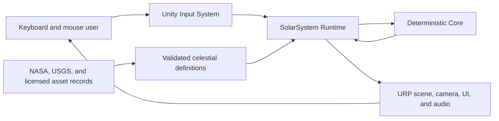
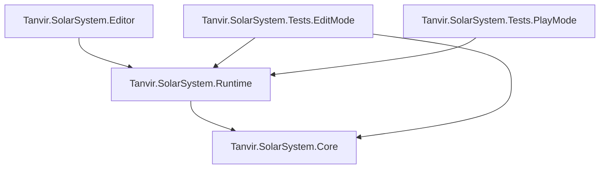
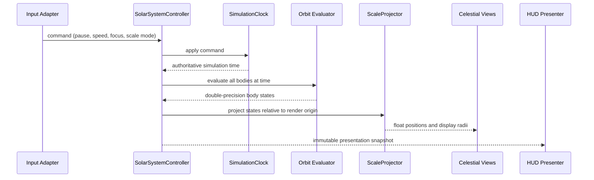
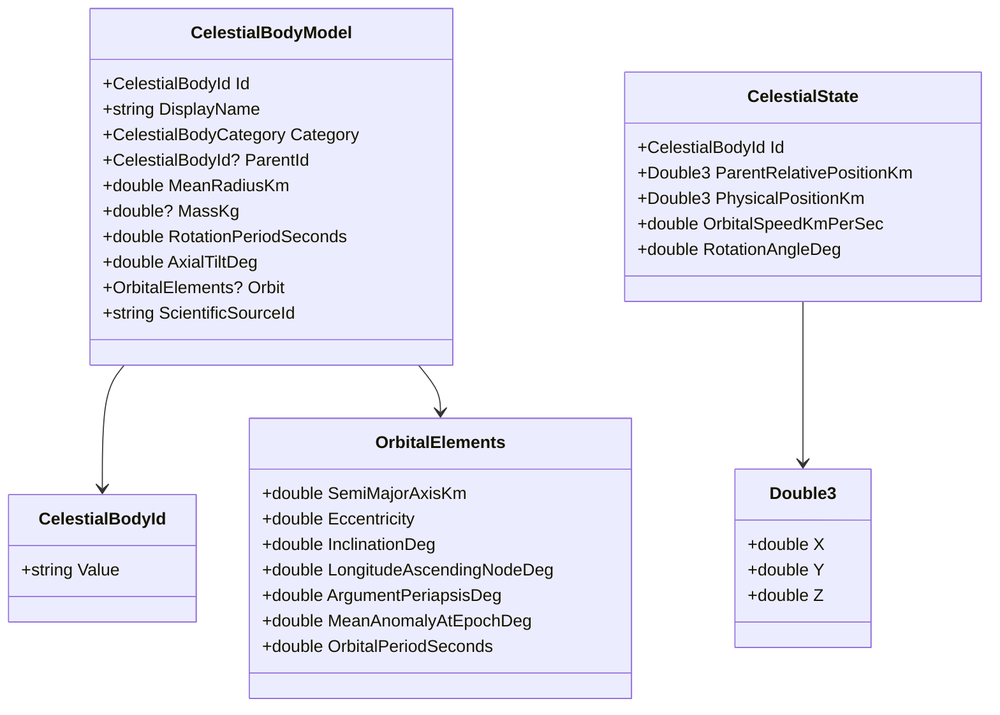

# Solar System Simulation

## Living Technical Design Document

**Project:** Solar System Simulation - Unity Portfolio Build  
**Author and product owner:** Tanvir  
**Document owner:** Tanvir  
**Technical steward:** Codex, subject to owner review  
**Document status:** Living technical authority; event-driven audio baseline validated  
**Version:** 0.12.0  
**Last updated:** 2026-07-24  
**Unity baseline:** Unity 6000.5.3f1, Universal Render Pipeline 17.5.0  
**Product authority:** `Docs/Design/GDD.md`  
**Art authority:** `Docs/Art/ArtBible.md`

> **Living-document rule:** This TDD is the authority for how approved product behavior is implemented. It does not approve product scope. Proposed technical decisions remain subject to Tanvir's review before implementation.

## 1. Document Control

### 1.1 Purpose

This document converts the approved Solar System GDD into a testable Unity architecture. It defines responsibilities, dependency direction, data schemas, numerical methods, folder and assembly boundaries, scene composition, validation, performance strategy, and the first implementation slice.

### 1.2 Revision history

| Version | Date | Author | Summary | Approval |
|---|---|---|---|---|
| 0.1.0 | 2026-07-22 | Codex, for Tanvir | Initial architecture, folders, assemblies, schemas, algorithms, scene plan, tests, risks, and delivery slices | Pending owner review |
| 0.2.0 | 2026-07-22 | Codex, for Tanvir | Recorded approval of the Slice 0 namespace, assembly, precision, composition, authoring-state, and scene architecture | Slice 0 architecture approved |
| 0.3.0 | 2026-07-22 | Codex, for Tanvir | Implemented and validated immutable runtime models, deterministic catalog ordering, simulation clock, Kepler evaluator, and Slice 1 tests | Slice 1 implementation validated |
| 0.4.0 | 2026-07-22 | Codex, for Tanvir | Implemented serialized Sun-Earth-Moon authoring, coordinate/scale adapters, centralized views, cached orbit paths, the visible scene, and Slice 2 validation | Sun-Earth-Moon proof validated; scale tuning and Jupiter remain open |
| 0.4.1 | 2026-07-23 | Codex, for Tanvir | Separated Slice 2 editor orchestration, asset authoring, build data, and scene construction; revalidated the complete visible proof | Technical refactor validated; product scope unchanged |
| 0.5.0 | 2026-07-23 | Codex, for Tanvir | Added verified Jupiter authoring and presentation, gas-giant scale acceptance tests, camera-range evidence, and complete Slice 2 validation | Representative graybox slice validated; final guided-comparison tuning remains open |
| 0.6.0 | 2026-07-23 | Codex, for Tanvir | Added the project-owned input map, stable-ID selection, raycast adapters, explicit interaction composition, and validated free/focus camera state machine | First Slice 3 interaction proof validated; time, scale-comparison, and UI work remain |
| 0.7.0 | 2026-07-23 | Codex, for Tanvir | Added bounded time-control commands, read-only presentation state, the first runtime UI Toolkit HUD, reproducible UI authoring, and complete behavioral/visual validation | Time-control and HUD proof validated; scale comparison and broader interface remain |
| 0.8.0 | 2026-07-23 | Codex, for Tanvir | Added authored educational summaries, display-only fact formatting, a selected-body information card, and a screen-space selection reticle | Slice 3 interaction vertical slice complete; visual/content production may begin |
| 0.9.0 | 2026-07-23 | Codex, for Tanvir | Added the project-owned panoramic skybox, deterministic visual asset authoring, focused URP volume profile, camera post-processing contract, tuned representative materials, and visual validation | First visual-production foundation validated; unique atmosphere/cloud/solar shaders remain evidence-gated |
| 0.10.0 | 2026-07-23 | Codex, for Tanvir | Replaced the fixed directional-light approximation with a Sun-parented point source, explicit radial-illumination constraints, and real-scene regression coverage | Sun-facing day hemispheres and opposing night hemispheres validated for the representative scene |
| 0.11.0 | 2026-07-23 | Codex, for Tanvir | Expanded the deterministic authoring pipeline to all eight planets, added a generated Saturn annulus, and reframed the initial camera for the complete planetary envelope | Required planetary baseline validated; advanced atmosphere, cloud, and ring shading remain deferred |
| 0.12.0 | 2026-07-24 | Codex, for Tanvir | Added event-driven audio feedback, independent runtime channel levels and mute, deterministic clip-import contracts, and licensed scene ambience | Automated behavior validated; owner listening and final mix approval remain |

### 1.3 Status vocabulary

- **[APPROVED]** - explicitly accepted by Tanvir and safe to implement.
- **[PROPOSED]** - recommended implementation direction awaiting approval.
- **[OPEN]** - a decision or evidence is required.
- **[DEFERRED]** - intentionally postponed outside the current milestone.
- **[REJECTED]** - considered and declined.
- **[SUPERSEDED]** - replaced by a later recorded decision.

### 1.4 Decision hierarchy

When sources disagree, use this order:

1. Explicit owner decisions in the living GDD.
2. Approved ADRs and this TDD's decision log.
3. Verified primary scientific references and recorded source data.
4. The Art Bible for visual intent and asset treatment.
5. Coding, repository, and Efficient Unity workflow standards.
6. The supplied project plan as non-authoritative research input.

## 2. Technical Goals and Non-Goals

### 2.1 Goals

- Deterministic analytical motion for all required planets and moons.
- Clear separation among physical data, simulation, scale transformation, presentation, camera, input, UI, and audio.
- Double-precision domain calculations with stable float-space rendering.
- ScriptableObject authoring backed by validation and immutable runtime models.
- Explicit composition without scene searches or global mutable singletons.
- Edit Mode coverage for calculations and validation; Play Mode coverage for representative user flows.
- A readable portfolio architecture that remains approachable for a beginner.
- Stable 60 FPS at 1080p on the eventual representative mid-range PC.

### 2.2 Non-goals

- Date-exact ephemeris or n-body gravitational integration.
- Rigidbody-driven orbital motion.
- ECS/DOTS, Burst, Jobs, or compute-based simulation for the initial body count.
- A general-purpose astronomy engine or reusable framework extracted before demonstrated reuse.
- Networking, save games, procedural universe generation, or cross-platform release in the first version.
- Object pooling for static celestial bodies; pooling is deferred until a recurring dynamic population exists.
- Runtime modification of source ScriptableObject assets.

### 2.3 Quality attributes

In priority order:

1. Correctness and honest scientific presentation.
2. Determinism and testability.
3. Visual stability across extreme scale.
4. Maintainability and portfolio readability.
5. Performance on the approved hardware category.
6. Extensibility for optional dwarf planets, comets, and asteroid belts without prebuilding them.

## 3. Constraints and Baseline

### 3.1 Approved constraints

- **[APPROVED]** URP is the render pipeline.
- **[APPROVED]** Orbits use deterministic analytical mechanics rather than Unity physics.
- **[APPROVED]** Accuracy is educational: verified relative data and convincing ellipses without claiming date-exact real positions.
- **[APPROVED]** Physical scale is taught through a controlled guided comparison.
- **[APPROVED]** Windows 10/11 x86-64, keyboard and mouse, and 1920x1080 are the first-release baseline.
- **[APPROVED]** Development uses short-lived branches with trunk-based integration and explicit approval before commits or pushes.

### 3.2 Installed packages relevant to architecture

- Universal Render Pipeline 17.5.0.
- Input System 1.20.0.
- Unity Test Framework 1.7.0.
- Unity UI/uGUI 2.5.0.
- Timeline 1.8.12.

The project contains validated deterministic runtime, interaction, UI, and
visual-foundation slices. The project-owned `SolarSystem` scene is the sole
enabled build scene; Unity template content is not a runtime dependency.

### 3.3 Package policy

The owner-approved direct-package baseline is recorded in `Docs/Technical/Unity Package Baseline.md`. Unity AI Assistant is retained for the MCP collaboration bridge; scope-unneeded inference, navigation, collaboration, Rider, multiplayer, and visual-scripting packages were removed. Future package changes require owner approval plus Unity resolution, compilation, Console, and relevant test validation.

## 4. Architecture Overview

### 4.1 Context



### 4.2 Dependency direction

**[PROPOSED]** Use the Efficient Unity Level 2 assembly model.



`Core` never references `Runtime`, Unity scene types, the Input System, UI, URP, or editor APIs. `Runtime` may reference UnityEngine and approved runtime packages. Only `Editor` may reference `UnityEditor`.

### 4.3 Runtime data flow



### 4.4 State ownership

- `SimulationClock` owns elapsed simulation time, pause state, and speed multiplier.
- `CelestialCatalog` owns the validated, read-only runtime definitions.
- `SolarSystemController` owns current evaluated states and the ordered simulation update.
- `SelectionService` owns the selected/focused body ID.
- `ScaleModeService` owns the active scale mode and controlled transition progress.
- `FocusCameraController` owns camera pose/transition state, not simulation state.
- Views own only presentation caches and Unity component references.
- UI owns transient interface state such as an open help panel, not authoritative simulation values.

### 4.5 Composition and dependency injection

**[PROPOSED]** Use manual dependency injection with one `SolarSystemCompositionRoot` MonoBehaviour.

- ScriptableObject catalogs and required scene references are serialized on the composition root.
- The root validates references, converts authoring data, constructs plain C# services, injects adapters, and starts the controller.
- Plain C# services receive dependencies through constructors.
- MonoBehaviours receive explicit initialization calls or serialized references.
- No DI container, service locator, mutable singleton, `FindObjectOfType`, or scene-wide name lookup is required.

## 5. Folder, Namespace, and Assembly Plan

### 5.1 Project-authored folder tree

**[PROPOSED]** All authored Unity content lives beneath `Assets/SolarSystem`:

```text
Assets/
  SolarSystem/
    Runtime/
      Core/
        Math/
        Simulation/
      Application/
      Authoring/
      Presentation/
        Camera/
        CelestialBodies/
        Scale/
      UI/
      Audio/
    Editor/
      Validation/
      Import/
    Tests/
      EditMode/
      PlayMode/
    Content/
      Data/
      Materials/
      Prefabs/
      Textures/
      Audio/
      UI/
    Scenes/
    Settings/
```

Create folders only when the first file needs them. Original downloaded sources remain in `SourceAssets`; reviewed Unity-ready derivatives enter `Assets/SolarSystem/Content`. Third-party Unity packages, if introduced, live under `Assets/ThirdParty` and retain provenance.

### 5.2 Assemblies

**[PROPOSED]** Initial assembly definitions:

- `Tanvir.SolarSystem.Core`: deterministic value types, validation rules, orbital/rotation math, no MonoBehaviours or ScriptableObjects.
- `Tanvir.SolarSystem.Runtime`: application services, authoring adapters, views, camera, input, UI, and audio; references Core and necessary Unity packages.
- `Tanvir.SolarSystem.Editor`: catalog validators/import tools; editor-only; references Core, Runtime, URP Core, and URP Runtime where editor scene generation requires those types.
- `Tanvir.SolarSystem.Tests.EditMode`: formula, data, catalog, and service tests.
- `Tanvir.SolarSystem.Tests.PlayMode`: bootstrap and representative interaction flows.

Do not split UI, camera, audio, or authoring into separate assemblies until compile-time or dependency evidence justifies it.

### 5.3 Namespace standard

**[PROPOSED]** Root namespace: `Tanvir.SolarSystem`.

Examples:

- `Tanvir.SolarSystem.Simulation`
- `Tanvir.SolarSystem.Application`
- `Tanvir.SolarSystem.Authoring`
- `Tanvir.SolarSystem.Presentation.Camera`
- `Tanvir.SolarSystem.UI`
- `Tanvir.SolarSystem.Editor.Validation`

### 5.4 Naming responsibilities

- `Definition`: immutable authored description, generally a ScriptableObject.
- `Model` or domain-specific name: validated runtime data.
- `Service`: stateful application capability with a narrow responsibility.
- `Controller`: owns an ordered runtime process.
- `View`: applies state to Unity presentation components.
- `Presenter`: converts application state into UI-facing state.
- `CompositionRoot`: constructs and wires the object graph.

Avoid generic `Manager`, `Helper`, or `Utils` names.

### 5.5 Editor builder boundaries

**[IMPLEMENTED]** The reproducible Slice 2 builder follows the same separation-of-concerns standard as runtime code:

- `SolarSystemSlice2Builder` exposes the public menu command and orchestrates the build.
- `SolarSystemSlice2AssetBuilder` creates or updates scientific definitions,
  the catalog, presentation scale, materials, and generated presentation meshes.
- `SolarSystemSlice2BuildData` carries an ordered collection of body definition,
  material, and orbit-presentation records between focused stages.
- `SolarSystemSlice2SceneBuilder` iterates that collection to construct,
  initialize, save, and register body views and orbit paths without per-planet
  scene-construction branches.
- `SolarSystemVisualFoundationBuilder` updates rendering assets and the existing
  scene in place, preserving stable scene identities during visual iteration.
- Volume-profile authoring reuses valid component subassets, removes only
  unexpected or duplicate components, and restores the intended component
  order without replacing stable local file IDs.

The full command is `Tools > Solar System > Rebuild Project Content`; the
focused visual command is `Tools > Solar System > Apply Visual Foundation`.
A full rebuild may assign new Unity local file IDs because it creates a fresh
scene. Focused visual iteration uses the in-place command to avoid unrelated
scene and rendering-subasset churn.

## 6. Runtime Systems

### 6.1 Simulation clock

`SimulationClock` is a plain C# service. It advances from Unity unscaled delta time supplied by the controller, multiplied by a labeled simulation-rate factor. Pause stops simulation time without freezing UI/camera animation.

The clock exposes an immutable snapshot and a `Changed` event only when pause or speed settings change. Per-frame time reads do not raise events.

### 6.2 Celestial catalog

`CelestialCatalogDefinition` is the authoring root. On startup, `CelestialCatalogBuilder` validates it and creates an immutable runtime catalog keyed by `CelestialBodyId`.

Validation rejects:

- Empty or duplicate IDs.
- Missing parent IDs or parent cycles.
- Invalid radius, orbital period, or eccentricity ranges.
- Missing required source/provenance identifiers.
- A non-Sun body lacking a valid parent/orbit.
- Unsupported units or unrecognized body categories.

Validation errors stop simulation startup with a concise diagnostic; they do not silently substitute invented values.

### 6.3 Orbital evaluator

`KeplerOrbitEvaluator` evaluates each orbit from authoritative simulation time. It does not increment transforms or store accumulated anomaly as the source of truth.

Required outputs per body:

- Parent-relative physical position in kilometers using `Double3`.
- World physical position derived in topological parent order.
- Instantaneous orbital speed in kilometers per second.
- Rotation angle in degrees or radians with explicit convention.

### 6.4 Solar System controller

One `SolarSystemController` performs the small system-wide update:

1. Read the clock.
2. Evaluate bodies in validated parent-before-child order.
3. Publish a read-only simulation snapshot.
4. Project physical states into the active presentation scale.
5. Apply results to registered views.
6. Update UI presentation data at a throttled rate where smooth per-frame updates are unnecessary.

The initial body count does not justify one `Update` per body, Jobs, Burst, or ECS.

### 6.5 Scale projection

`ScaleModeService` separates physical state from display state.

Initial modes:

- `Presentation`: compressed distances and exaggerated radii for readable exploration.
- `GuidedComparison`: controlled transition showing why a single true scale is impractical.

`ScaleProjector` receives physical positions/radii, focus origin, and scale settings; it returns float-space positions and display radii. The exact monotonic distance function and radius clamps remain configurable and must be validated against the guided experience.

**[IMPLEMENTED/PROVISIONAL]** The first graybox projects each parent-relative offset with `15 * log10(1 + distanceKm / 1,000,000)` and projects radius with `0.8 * (radiusKm / 6,371)^0.4`, clamped to `[0.18, 4.8]` Unity units. Hierarchy-relative projection preserves a readable Moon offset while parent-first composition keeps relationships deterministic. These values are evidence-producing defaults, not an approval of `TDD-OPEN-004`.

Render positions are relative to an explicit render origin, normally the current focus anchor, preventing large float magnitudes. Physical positions remain unchanged.

### 6.6 Selection and focus

**[IMPLEMENTED]** `SelectionService` owns a valid `CelestialBodyId?`.
Selection changes publish one C# event and duplicate selections do not produce
duplicate notifications. `CelestialSelectionController` is the Unity adapter:
it raycasts from the current pointer through the explorer camera, resolves a
`CelestialBodyView`, and updates the service. Each body owns one root-level
`SphereCollider` whose radius follows the projected visual radius.

Focus may follow selection but remains a separate command so cinematic mode can move without changing informational selection.

`SolarSystemHudPresenter` consumes the controller's selected view only as a
presentation adapter: it projects the selected body's world position into
panel space and sizes a four-corner reticle from the projected display radius.
The selection service remains the sole owner of selected identity. Off-screen
or invalid targets hide the reticle without clearing selection.

### 6.7 Camera

**[IMPLEMENTED/PARTIAL]** `SolarSystemCameraController` currently supports:

- damped free-flight navigation with a temporary boost;
- focus and pointer orbit around a selected body;
- body-relative zoom limits;
- smooth transitions that can be cancelled or redirected.

Camera transitions and movement use unscaled time so pausing the simulation
does not trap the camera. Focus distance and zoom limits respond to the target's
projected radius. Context-sensitive free-flight speed, scripted cinematic
waypoints, and reduced-motion/instant transitions remain pending.

### 6.8 Input

**[IMPLEMENTED/PARTIAL]** `SolarSystemInputAdapter` owns Input System callbacks
and converts the project-owned `Explorer` map into continuous intent and
discrete commands. Runtime systems do not poll keyboard keys directly. The
binding contract is maintained in `Docs/Design/Controls.md`.

The implemented map covers:

- WASD/arrow movement, Q/E elevation, right-mouse look, and Shift boost;
- left-click selection, F focus, Escape cancellation, and mouse-wheel zoom;
- Space pause/resume plus bracket-key slower/faster commands.

`SimulationTimeInputController` translates the three time intents into an
application service. Input code does not access the clock or simulation
controller. Scale comparison and complete UI/help actions remain pending.

### 6.9 UI

**[IMPLEMENTED/PARTIAL]** Runtime UI Toolkit is validated for the portfolio HUD.
`PanelSettings_SolarSystem` uses a 1920x1080 Scale With Screen Size reference,
while a project-owned UXML/USS pair defines the status and control-hint layout.

`SolarSystemHudPresenter` reads `SimulationTimeControlService` and
`SelectionService`, converts their snapshots into display strings with explicit
units, and reacts only to effective settings/selection changes. UI never
performs orbital math or writes simulation state. The proof displays running or
paused state, the labeled multiplier and baseline meaning, current selection,
and concise keyboard hints.

`CelestialBodyInformation` is a display-only formatter. It converts the selected
definition's verified authoring values into consistent, culture-invariant
strings with units and bounded precision. Concise educational summaries are
authored beside each definition; the formatter does not invent facts. The
right-side card exposes the source-record ID and a scale-adjustment disclosure.
The presenter owns visibility and UI element binding, not scientific data or
selection state. Navigator, settings, Help, live current-distance/speed fields,
scale-mode controls, and licensed typography remain release work.

### 6.10 Audio

`AudioDirector` responds to explicit application events and owns the runtime
audio-channel policy. It does not infer events by watching transforms or own
gameplay state.

- `SelectionService.SelectionChanged` maps a non-empty selection to the select cue.
- `SolarSystemCameraController.FocusStarted` maps an accepted focus request to
  the focus-confirmation cue.
- `SimulationTimeControlService.Changed` maps pause and speed changes to the
  time cue.
- Master, music, UI, and celestial gains are normalized, independently
  adjustable, and applied without changing the source assets. Master mute
  preserves the chosen channel gains.
- Music and UI use non-spatial sources under `_Audio`. The stylized Sun source
  is 2D and parented to the Sun; Earth ambience is fully 3D and parented to
  Earth with logarithmic attenuation.
- Complete initialization subscribes once; destruction or reinitialization
  removes prior subscriptions.

The current baseline uses explicit `AudioSource` channel routing. A Unity
`AudioMixer` asset and player-facing settings bindings are future work and
must not be implied by the implemented API.

## 7. Data Model and Authoring

### 7.1 Core value types



Use `double` for physical time, distances, anomalies, and velocities. Convert to Unity `Vector3` only after projection into local display space.

### 7.2 ScriptableObject schema

`CelestialBodyDefinition` fields:

- Stable string ID and display name.
- Body category.
- Parent body ID.
- Mean radius in kilometers.
- Optional mass in kilograms for information display, not orbital force integration.
- Sidereal rotation period in seconds; signed convention documents retrograde rotation.
- Axial tilt in degrees.
- `OrbitalElementsDefinition` with explicitly named units.
- Presentation references: material profile, optional atmosphere/ring profile, label metadata.
- Scientific source record ID and last verification date.

`CelestialCatalogDefinition` contains the body definitions. Individual definitions remain independently inspectable; the catalog provides deterministic ordering and validation. `PresentationScaleDefinition` owns the separate, explicitly non-physical presentation preset.

### 7.3 IDs and references

Stable string IDs such as `sun`, `earth`, and `moon` are serialized. Runtime wraps them in `CelestialBodyId`. Parent relations use IDs instead of direct scene-object references, enabling validation and deterministic construction.

### 7.4 Runtime conversion

Authoring assets are treated as read-only. At bootstrap they convert into immutable models. Runtime state is never stored back into ScriptableObjects. This prevents Play Mode changes from contaminating source assets and makes tests independent from the Asset Database where possible.

## 8. Algorithms and Numerical Strategy

### 8.1 Keplerian position

For each orbit at elapsed simulation time `t`:

```text
n = 2pi / T
M(t) = normalize(M0 + n * t)
solve E - e sin(E) = M
x = a(cos(E) - e)
y = a sqrt(1 - e^2) sin(E)
```

The orbital-plane position is rotated by argument of periapsis, inclination, and longitude of the ascending node into the parent coordinate space.

Use Newton-Raphson iteration for eccentric anomaly with a documented maximum iteration count and tolerance. All approved planets and moons have eccentricities safely below 1; parabolic and hyperbolic trajectories are deferred for future comets.

**[IMPLEMENTED] Numerical contract:** `KeplerOrbitEvaluator` uses at most 20 Newton-Raphson iterations and a correction tolerance of `1e-12` radians. Circular and high-eccentricity elliptical fixtures, analytical speed, inclined/node rotations, hierarchy composition, repeatability, and invalid inputs are covered by Edit Mode tests.

### 8.2 Determinism

- Evaluation depends on immutable definitions and the authoritative `double` simulation time.
- Body order is deterministic and parent-first.
- Tests compare with explicit absolute/relative tolerances rather than bitwise floating-point equality.
- Rendering interpolation or camera smoothing never feeds back into physical state.

### 8.3 Rotation

Rotation angle is evaluated from time and signed sidereal rotation period. The sign convention and axis orientation are verified with retrograde cases such as Venus and Uranus before content scaling.

### 8.4 Coordinate conventions

**[APPROVED/IMPLEMENTED]** Core orbital calculations use a right-handed reference frame whose orbital reference plane is XY and whose positive normal is +Z. Orbital-plane coordinates are transformed by `Rz(longitude of ascending node) * Rx(inclination) * Rz(argument of periapsis)`. `UnityCoordinateAdapter` maps Core `(x, y, z)` to Unity `(x, z, y)` exactly once at the Core/Runtime boundary, placing the orbital plane on Unity XZ and the positive normal on Unity +Y. Edit Mode tests cover this mapping.

## 9. Scene, Prefab, and Bootstrap Design

### 9.1 Build scene

**[IMPLEMENTED]** The intentional `SolarSystem` scene is the sole enabled build scene. The template `SampleScene` remains on disk pending a separately approved removal. Additive scenes are deferred until a real loading or ownership boundary appears.

### 9.2 Scene hierarchy

```text
SolarSystem
  _Application
    SolarSystemCompositionRoot
  _Simulation
    CelestialBodies
      Sun
        Visual
      Earth
        Visual
      Moon
        Visual
      Jupiter
        Visual
    OrbitPaths
      Earth Orbit
      Moon Orbit
      Jupiter Orbit
  _Environment
    Main Camera
    Sun Key Light
    Global Volume
  _Diagnostics
```

Underscore-prefixed scene groups are organizational roots, not lookup keys. Interaction, UI, and audio objects will be added beneath the existing responsibility groups when their slices are implemented; they are not represented as already present.

### 9.3 Celestial body prefab

One base `CelestialBodyView` prefab may contain surface mesh, selection target, and label anchor. Atmosphere, cloud, and ring child presenters are optional composition modules. The prefab receives a body ID and presentation profile; it does not own authoritative orbital state.

### 9.4 Lifecycle

1. `Awake`: composition root validates serialized references and builds services.
2. Initialization: catalog validation and view registration.
3. `Start`: first deterministic snapshot is evaluated and rendered.
4. Runtime: controller update, camera late update, UI throttled refresh.
5. Shutdown: unsubscribe events and dispose plain services where needed.

Do not rely on configurable Script Execution Order for normal correctness.

## 10. Rendering, Materials, Lighting, and Audio

The Art Bible owns visual targets and asset choices. This TDD owns runtime behavior:

- URP asset changes are deliberate and diff-reviewed.
- The Sun is the motivated light source; emissive appearance and actual scene lighting are separate controls.
- Materials reference Unity-ready derivatives, never files directly from `SourceAssets`.
- The runtime scene references the project-owned `VP_SolarSystem` profile,
  never Unity's template `SampleSceneProfile`.
- The profile owns exactly ACES tonemapping, restrained bloom, fixed post
  exposure/color adjustment, and a subtle vignette. Motion blur, film grain,
  chromatic aberration, and automatic exposure are excluded from the baseline.
- The approved panoramic starfield is referenced by `M_SpaceSkybox`; the
  camera enables HDR, post-processing, NaN suppression, and dithering.
- All required planet baseline materials enable GPU instancing. Earth's normal map imports
  as linear normal data; specular data imports linear and remains deferred
  until a reviewed channel-packing/custom-shader contract is available.
- Low flat ambient fill and low sky reflection preserve silhouettes.
- The scene has one realtime `Solar Radial Light`: a point light parented to
  the Sun at local origin. Its `1450 cd`, `80`-unit, `5600 K` presentation
  contract covers the compressed planetary envelope and allows URP Lit
  materials to derive their incident direction from the live Sun position.
- `RenderSettings.sun` remains unset because the scene has no directional Sun.
  Realtime point-light shadows remain disabled: six-face shadow rendering is
  unjustified for the baseline, and exaggerated radii plus compressed
  distances would create misleading eclipses. Eclipse presentation requires a
  separately reviewed scientific and performance contract.
- Saturn's first ring presentation uses a deterministically generated 128-segment
  annulus mesh and the audited CC BY 4.0 ring alpha strip. It is transparent,
  two-sided, non-shadow-casting, and parented to Saturn's tilted/spinning visual
  root. Advanced ring lighting, self-shadowing, and particle-scale effects are deferred.
- Atmosphere and cloud components remain optional per body.
- Orbit paths use cached geometry and update only when scale/settings change.
- Post-processing respects accessibility toggles; motion blur defaults off.
- Quality tiers and LODs are introduced from measured screen-space need.
- Audio uses explicit master, music, UI, and celestial channel gains. A future
  `AudioMixer` may expose the same contract after profiling and settings-UI
  requirements justify the asset.

## 11. Error Handling, Diagnostics, and Validation

- Invalid catalogs fail fast during bootstrap with body ID, field, invalid value, and expected constraint.
- User-facing release builds show a concise initialization failure panel and log detailed diagnostics.
- Editor validation reports all catalog errors in one pass where possible.
- No silent scientific fallback values are invented.
- Development diagnostics may show simulation time, selected ID, physical/display coordinates, scale mode, frame time, and allocation counters behind a development-only toggle.
- Public logs must not expose local paths, credentials, or account tokens.

## 12. Testing Strategy

### 12.1 Edit Mode Core tests

- Circular orbit at cardinal anomalies.
- Elliptical periapsis and apoapsis distances.
- Newton-Raphson convergence for representative eccentricities.
- Inclination/node/periapsis rotations.
- Parent-child composition for Earth-Moon and Jupiter-moon examples.
- Deterministic repeated evaluation.
- Pause/speed clock transitions.
- Retrograde rotation convention.
- Scale projection monotonicity and finite float outputs.

### 12.2 Edit Mode authoring tests

- Duplicate/missing IDs.
- Missing parents and parent cycles.
- Invalid eccentricity, radius, period, and source record.
- Deterministic catalog ordering.
- ScriptableObject-to-runtime conversion without asset mutation.

### 12.3 Play Mode tests

- `SolarSystem` scene bootstraps without errors.
- Required views register against catalog entries.
- Pause and speed commands affect all body motion consistently.
- Selection updates focus and UI without invalid state.
- Scale transition can be interrupted safely.
- Reduced-motion mode completes camera transitions immediately or within its defined bound.
- Asynchronous camera transitions are awaited by observable state with a
  bounded timeout; tests do not rely on fixed sleeps near the nominal
  transition duration.

### 12.4 Manual validation

- Visual seams, atmosphere/ring alignment, exposure, and label readability.
- Free-fly and focus-camera feel.
- Keyboard-only primary flows.
- Audio balance and mute.
- Representative-device frame-time and memory captures.

## 13. Performance and Memory Plan

Initial budgets:

- 60 FPS at 1920x1080 on the eventual documented mid-range reference PC.
- No avoidable managed allocations during steady-state simulation/camera operation.
- No visible transform jitter in supported views.
- UI text updates throttled when per-frame refresh has no visible benefit.
- Orbit path meshes cached by configuration.
- Texture import sizes chosen from measured screen-space demand.

The small static body count requires neither pooling nor data-oriented technology. Pooling becomes relevant only for approved dynamic comets/asteroids with recurring spawn/despawn behavior.

Formal frame-time, memory, loading, and VRAM budgets are set after the first representative visual slice.

## 14. Repository, Licensing, and Build Constraints

- Project-authored files remain under the defined root and keep `.meta` partners.
- Binary assets follow `.gitattributes` and Git LFS policy.
- Original/downloaded source assets retain manifest and license records outside Unity import scope.
- Every imported third-party derivative retains traceability to its source record.
- The ignored ambient-music source is never committed standalone.
- Builds are written only to ignored `Build`/`Builds` locations.
- No commit or push occurs without Tanvir's explicit approval.
- A Unity import, long test run, or build requires approval before execution.

## 15. Delivery Slices

### Slice 0 - Technical foundation

- Approve this TDD's gating architecture.
- Create project-authored folders and assembly definitions.
- Add a minimal Core Edit Mode test assembly.
- Confirm Unity compilation/import.

### Slice 1 - Deterministic simulation

**Status: Implemented and validated on 2026-07-22.**

- Immutable value types, clock, validated catalog model, Kepler evaluator, and tests are implemented in the Unity-free Core assembly.
- Programmatic Sun, planet, and moon fixtures prove the domain model before ScriptableObject authoring begins.
- Unity compilation completed with zero Console errors or warnings; all 31 project Edit Mode cases passed.
- Detailed evidence is recorded in `Docs/ProjectManagement/Slice 1 Deterministic Simulation Validation.md`.

### Slice 2 - Graybox vertical slice

**Status: Implemented and validated on 2026-07-23.**

- Serialized Sun, Earth, Moon, and Jupiter definitions, scientific source records, scale projection, centralized views, cached paths, and the `SolarSystem` scene are implemented.
- Jupiter proves the terrestrial-to-gas-giant radius range and the broader heliocentric camera range without changing the established projection parameters.
- Unity compilation completed with zero Console errors or warnings; all 43 Edit Mode cases and the real-scene Play Mode case passed.
- The exact presentation-scale curve remains a tunable proposal under `TDD-OPEN-004`; the representative architecture and range proof no longer depend on resolving that final UX choice.
- Detailed evidence is recorded in `Docs/ProjectManagement/Slice 2 Sun Earth Moon Validation.md` and `Docs/ProjectManagement/Slice 2 Jupiter Scale Validation.md`.

### Slice 3 - Interaction vertical slice

**Status: Complete; validated on 2026-07-23.**

- A project-owned Input System asset, explicit interaction composition root,
  stable-ID selection, raycast body adapters, and the free/focus camera state
  machine are implemented.
- Focus transitions use unscaled time, can redirect to another body, and return
  to free flight without snapping.
- A bounded `SimulationTimeControlService` defines a provisional one-day-per-
  real-second baseline and the `1x` through `10,000x` presets without exposing
  simulation internals to input or presentation.
- The first runtime UI Toolkit HUD shows pause state, time rate, selected body,
  and keyboard hints through read-only application state.
- A selected-body information card presents authored educational context,
  verified physical/orbital values, units, scale disclosure, and the source
  record. A screen-space four-corner reticle provides non-color-only selection
  feedback while keeping selection separate from camera focus.
- Unity compilation completed with zero Console errors; all 66 Edit
  Mode cases and all three real-scene Play Mode cases passed for Slice 3.
- The visual-foundation candidate completes with zero Console warnings/errors,
  69 Edit Mode cases, and four real-scene Play Mode cases. Its visual profile,
  texture import, skybox, camera, environment, lighting, and material contracts
  are covered explicitly.
- The Sun-origin illumination correction completes with zero Console
  warnings/errors, 69 Edit Mode cases, and five real-scene Play Mode cases. The
  added scene test asserts point-light type and units, Sun parenting and
  co-location, representative-body range coverage, and the absence of the
  obsolete directional-Sun reference.
- Guided scale mode, navigator, Help/settings, licensed typography, and
  reduced-motion behavior remain release work and do not block the start of
  the visual/content production slice.
- Detailed evidence is recorded in
  `Docs/ProjectManagement/Slice 3 Interaction Proof Validation.md`.
- Time-control and HUD evidence is recorded in
  `Docs/ProjectManagement/Slice 3 Simulation Time and HUD Validation.md`.
- Selection-feedback and educational-panel evidence is recorded in
  `Docs/ProjectManagement/Slice 3 Selection and Body Information Validation.md`.
- Visual-foundation evidence is recorded in
  `Docs/ProjectManagement/Slice 4 Visual Foundation Validation.md`.
- Sun-origin illumination evidence is recorded in
  `Docs/ProjectManagement/Slice 4 Sun-Origin Illumination Validation.md`.
- Licensed audio and event-routing evidence is recorded in
  `Docs/ProjectManagement/Slice 4 Audio Baseline Validation.md`.

### Slice 4 - Visual/content completion

- Integrate reviewed materials, required planets/moons, lighting, atmosphere/ring variants, audio, and accessibility options.
- **[IMPLEMENTED BASELINE]** The required eight planets now use serialized,
  source-linked definitions, deterministic orbits, audited 2K textures, Lit
  materials, selectable views, and cached orbit paths. Saturn adds a generated
  ring mesh. The initial camera frames the complete authored system.
- **[IMPLEMENTED BASELINE]** Licensed music, 2D Sun ambience, 3D Earth
  ambience, selection/focus/time cues, and independent runtime levels/mute are
  integrated through application events and reproducible import policies.
- The broader proposed moon set, atmosphere/cloud layers, advanced planet and
  ring shaders, labels/navigation, player-facing audio settings, final audio
  mix approval, and accessibility options remain Slice 4 work.

### Slice 5 - Portfolio release

- Profile, test, build, document, capture media, audit licenses/repository, and prepare the release candidate.

## 16. Risks and Trade-offs

### Extreme-scale precision

Physical `double` state plus focus-relative float projection reduces jitter. Validate this before full content; do not solve it with enormous Unity transforms.

### Architecture overgrowth

Core/Runtime separation protects deterministic math without fragmenting every feature. Additional assemblies require evidence.

### ScriptableObject misuse

Assets remain authoring definitions; runtime state is constructed separately and never written back.

### Event opacity

Use direct calls for mandatory flows and events only for state notifications with explicit lifecycle ownership.

### Visual scope

Prove one representative visual slice before building unique high-cost shaders for every body.

### Scientific overclaiming

Data sources, units, transformations, and limitations remain visible and testable.

## 17. Open Technical Decisions

| ID | Decision needed | Recommendation | Owner | Gate | Status |
|---|---|---|---|---|---|
| TDD-OPEN-003 | Runtime UI technology | Runtime UI Toolkit proof passed with project-owned UXML, USS, PanelSettings, presenter, and real-scene validation | Tanvir | Slice 3 | Resolved by 0.7.0 implementation evidence |
| TDD-OPEN-004 | Exact distance-compression and radius-exaggeration curves | Tune ScriptableObject presets during graybox usability testing | Tanvir | Slice 2 | Open |
| TDD-OPEN-005 | Exact reference PC | Record actual CPU, GPU, RAM, storage, and display before formal profiling | Tanvir | Slice 4 | Open |

## 18. Technical Decision Log

| ID | Date | Decision | Status | Owner | Rationale / link |
|---|---|---|---|---|---|
| TDD-001 | 2026-07-22 | Use URP 17.5.0 | Approved | Tanvir | Existing project baseline and appropriate performance/visual balance |
| TDD-002 | 2026-07-22 | Use deterministic analytical orbits without Rigidbody orbital physics | Approved | Tanvir | GDD-003 |
| TDD-003 | 2026-07-22 | Keep physical data separate from presentation scale | Approved product constraint | Tanvir | GDD scale and accuracy requirements |
| TDD-004 | 2026-07-22 | Use double-precision domain state with focus-relative float projection | Approved | Tanvir | Precision across extreme distances |
| TDD-005 | 2026-07-22 | Use manual dependency injection and one composition root | Approved | Tanvir | Explicit, beginner-readable dependencies without container overhead |
| TDD-006 | 2026-07-22 | Use one build scene until additive loading solves a measured need | Approved | Tanvir | Minimal scene complexity for current scope |
| TDD-007 | 2026-07-22 | Keep ScriptableObjects as authoring definitions, not mutable runtime state | Approved | Tanvir | Testability and Play Mode safety |
| TDD-008 | 2026-07-22 | Use `Tanvir.SolarSystem` as the root namespace and assembly prefix | Approved | Tanvir | Stable project identity and conventional namespace hierarchy |
| TDD-009 | 2026-07-22 | Use Core, Runtime, Editor, Edit Mode test, and Play Mode test assembly boundaries | Approved | Tanvir | Efficient Unity Level 2 architecture |
| TDD-010 | 2026-07-23 | Use a project-owned, fixed-exposure URP visual profile and an in-place visual builder; defer unique high-cost shaders until representative evidence justifies them | Implemented candidate | Tanvir | Stable portfolio presentation, reproducibility, and controlled shader scope |
| TDD-011 | 2026-07-23 | Use one Sun-parented realtime point light for radial day/night illumination; keep its calibrated presentation range/intensity explicit and defer point shadows/eclipses | Implemented candidate | Tanvir | Correct source geometry across moving bodies without a custom shader or misleading compressed-scale eclipses |
| TDD-012 | 2026-07-23 | Author required bodies through one ordered editor content collection and generate Saturn's baseline annulus deterministically | Implemented candidate | Tanvir | Removes per-planet scene wiring, preserves reproducibility, and keeps advanced ring effects outside the baseline |

## 19. Definition of Done for TDD Version 1.0

- Slice 0 decisions are approved or deliberately deferred.
- Folder, namespace, assembly, bootstrap, state, and dependency boundaries are unambiguous.
- Celestial schema, units, coordinate mapping, orbit formula, tolerances, and validation rules are testable.
- Scene and first graybox slice can be built without inventing architecture during implementation.
- Edit and Play Mode validation paths are explicit.
- GDD, TDD, Art Bible, repository standard, coding standard, and setup guide have clear ownership.
- Remaining open decisions have owners and milestone gates.
- No unmarked assumption is presented as approved.
