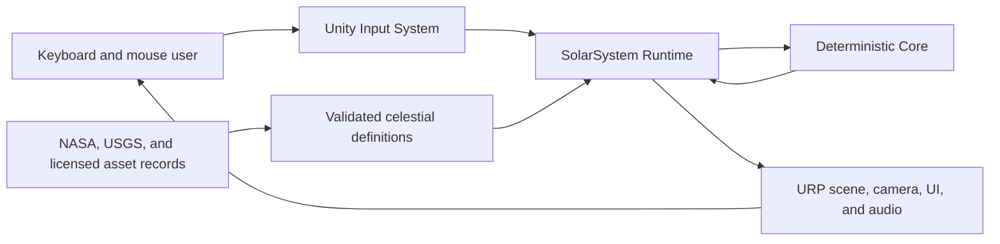
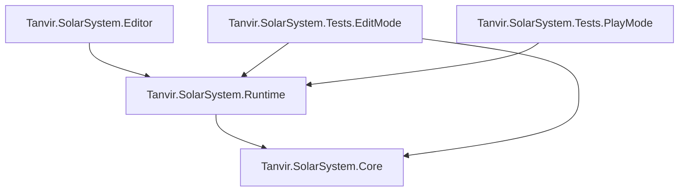
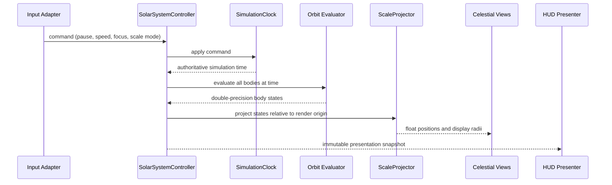
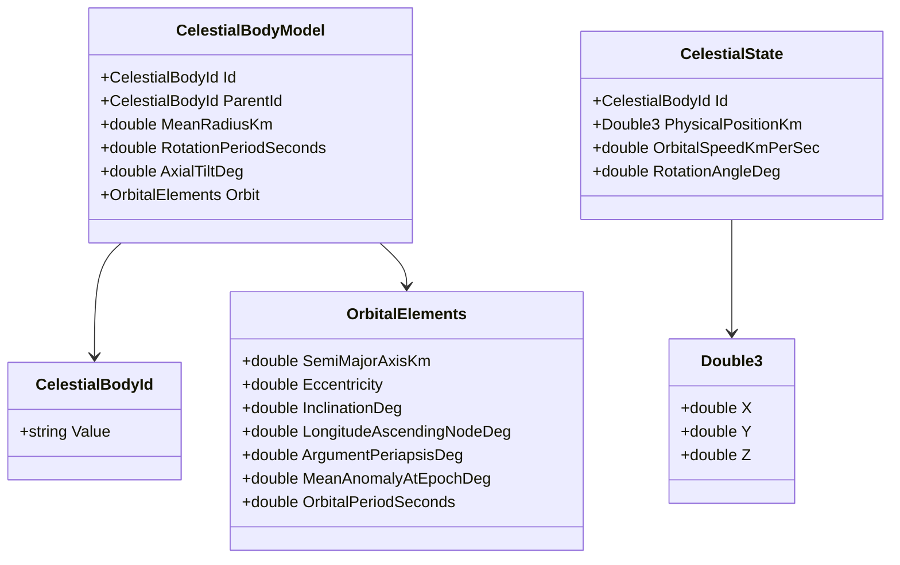

# Solar System Simulation

## Living Technical Design Document

**Project:** Solar System Simulation - Unity Portfolio Build  
**Author and product owner:** Tanvir  
**Document owner:** Tanvir  
**Technical steward:** Codex, subject to owner review  
**Document status:** Draft with proposed architecture  
**Version:** 0.2.0  
**Last updated:** 2026-07-22  
**Unity baseline:** Unity 6000.5.3f1, Universal Render Pipeline 17.5.0  
**Product authority:** `Docs/Design/GDD.md`  
**Art authority:** `Docs/Art/ArtBible.md`

> **Living-document rule:** This TDD is the authority for how approved product behavior is implemented. It does not approve product scope. Proposed technical decisions remain subject to Tanvir's review before implementation.

## 1. Document Control

### 1.1 Purpose

This document converts the approved Solar System GDD into a testable Unity architecture. It defines responsibilities, dependency direction, data schemas, numerical methods, folder and assembly boundaries, scene composition, validation, performance strategy, and the first implementation slice.

### 1.2 Revision history

| Version | Date | Author | Summary | Approval |
|---|---|---|---|---|
| 0.1.0 | 2026-07-22 | Codex, for Tanvir | Initial architecture, folders, assemblies, schemas, algorithms, scene plan, tests, risks, and delivery slices | Pending owner review |
| 0.2.0 | 2026-07-22 | Codex, for Tanvir | Recorded approval of the Slice 0 namespace, assembly, precision, composition, authoring-state, and scene architecture | Slice 0 architecture approved |

### 1.3 Status vocabulary

- **[APPROVED]** - explicitly accepted by Tanvir and safe to implement.
- **[PROPOSED]** - recommended implementation direction awaiting approval.
- **[OPEN]** - a decision or evidence is required.
- **[DEFERRED]** - intentionally postponed outside the current milestone.
- **[REJECTED]** - considered and declined.
- **[SUPERSEDED]** - replaced by a later recorded decision.

### 1.4 Decision hierarchy

When sources disagree, use this order:

1. Explicit owner decisions in the living GDD.
2. Approved ADRs and this TDD's decision log.
3. Verified primary scientific references and recorded source data.
4. The Art Bible for visual intent and asset treatment.
5. Coding, repository, and Efficient Unity workflow standards.
6. The supplied project plan as non-authoritative research input.

## 2. Technical Goals and Non-Goals

### 2.1 Goals

- Deterministic analytical motion for all required planets and moons.
- Clear separation among physical data, simulation, scale transformation, presentation, camera, input, UI, and audio.
- Double-precision domain calculations with stable float-space rendering.
- ScriptableObject authoring backed by validation and immutable runtime models.
- Explicit composition without scene searches or global mutable singletons.
- Edit Mode coverage for calculations and validation; Play Mode coverage for representative user flows.
- A readable portfolio architecture that remains approachable for a beginner.
- Stable 60 FPS at 1080p on the eventual representative mid-range PC.

### 2.2 Non-goals

- Date-exact ephemeris or n-body gravitational integration.
- Rigidbody-driven orbital motion.
- ECS/DOTS, Burst, Jobs, or compute-based simulation for the initial body count.
- A general-purpose astronomy engine or reusable framework extracted before demonstrated reuse.
- Networking, save games, procedural universe generation, or cross-platform release in the first version.
- Object pooling for static celestial bodies; pooling is deferred until a recurring dynamic population exists.
- Runtime modification of source ScriptableObject assets.

### 2.3 Quality attributes

In priority order:

1. Correctness and honest scientific presentation.
2. Determinism and testability.
3. Visual stability across extreme scale.
4. Maintainability and portfolio readability.
5. Performance on the approved hardware category.
6. Extensibility for optional dwarf planets, comets, and asteroid belts without prebuilding them.

## 3. Constraints and Baseline

### 3.1 Approved constraints

- **[APPROVED]** URP is the render pipeline.
- **[APPROVED]** Orbits use deterministic analytical mechanics rather than Unity physics.
- **[APPROVED]** Accuracy is educational: verified relative data and convincing ellipses without claiming date-exact real positions.
- **[APPROVED]** Physical scale is taught through a controlled guided comparison.
- **[APPROVED]** Windows 10/11 x86-64, keyboard and mouse, and 1920x1080 are the first-release baseline.
- **[APPROVED]** Development uses short-lived branches with trunk-based integration and explicit approval before commits or pushes.

### 3.2 Installed packages relevant to architecture

- Universal Render Pipeline 17.5.0.
- Input System 1.20.0.
- Unity Test Framework 1.7.0.
- Unity UI/uGUI 2.5.0.
- Timeline 1.8.12.

The project now contains the project-authored assembly and test foundation, but no production runtime behavior yet constrains this architecture. The Unity template scene remains only as a temporary validation scene.

### 3.3 Package policy

The owner-approved direct-package baseline is recorded in `Docs/Technical/Unity Package Baseline.md`. Unity AI Assistant is retained for the MCP collaboration bridge; scope-unneeded inference, navigation, collaboration, Rider, multiplayer, and visual-scripting packages were removed. Future package changes require owner approval plus Unity resolution, compilation, Console, and relevant test validation.

## 4. Architecture Overview

### 4.1 Context



### 4.2 Dependency direction

**[PROPOSED]** Use the Efficient Unity Level 2 assembly model.



`Core` never references `Runtime`, Unity scene types, the Input System, UI, URP, or editor APIs. `Runtime` may reference UnityEngine and approved runtime packages. Only `Editor` may reference `UnityEditor`.

### 4.3 Runtime data flow



### 4.4 State ownership

- `SimulationClock` owns elapsed simulation time, pause state, and speed multiplier.
- `CelestialCatalog` owns the validated, read-only runtime definitions.
- `SolarSystemController` owns current evaluated states and the ordered simulation update.
- `SelectionService` owns the selected/focused body ID.
- `ScaleModeService` owns the active scale mode and controlled transition progress.
- `FocusCameraController` owns camera pose/transition state, not simulation state.
- Views own only presentation caches and Unity component references.
- UI owns transient interface state such as an open help panel, not authoritative simulation values.

### 4.5 Composition and dependency injection

**[PROPOSED]** Use manual dependency injection with one `SolarSystemCompositionRoot` MonoBehaviour.

- ScriptableObject catalogs and required scene references are serialized on the composition root.
- The root validates references, converts authoring data, constructs plain C# services, injects adapters, and starts the controller.
- Plain C# services receive dependencies through constructors.
- MonoBehaviours receive explicit initialization calls or serialized references.
- No DI container, service locator, mutable singleton, `FindObjectOfType`, or scene-wide name lookup is required.

## 5. Folder, Namespace, and Assembly Plan

### 5.1 Project-authored folder tree

**[PROPOSED]** All authored Unity content lives beneath `Assets/SolarSystem`:

```text
Assets/
  SolarSystem/
    Runtime/
      Core/
        Math/
        Simulation/
      Application/
      Authoring/
      Presentation/
        Camera/
        CelestialBodies/
        Scale/
      UI/
      Audio/
    Editor/
      Validation/
      Import/
    Tests/
      EditMode/
      PlayMode/
    Content/
      Data/
      Materials/
      Prefabs/
      Textures/
      Audio/
      UI/
    Scenes/
    Settings/
```

Create folders only when the first file needs them. Original downloaded sources remain in `SourceAssets`; reviewed Unity-ready derivatives enter `Assets/SolarSystem/Content`. Third-party Unity packages, if introduced, live under `Assets/ThirdParty` and retain provenance.

### 5.2 Assemblies

**[PROPOSED]** Initial assembly definitions:

- `Tanvir.SolarSystem.Core`: deterministic value types, validation rules, orbital/rotation math, no MonoBehaviours or ScriptableObjects.
- `Tanvir.SolarSystem.Runtime`: application services, authoring adapters, views, camera, input, UI, and audio; references Core and necessary Unity packages.
- `Tanvir.SolarSystem.Editor`: catalog validators/import tools; editor-only; references Runtime.
- `Tanvir.SolarSystem.Tests.EditMode`: formula, data, catalog, and service tests.
- `Tanvir.SolarSystem.Tests.PlayMode`: bootstrap and representative interaction flows.

Do not split UI, camera, audio, or authoring into separate assemblies until compile-time or dependency evidence justifies it.

### 5.3 Namespace standard

**[PROPOSED]** Root namespace: `Tanvir.SolarSystem`.

Examples:

- `Tanvir.SolarSystem.Simulation`
- `Tanvir.SolarSystem.Application`
- `Tanvir.SolarSystem.Authoring`
- `Tanvir.SolarSystem.Presentation.Camera`
- `Tanvir.SolarSystem.UI`
- `Tanvir.SolarSystem.Editor.Validation`

### 5.4 Naming responsibilities

- `Definition`: immutable authored description, generally a ScriptableObject.
- `Model` or domain-specific name: validated runtime data.
- `Service`: stateful application capability with a narrow responsibility.
- `Controller`: owns an ordered runtime process.
- `View`: applies state to Unity presentation components.
- `Presenter`: converts application state into UI-facing state.
- `CompositionRoot`: constructs and wires the object graph.

Avoid generic `Manager`, `Helper`, or `Utils` names.

## 6. Runtime Systems

### 6.1 Simulation clock

`SimulationClock` is a plain C# service. It advances from Unity unscaled delta time supplied by the controller, multiplied by a labeled simulation-rate factor. Pause stops simulation time without freezing UI/camera animation.

The clock exposes an immutable snapshot and a `Changed` event only when pause or speed settings change. Per-frame time reads do not raise events.

### 6.2 Celestial catalog

`CelestialCatalogDefinition` is the authoring root. On startup, `CelestialCatalogBuilder` validates it and creates an immutable runtime catalog keyed by `CelestialBodyId`.

Validation rejects:

- Empty or duplicate IDs.
- Missing parent IDs or parent cycles.
- Invalid radius, orbital period, or eccentricity ranges.
- Missing required source/provenance identifiers.
- A non-Sun body lacking a valid parent/orbit.
- Unsupported units or unrecognized body categories.

Validation errors stop simulation startup with a concise diagnostic; they do not silently substitute invented values.

### 6.3 Orbital evaluator

`KeplerOrbitEvaluator` evaluates each orbit from authoritative simulation time. It does not increment transforms or store accumulated anomaly as the source of truth.

Required outputs per body:

- Parent-relative physical position in kilometers using `Double3`.
- World physical position derived in topological parent order.
- Instantaneous orbital speed in kilometers per second.
- Rotation angle in degrees or radians with explicit convention.

### 6.4 Solar System controller

One `SolarSystemController` performs the small system-wide update:

1. Read the clock.
2. Evaluate bodies in validated parent-before-child order.
3. Publish a read-only simulation snapshot.
4. Project physical states into the active presentation scale.
5. Apply results to registered views.
6. Update UI presentation data at a throttled rate where smooth per-frame updates are unnecessary.

The initial body count does not justify one `Update` per body, Jobs, Burst, or ECS.

### 6.5 Scale projection

`ScaleModeService` separates physical state from display state.

Initial modes:

- `Presentation`: compressed distances and exaggerated radii for readable exploration.
- `GuidedComparison`: controlled transition showing why a single true scale is impractical.

`ScaleProjector` receives physical positions/radii, focus origin, and scale settings; it returns float-space positions and display radii. The exact monotonic distance function and radius clamps remain configurable and must be validated against the guided experience.

Render positions are relative to an explicit render origin, normally the current focus anchor, preventing large float magnitudes. Physical positions remain unchanged.

### 6.6 Selection and focus

`SelectionService` owns a valid `CelestialBodyId?`. Selection changes publish one C# event. Camera, UI, audio, and highlighting subscribe through explicit initialization and unsubscribe on disposal/disable.

Focus may follow selection but remains a separate command so cinematic mode can move without changing informational selection.

### 6.7 Camera

`FocusCameraController` supports:

- Free-fly navigation.
- Focus/orbit around a selected body.
- Scripted cinematic waypoints using the same focus and simulation services.
- Interruptible transitions.
- Reduced-motion or instant-transition behavior.

Camera transitions use unscaled time so pausing the simulation does not trap the camera. Near/far clipping and movement speed respond to the current display scale and target radius.

### 6.8 Input

`SolarSystemInputAdapter` owns Input System callbacks and converts them into application commands. Runtime systems do not poll keyboard keys directly.

Action-map groups are expected for:

- Navigation.
- Selection/focus.
- Simulation time.
- Scale comparison.
- UI/help.

Exact bindings are deferred to the input/UI design pass.

### 6.9 UI

**[PROPOSED]** Use runtime UI Toolkit for portfolio overlays and panels, subject to a small proof before broad implementation.

`SolarSystemHudPresenter` converts application snapshots into display strings with explicit units. UI never performs orbital math. Frequently changing numeric labels may update at 10 Hz unless visual testing requires more, while selection/command feedback updates immediately.

### 6.10 Audio

`AudioDirector` responds to explicit application events and owns ambient/UI mixer routing. It does not infer events by watching transforms. Ambient music, UI effects, and master volume remain independently adjustable.

## 7. Data Model and Authoring

### 7.1 Core value types



Use `double` for physical time, distances, anomalies, and velocities. Convert to Unity `Vector3` only after projection into local display space.

### 7.2 ScriptableObject schema

`CelestialBodyDefinition` fields:

- Stable string ID and display name.
- Body category.
- Parent body ID.
- Mean radius in kilometers.
- Optional mass in kilograms for information display, not orbital force integration.
- Sidereal rotation period in seconds; signed convention documents retrograde rotation.
- Axial tilt in degrees.
- `OrbitalElementsDefinition` with explicitly named units.
- Presentation references: material profile, optional atmosphere/ring profile, label metadata.
- Scientific source record ID and last verification date.

`CelestialCatalogDefinition` contains the body definitions and scale presets. Individual definitions remain independently inspectable; the catalog provides deterministic ordering and validation.

### 7.3 IDs and references

Stable string IDs such as `sun`, `earth`, and `moon` are serialized. Runtime wraps them in `CelestialBodyId`. Parent relations use IDs instead of direct scene-object references, enabling validation and deterministic construction.

### 7.4 Runtime conversion

Authoring assets are treated as read-only. At bootstrap they convert into immutable models. Runtime state is never stored back into ScriptableObjects. This prevents Play Mode changes from contaminating source assets and makes tests independent from the Asset Database where possible.

## 8. Algorithms and Numerical Strategy

### 8.1 Keplerian position

For each orbit at elapsed simulation time `t`:

```text
n = 2pi / T
M(t) = normalize(M0 + n * t)
solve E - e sin(E) = M
x = a(cos(E) - e)
y = a sqrt(1 - e^2) sin(E)
```

The orbital-plane position is rotated by argument of periapsis, inclination, and longitude of the ascending node into the parent coordinate space.

Use Newton-Raphson iteration for eccentric anomaly with a documented maximum iteration count and tolerance. All approved planets and moons have eccentricities safely below 1; parabolic and hyperbolic trajectories are deferred for future comets.

### 8.2 Determinism

- Evaluation depends on immutable definitions and the authoritative `double` simulation time.
- Body order is deterministic and parent-first.
- Tests compare with explicit absolute/relative tolerances rather than bitwise floating-point equality.
- Rendering interpolation or camera smoothing never feeds back into physical state.

### 8.3 Rotation

Rotation angle is evaluated from time and signed sidereal rotation period. The sign convention and axis orientation are verified with retrograde cases such as Venus and Uranus before content scaling.

### 8.4 Coordinate conventions

**[PROPOSED]** Domain orbital calculations use a documented right-handed reference plane. A single adapter maps that plane into Unity's left-handed, Y-up world convention. Conversion occurs once at the Core/Runtime boundary and is covered by tests.

## 9. Scene, Prefab, and Bootstrap Design

### 9.1 Build scene

**[PROPOSED]** Replace the template `SampleScene` with one intentional `SolarSystem` scene for the first release. Additive scenes are deferred until a real loading or ownership boundary appears.

### 9.2 Scene hierarchy

```text
SolarSystem
  _Application
    SolarSystemCompositionRoot
    EventSystem / UI document host
    AudioDirector
  _Presentation
    CelestialBodyRoot
    OrbitPathRoot
    CameraRig
    Lighting
    GlobalVolume
  _Diagnostics
```

Underscore-prefixed scene groups are organizational roots, not lookup keys.

### 9.3 Celestial body prefab

One base `CelestialBodyView` prefab may contain surface mesh, selection target, and label anchor. Atmosphere, cloud, and ring child presenters are optional composition modules. The prefab receives a body ID and presentation profile; it does not own authoritative orbital state.

### 9.4 Lifecycle

1. `Awake`: composition root validates serialized references and builds services.
2. Initialization: catalog validation and view registration.
3. `Start`: first deterministic snapshot is evaluated and rendered.
4. Runtime: controller update, camera late update, UI throttled refresh.
5. Shutdown: unsubscribe events and dispose plain services where needed.

Do not rely on configurable Script Execution Order for normal correctness.

## 10. Rendering, Materials, Lighting, and Audio

The Art Bible owns visual targets and asset choices. This TDD owns runtime behavior:

- URP asset changes are deliberate and diff-reviewed.
- The Sun is the motivated light source; emissive appearance and actual scene lighting are separate controls.
- Materials reference Unity-ready derivatives, never files directly from `SourceAssets`.
- Atmosphere/ring/cloud components remain optional per body.
- Orbit paths use cached geometry and update only when scale/settings change.
- Post-processing respects accessibility toggles; motion blur defaults off.
- Quality tiers and LODs are introduced from measured screen-space need.
- Audio routes through mixer groups for master, music, and UI levels.

## 11. Error Handling, Diagnostics, and Validation

- Invalid catalogs fail fast during bootstrap with body ID, field, invalid value, and expected constraint.
- User-facing release builds show a concise initialization failure panel and log detailed diagnostics.
- Editor validation reports all catalog errors in one pass where possible.
- No silent scientific fallback values are invented.
- Development diagnostics may show simulation time, selected ID, physical/display coordinates, scale mode, frame time, and allocation counters behind a development-only toggle.
- Public logs must not expose local paths, credentials, or account tokens.

## 12. Testing Strategy

### 12.1 Edit Mode Core tests

- Circular orbit at cardinal anomalies.
- Elliptical periapsis and apoapsis distances.
- Newton-Raphson convergence for representative eccentricities.
- Inclination/node/periapsis rotations.
- Parent-child composition for Earth-Moon and Jupiter-moon examples.
- Deterministic repeated evaluation.
- Pause/speed clock transitions.
- Retrograde rotation convention.
- Scale projection monotonicity and finite float outputs.

### 12.2 Edit Mode authoring tests

- Duplicate/missing IDs.
- Missing parents and parent cycles.
- Invalid eccentricity, radius, period, and source record.
- Deterministic catalog ordering.
- ScriptableObject-to-runtime conversion without asset mutation.

### 12.3 Play Mode tests

- `SolarSystem` scene bootstraps without errors.
- Required views register against catalog entries.
- Pause and speed commands affect all body motion consistently.
- Selection updates focus and UI without invalid state.
- Scale transition can be interrupted safely.
- Reduced-motion mode completes camera transitions immediately or within its defined bound.

### 12.4 Manual validation

- Visual seams, atmosphere/ring alignment, exposure, and label readability.
- Free-fly and focus-camera feel.
- Keyboard-only primary flows.
- Audio balance and mute.
- Representative-device frame-time and memory captures.

## 13. Performance and Memory Plan

Initial budgets:

- 60 FPS at 1920x1080 on the eventual documented mid-range reference PC.
- No avoidable managed allocations during steady-state simulation/camera operation.
- No visible transform jitter in supported views.
- UI text updates throttled when per-frame refresh has no visible benefit.
- Orbit path meshes cached by configuration.
- Texture import sizes chosen from measured screen-space demand.

The small static body count requires neither pooling nor data-oriented technology. Pooling becomes relevant only for approved dynamic comets/asteroids with recurring spawn/despawn behavior.

Formal frame-time, memory, loading, and VRAM budgets are set after the first representative visual slice.

## 14. Repository, Licensing, and Build Constraints

- Project-authored files remain under the defined root and keep `.meta` partners.
- Binary assets follow `.gitattributes` and Git LFS policy.
- Original/downloaded source assets retain manifest and license records outside Unity import scope.
- Every imported third-party derivative retains traceability to its source record.
- The ignored ambient-music source is never committed standalone.
- Builds are written only to ignored `Build`/`Builds` locations.
- No commit or push occurs without Tanvir's explicit approval.
- A Unity import, long test run, or build requires approval before execution.

## 15. Delivery Slices

### Slice 0 - Technical foundation

- Approve this TDD's gating architecture.
- Create project-authored folders and assembly definitions.
- Add a minimal Core Edit Mode test assembly.
- Confirm Unity compilation/import.

### Slice 1 - Deterministic simulation

- Implement value types, clock, catalog model, Kepler evaluator, and tests.
- Use programmatic test fixtures before creating all ScriptableObject content.

### Slice 2 - Graybox vertical slice

- Add Sun, Earth, Moon, and Jupiter definitions.
- Create scale projector, views, cached orbit paths, and the `SolarSystem` scene.
- Validate precision and camera range before full content production.

### Slice 3 - Interaction vertical slice

- Add input adapter, selection, focus/free camera, time controls, scale mode, and representative UI.

### Slice 4 - Visual/content completion

- Integrate reviewed materials, required planets/moons, lighting, atmosphere/ring variants, audio, and accessibility options.

### Slice 5 - Portfolio release

- Profile, test, build, document, capture media, audit licenses/repository, and prepare the release candidate.

## 16. Risks and Trade-offs

### Extreme-scale precision

Physical `double` state plus focus-relative float projection reduces jitter. Validate this before full content; do not solve it with enormous Unity transforms.

### Architecture overgrowth

Core/Runtime separation protects deterministic math without fragmenting every feature. Additional assemblies require evidence.

### ScriptableObject misuse

Assets remain authoring definitions; runtime state is constructed separately and never written back.

### Event opacity

Use direct calls for mandatory flows and events only for state notifications with explicit lifecycle ownership.

### Visual scope

Prove one representative visual slice before building unique high-cost shaders for every body.

### Scientific overclaiming

Data sources, units, transformations, and limitations remain visible and testable.

## 17. Open Technical Decisions

| ID | Decision needed | Recommendation | Owner | Gate | Status |
|---|---|---|---|---|---|
| TDD-OPEN-003 | Runtime UI technology | Prove UI Toolkit with the first HUD slice; fall back to uGUI only for a documented blocker | Tanvir | Slice 3 | Open |
| TDD-OPEN-004 | Exact distance-compression and radius-exaggeration curves | Tune ScriptableObject presets during graybox usability testing | Tanvir | Slice 2 | Open |
| TDD-OPEN-005 | Exact reference PC | Record actual CPU, GPU, RAM, storage, and display before formal profiling | Tanvir | Slice 4 | Open |

## 18. Technical Decision Log

| ID | Date | Decision | Status | Owner | Rationale / link |
|---|---|---|---|---|---|
| TDD-001 | 2026-07-22 | Use URP 17.5.0 | Approved | Tanvir | Existing project baseline and appropriate performance/visual balance |
| TDD-002 | 2026-07-22 | Use deterministic analytical orbits without Rigidbody orbital physics | Approved | Tanvir | GDD-003 |
| TDD-003 | 2026-07-22 | Keep physical data separate from presentation scale | Approved product constraint | Tanvir | GDD scale and accuracy requirements |
| TDD-004 | 2026-07-22 | Use double-precision domain state with focus-relative float projection | Approved | Tanvir | Precision across extreme distances |
| TDD-005 | 2026-07-22 | Use manual dependency injection and one composition root | Approved | Tanvir | Explicit, beginner-readable dependencies without container overhead |
| TDD-006 | 2026-07-22 | Use one build scene until additive loading solves a measured need | Approved | Tanvir | Minimal scene complexity for current scope |
| TDD-007 | 2026-07-22 | Keep ScriptableObjects as authoring definitions, not mutable runtime state | Approved | Tanvir | Testability and Play Mode safety |
| TDD-008 | 2026-07-22 | Use `Tanvir.SolarSystem` as the root namespace and assembly prefix | Approved | Tanvir | Stable project identity and conventional namespace hierarchy |
| TDD-009 | 2026-07-22 | Use Core, Runtime, Editor, Edit Mode test, and Play Mode test assembly boundaries | Approved | Tanvir | Efficient Unity Level 2 architecture |

## 19. Definition of Done for TDD Version 1.0

- Slice 0 decisions are approved or deliberately deferred.
- Folder, namespace, assembly, bootstrap, state, and dependency boundaries are unambiguous.
- Celestial schema, units, coordinate mapping, orbit formula, tolerances, and validation rules are testable.
- Scene and first graybox slice can be built without inventing architecture during implementation.
- Edit and Play Mode validation paths are explicit.
- GDD, TDD, Art Bible, repository standard, coding standard, and setup guide have clear ownership.
- Remaining open decisions have owners and milestone gates.
- No unmarked assumption is presented as approved.
