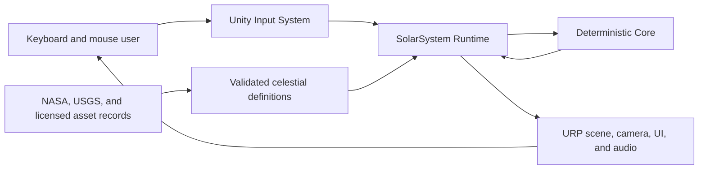
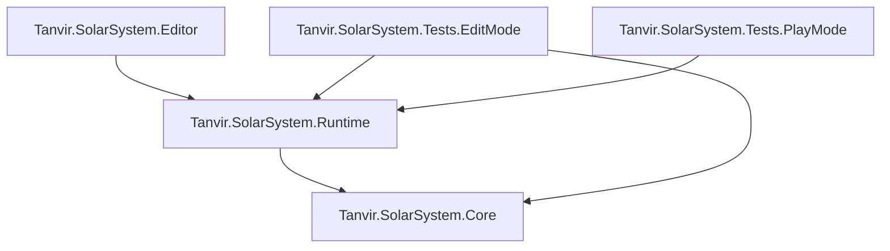
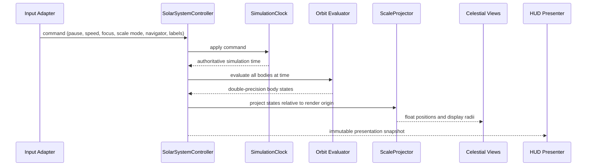
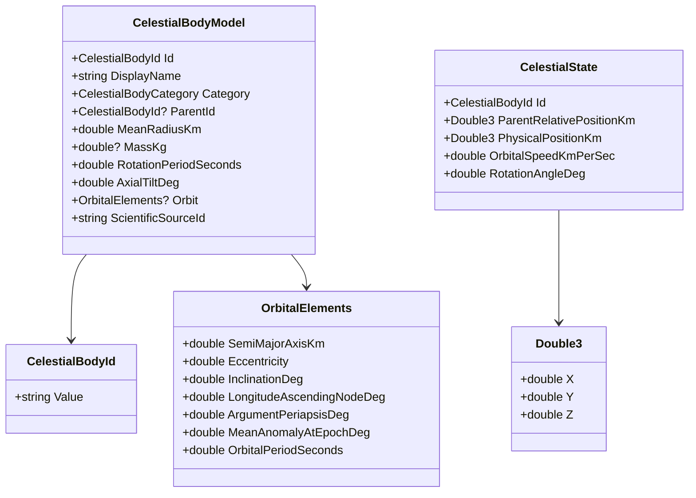

# Solar System Simulation

## Living Technical Design Document

**Project:** Solar System Simulation - Unity Portfolio Build  
**Author and product owner:** Tanvir  
**Document owner:** Tanvir  
**Technical steward:** Codex, subject to owner review  
**Document status:** Living technical authority; release performance contract and diagnostic harness validated  
**Version:** 0.36.0  
**Last updated:** 2026-07-26  
**Unity baseline:** Unity 6000.5.3f1, Universal Render Pipeline 17.5.0  
**Product authority:** `Docs/Design/GDD.md`  
**Art authority:** `Docs/Art/ArtBible.md`

> **Living-document rule:** This TDD is the authority for how approved product behavior is implemented. It does not approve product scope. Proposed technical decisions remain subject to Tanvir's review before implementation.

## 1. Document Control

### 1.1 Purpose

This document converts the approved Solar System GDD into a testable Unity architecture. It defines responsibilities, dependency direction, data schemas, numerical methods, folder and assembly boundaries, scene composition, validation, performance strategy, and the first implementation slice.

### 1.2 Revision history

| Version | Date | Author | Summary | Approval |
|---|---|---|---|---|
| 0.1.0 | 2026-07-22 | Codex, for Tanvir | Initial architecture, folders, assemblies, schemas, algorithms, scene plan, tests, risks, and delivery slices | Pending owner review |
| 0.2.0 | 2026-07-22 | Codex, for Tanvir | Recorded approval of the Slice 0 namespace, assembly, precision, composition, authoring-state, and scene architecture | Slice 0 architecture approved |
| 0.3.0 | 2026-07-22 | Codex, for Tanvir | Implemented and validated immutable runtime models, deterministic catalog ordering, simulation clock, Kepler evaluator, and Slice 1 tests | Slice 1 implementation validated |
| 0.4.0 | 2026-07-22 | Codex, for Tanvir | Implemented serialized Sun-Earth-Moon authoring, coordinate/scale adapters, centralized views, cached orbit paths, the visible scene, and Slice 2 validation | Sun-Earth-Moon proof validated; scale tuning and Jupiter remain open |
| 0.4.1 | 2026-07-23 | Codex, for Tanvir | Separated Slice 2 editor orchestration, asset authoring, build data, and scene construction; revalidated the complete visible proof | Technical refactor validated; product scope unchanged |
| 0.5.0 | 2026-07-23 | Codex, for Tanvir | Added verified Jupiter authoring and presentation, gas-giant scale acceptance tests, camera-range evidence, and complete Slice 2 validation | Representative graybox slice validated; final guided-comparison tuning remains open |
| 0.6.0 | 2026-07-23 | Codex, for Tanvir | Added the project-owned input map, stable-ID selection, raycast adapters, explicit interaction composition, and validated free/focus camera state machine | First Slice 3 interaction proof validated; time, scale-comparison, and UI work remain |
| 0.7.0 | 2026-07-23 | Codex, for Tanvir | Added bounded time-control commands, read-only presentation state, the first runtime UI Toolkit HUD, reproducible UI authoring, and complete behavioral/visual validation | Time-control and HUD proof validated; scale comparison and broader interface remain |
| 0.8.0 | 2026-07-23 | Codex, for Tanvir | Added authored educational summaries, display-only fact formatting, a selected-body information card, and a screen-space selection reticle | Slice 3 interaction vertical slice complete; visual/content production may begin |
| 0.9.0 | 2026-07-23 | Codex, for Tanvir | Added the project-owned panoramic skybox, deterministic visual asset authoring, focused URP volume profile, camera post-processing contract, tuned representative materials, and visual validation | First visual-production foundation validated; unique atmosphere/cloud/solar shaders remain evidence-gated |
| 0.10.0 | 2026-07-23 | Codex, for Tanvir | Replaced the fixed directional-light approximation with a Sun-parented point source, explicit radial-illumination constraints, and real-scene regression coverage | Sun-facing day hemispheres and opposing night hemispheres validated for the representative scene |
| 0.11.0 | 2026-07-23 | Codex, for Tanvir | Expanded the deterministic authoring pipeline to all eight planets, added a generated Saturn annulus, and reframed the initial camera for the complete planetary envelope | Required planetary baseline validated; advanced atmosphere, cloud, and ring shading remain deferred |
| 0.12.0 | 2026-07-24 | Codex, for Tanvir | Added event-driven audio feedback, independent runtime channel levels and mute, deterministic clip-import contracts, and licensed scene ambience | Automated behavior validated; owner listening and final mix approval remain |
| 0.13.0 | 2026-07-24 | Codex, for Tanvir | Replaced exaggerated body radii with exact Earth-relative proportions, calibrated readable orbit clearances, anchored `1x` to Earth's sidereal rotation, and added full-cycle regression coverage | Presentation-scale contract approved and validated; guided comparison UI remains |
| 0.14.0 | 2026-07-24 | Codex, for Tanvir | Added the deterministic three-stage scale service, shared linear projections, Earth-relative render origin, guided camera state capture/restoration, input locking, UI/audio adapters, and full regression coverage | Guided physical-scale comparison implemented and validated |
| 0.15.0 | 2026-07-24 | Codex, for Tanvir | Added project-owned URP Earth shaders, immutable layer authoring, deterministic cloud drift, Sun shader globals, close-focus orbit visibility policy, and complete asset/scene regression coverage | Representative layered-Earth architecture implemented and validated |
| 0.16.0 | 2026-07-24 | Codex, for Tanvir | Added project-owned solar surface/corona shaders, immutable solar authoring, absolute-time phase evaluation, cached property blocks, reproducible scene wiring, and complete asset/scene regression coverage | Solar hero architecture implemented and validated |
| 0.17.0 | 2026-07-24 | Codex, for Tanvir | Added reusable gas-giant authoring, anchored-texture Jupiter surface/atmosphere shaders, absolute-time band phase, cached property blocks, reproducible scene wiring, and complete asset/scene regression coverage | Jupiter hero architecture implemented and validated |
| 0.18.0 | 2026-07-24 | Codex, for Tanvir | Extended the reusable gas-giant path to Saturn and added a project-owned one-sample, two-sided, Sun-aware ring shader with deterministic authoring and complete asset/scene regression coverage | Saturn hero architecture implemented and validated |
| 0.19.0 | 2026-07-24 | Codex, for Tanvir | Extended the reusable layered-body path to Venus, corrected layer motion to absolute signed simulation time, and added an opaque anchored cloud deck with bounded atmosphere transparency and complete asset/scene regression coverage | Venus atmosphere architecture implemented and validated |
| 0.20.0 | 2026-07-24 | Codex, for Tanvir | Generalized the layered-body path to explicit atmosphere-only composition and added an anchored rocky-surface shader, thin Mars limb, reproducible assets/scene wiring, and complete regression coverage | Mars hero architecture implemented and validated |
| 0.21.0 | 2026-07-24 | Codex, for Tanvir | Added reusable ice-giant authoring/model/view architecture, generalized the giant-planet shader identity, distinct Uranus/Neptune material contracts, Sun-aware nightside readability, reproducible scene wiring, and complete regression coverage | Uranus and Neptune hero architecture implemented and validated |
| 0.22.0 | 2026-07-24 | Codex, for Tanvir | Added reusable airless-rocky authoring/model/view architecture, distinct Mercury/Moon material contracts, live-Sun nightside readability in the shared rocky shader, reproducible scene wiring, and complete regression coverage | Mercury and Moon hero architecture implemented and validated |
| 0.23.0 | 2026-07-25 | Codex, for Tanvir | Expanded the data-driven catalog and reproducible scene pipeline to the approved major moons using JPL parent-relative mean elements, signed synchronous rotation, audited USGS materials, and complete hierarchy/scene regression coverage | Major-moon baseline implemented and validated |
| 0.24.0 | 2026-07-25 | Codex, for Tanvir | Extended the atmosphere-only layered-body path with a validated deterministic atmosphere phase and added project-owned Titan surface/haze shaders, reproducible authoring, bounded overdraw, live-Sun response, and complete regression coverage | Titan haze hero architecture implemented and validated |
| 0.25.0 | 2026-07-25 | Codex, for Tanvir | Extended the reusable airless-rocky path to Io and Europa with distinct immutable contracts, clean material-schema migration, deterministic scene wiring, anchored USGS sources, and full asset/scene regression coverage | Io and Europa hero architecture implemented and validated |
| 0.26.0 | 2026-07-25 | Codex, for Tanvir | Extended the reusable airless-rocky path to Ganymede and Callisto with distinct immutable contracts, clean material-schema migration, deterministic scene wiring, anchored USGS sources, and full asset/scene regression coverage | Ganymede and Callisto hero architecture implemented and validated |
| 0.27.0 | 2026-07-25 | Codex, for Tanvir | Extended the reusable airless-rocky path to Triton with a disclosed unobserved-coverage fill, preserved retrograde scientific state, corrected outer-system point-light culling, deterministic scene wiring, and full asset/scene regression coverage | Triton hero architecture implemented and validated |
| 0.28.0 | 2026-07-25 | Codex, for Tanvir | Added event-driven celestial navigation state, parent-first selection/focus routing, cached UI Toolkit navigator entries, allocation-stable projected labels, deterministic overlap priorities, responsive safe areas, explicit input, and real-scene regression coverage | Navigator and label architecture implemented and validated |
| 0.29.0 | 2026-07-25 | Codex, for Tanvir | Added immutable cinematic-tour authoring/runtime data, shared guided ownership, allocation-stable live group framing, exact moving-target camera restoration, responsive UI, and full asset/service/scene coverage | Cinematic-tour architecture implemented and validated |
| 0.30.0 | 2026-07-25 | Codex, for Tanvir | Added authored composition/easing, phase-robust screen-plane group framing, persisted reduced motion, reversible orbit/body visibility ownership, and exact restoration coverage | Cinematic-tour polish architecture implemented and validated |
| 0.31.0 | 2026-07-25 | Codex, for Tanvir | Added a pure persistent-settings model, versioned PlayerPrefs adapter, unified modal menu state, sole contextual Escape router, input gating, and responsive UI Toolkit surfaces | Explorer UX architecture implemented and validated |
| 0.32.0 | 2026-07-25 | Codex, for Tanvir | Recorded the owner-approved release-default audio mix after validated overview/focus audition | Final audio mix approved; technical audio baseline unchanged |
| 0.33.0 | 2026-07-25 | Codex, for Tanvir | Added pinned Inter v4.1 Regular/SemiBold sources, reproducible dynamic TextCore font assets, explicit USS role mapping, runtime credits, provenance, and regression coverage | Final UI typography approved and technically validated |
| 0.34.0 | 2026-07-25 | Codex, for Tanvir | Added an opt-in, allocation-conscious performance harness, approved budgets and scenario matrix, raw JSON evidence, Editor diagnostic routing, and explicit external-certification boundaries | Harness implementation and Editor diagnostics validated; standalone reference-hardware certification remains |
| 0.35.0 | 2026-07-26 | Codex, for Tanvir | Added a deterministic pooled comet presentation system with ScriptableObject authoring, a project-owned trail shader, bounded off-camera despawn, pause behavior, and Edit/Play Mode coverage | Assignment comet slice implemented and validated |
| 0.36.0 | 2026-07-26 | Codex, for Tanvir | Added a centralized readable-opening epoch contract and regression coverage that distributes all eight planet directions without altering per-body scientific authoring | Owner-requested initial composition implemented and validated |

### 1.3 Status vocabulary

- **[APPROVED]** - explicitly accepted by Tanvir and safe to implement.
- **[PROPOSED]** - recommended implementation direction awaiting approval.
- **[OPEN]** - a decision or evidence is required.
- **[DEFERRED]** - intentionally postponed outside the current milestone.
- **[REJECTED]** - considered and declined.
- **[SUPERSEDED]** - replaced by a later recorded decision.

### 1.4 Decision hierarchy

When sources disagree, use this order:

1. Explicit owner decisions in the living GDD.
2. Approved ADRs and this TDD's decision log.
3. Verified primary scientific references and recorded source data.
4. The Art Bible for visual intent and asset treatment.
5. Coding, repository, and Efficient Unity workflow standards.
6. The supplied project plan as non-authoritative research input.

## 2. Technical Goals and Non-Goals

### 2.1 Goals

- Deterministic analytical motion for all required planets and moons.
- Clear separation among physical data, simulation, scale transformation, presentation, camera, input, UI, and audio.
- Double-precision domain calculations with stable float-space rendering.
- ScriptableObject authoring backed by validation and immutable runtime models.
- Explicit composition without scene searches or global mutable singletons.
- Edit Mode coverage for calculations and validation; Play Mode coverage for representative user flows.
- A readable portfolio architecture that remains approachable for a beginner.
- Stable 60 FPS at 1080p on the eventual representative mid-range PC.

### 2.2 Non-goals

- Date-exact ephemeris or n-body gravitational integration.
- Rigidbody-driven orbital motion.
- ECS/DOTS, Burst, Jobs, or compute-based simulation for the initial body count.
- A general-purpose astronomy engine or reusable framework extracted before demonstrated reuse.
- Networking, save games, procedural universe generation, or cross-platform release in the first version.
- Object pooling for static celestial bodies; only recurring transient
  populations such as the approved illustrative comets use pooling.
- Runtime modification of source ScriptableObject assets.

### 2.3 Quality attributes

In priority order:

1. Correctness and honest scientific presentation.
2. Determinism and testability.
3. Visual stability across extreme scale.
4. Maintainability and portfolio readability.
5. Performance on the approved hardware category.
6. Extensibility for optional dwarf planets, scientific comet catalogs, and
   asteroid belts without prebuilding them.

## 3. Constraints and Baseline

### 3.1 Approved constraints

- **[APPROVED]** URP is the render pipeline.
- **[APPROVED]** Orbits use deterministic analytical mechanics rather than Unity physics.
- **[APPROVED]** Accuracy is educational: verified relative data and convincing ellipses without claiming date-exact real positions.
- **[APPROVED]** Physical scale is taught through a controlled guided comparison.
- **[APPROVED]** Windows 10/11 x86-64, keyboard and mouse, and 1920x1080 are the first-release baseline.
- **[APPROVED]** Development uses short-lived branches with trunk-based integration and explicit approval before commits or pushes.

### 3.2 Installed packages relevant to architecture

- Universal Render Pipeline 17.5.0.
- Input System 1.20.0.
- Unity Test Framework 1.7.0.
- Unity UI/uGUI 2.5.0.
- Timeline 1.8.12.

The project contains validated deterministic runtime, interaction, UI, and
visual-foundation slices. The project-owned `SolarSystem` scene is the sole
enabled build scene; Unity template content is not a runtime dependency.

### 3.3 Package policy

The owner-approved direct-package baseline is recorded in `Docs/Technical/Unity Package Baseline.md`. Unity AI Assistant is retained for the MCP collaboration bridge; scope-unneeded inference, navigation, collaboration, Rider, multiplayer, and visual-scripting packages were removed. Future package changes require owner approval plus Unity resolution, compilation, Console, and relevant test validation.

## 4. Architecture Overview

### 4.1 Context


```mermaid
flowchart LR
    User["Keyboard and mouse user"] --> Input["Unity Input System"]
    Input --> App["SolarSystem Runtime"]
    Data["Validated celestial definitions"] --> App
    App --> Sim["Deterministic Core"]
    Sim --> App
    App --> View["URP scene, camera, UI, and audio"]
    View --> User
    Sources["NASA, USGS, and licensed asset records"] --> Data
```

### 4.2 Dependency direction

**[PROPOSED]** Use the Efficient Unity Level 2 assembly model.


```mermaid
flowchart TD
    Core["Tanvir.SolarSystem.Core"]
    Runtime["Tanvir.SolarSystem.Runtime"] --> Core
    Editor["Tanvir.SolarSystem.Editor"] --> Runtime
    EditTests["Tanvir.SolarSystem.Tests.EditMode"] --> Core
    EditTests --> Runtime
    PlayTests["Tanvir.SolarSystem.Tests.PlayMode"] --> Runtime
```

`Core` never references `Runtime`, Unity scene types, the Input System, UI, URP, or editor APIs. `Runtime` may reference UnityEngine and approved runtime packages. Only `Editor` may reference `UnityEditor`.

### 4.3 Runtime data flow


```mermaid
sequenceDiagram
    participant Input as Input Adapter
    participant App as SolarSystemController
    participant Clock as SimulationClock
    participant Core as Orbit Evaluator
    participant Scale as ScaleProjector
    participant View as Celestial Views
    participant UI as HUD Presenter

    Input->>App: command (pause, speed, focus, scale mode, navigator, labels)
    App->>Clock: apply command
    Clock-->>App: authoritative simulation time
    App->>Core: evaluate all bodies at time
    Core-->>App: double-precision body states
    App->>Scale: project states relative to render origin
    Scale-->>View: float positions and display radii
    App-->>UI: immutable presentation snapshot
```

### 4.4 State ownership

- `SimulationClock` owns elapsed simulation time, pause state, and speed multiplier.
- `CelestialCatalog` owns the validated, read-only runtime definitions.
- `SolarSystemController` owns current evaluated states and the ordered simulation update.
- `SelectionService` owns the selected/focused body ID.
- `ScaleModeService` owns the active scale mode and controlled transition progress.
- `FocusCameraController` owns camera pose/transition state, not simulation state.
- Views own only presentation caches and Unity component references.
- `CelestialNavigationService` owns transient navigator visibility and the
  projected-label preference. Its controller routes body activation through
  the existing selection and camera services.
- `ExplorerSettingsService` owns the immutable persisted presentation and
  audio preferences; its controller applies them to existing runtime services.
- `ExplorerMenuService` owns only modal visibility and the active page.
  `ExplorerMenuController` is the sole contextual Escape router and coordinates
  onboarding completion and modal input gating.
- UI owns element caches and derived screen placement, not authoritative
  selection, camera, simulation, or scientific state.

### 4.5 Composition and dependency injection

**[PROPOSED]** Use manual dependency injection with one `SolarSystemCompositionRoot` MonoBehaviour.

- ScriptableObject catalogs and required scene references are serialized on the composition root.
- The root validates references, converts authoring data, constructs plain C# services, injects adapters, and starts the controller.
- Plain C# services receive dependencies through constructors.
- MonoBehaviours receive explicit initialization calls or serialized references.
- No DI container, service locator, mutable singleton, `FindObjectOfType`, or scene-wide name lookup is required.

## 5. Folder, Namespace, and Assembly Plan

### 5.1 Project-authored folder tree

**[PROPOSED]** All authored Unity content lives beneath `Assets/SolarSystem`:

```text
Assets/
  SolarSystem/
    Runtime/
      Core/
        Math/
        Simulation/
      Application/
      Authoring/
      Presentation/
        Camera/
        CelestialBodies/
        Scale/
      UI/
      Audio/
    Editor/
      Validation/
      Import/
    Tests/
      EditMode/
      PlayMode/
    Content/
      Data/
      Materials/
      Prefabs/
      Textures/
      Audio/
      UI/
    Scenes/
    Settings/
```

Create folders only when the first file needs them. Original downloaded sources remain in `SourceAssets`; reviewed Unity-ready derivatives enter `Assets/SolarSystem/Content`. Third-party Unity packages, if introduced, live under `Assets/ThirdParty` and retain provenance.

### 5.2 Assemblies

**[PROPOSED]** Initial assembly definitions:

- `Tanvir.SolarSystem.Core`: deterministic value types, validation rules, orbital/rotation math, no MonoBehaviours or ScriptableObjects.
- `Tanvir.SolarSystem.Runtime`: application services, authoring adapters, views, camera, input, UI, and audio; references Core and necessary Unity packages.
- `Tanvir.SolarSystem.Editor`: catalog validators/import tools; editor-only; references Core, Runtime, URP Core, and URP Runtime where editor scene generation requires those types.
- `Tanvir.SolarSystem.Tests.EditMode`: formula, data, catalog, and service tests.
- `Tanvir.SolarSystem.Tests.PlayMode`: bootstrap and representative interaction flows.

Do not split UI, camera, audio, or authoring into separate assemblies until compile-time or dependency evidence justifies it.

### 5.3 Namespace standard

**[PROPOSED]** Root namespace: `Tanvir.SolarSystem`.

Examples:

- `Tanvir.SolarSystem.Simulation`
- `Tanvir.SolarSystem.Application`
- `Tanvir.SolarSystem.Authoring`
- `Tanvir.SolarSystem.Presentation.Camera`
- `Tanvir.SolarSystem.UI`
- `Tanvir.SolarSystem.Editor.Validation`

### 5.4 Naming responsibilities

- `Definition`: immutable authored description, generally a ScriptableObject.
- `Model` or domain-specific name: validated runtime data.
- `Service`: stateful application capability with a narrow responsibility.
- `Controller`: owns an ordered runtime process.
- `View`: applies state to Unity presentation components.
- `Presenter`: converts application state into UI-facing state.
- `CompositionRoot`: constructs and wires the object graph.

Avoid generic `Manager`, `Helper`, or `Utils` names.

### 5.5 Editor builder boundaries

**[IMPLEMENTED]** The reproducible Slice 2 builder follows the same separation-of-concerns standard as runtime code:

- `SolarSystemSlice2Builder` exposes the public menu command and orchestrates the build.
- `SolarSystemSlice2AssetBuilder` creates or updates scientific definitions,
  the catalog, presentation scale, materials, and generated presentation meshes.
- `SolarSystemSlice2BuildData` carries an ordered collection of body definition,
  material, and orbit-presentation records between focused stages.
- `SolarSystemSlice2SceneBuilder` iterates that collection to construct,
  initialize, save, and register body views and orbit paths without per-planet
  scene-construction branches.
- `SolarSystemVisualFoundationBuilder` updates rendering assets and the existing
  scene in place, preserving stable scene identities during visual iteration.
- Volume-profile authoring reuses valid component subassets, removes only
  unexpected or duplicate components, and restores the intended component
  order without replacing stable local file IDs.

The full command is `Tools > Solar System > Rebuild Project Content`; the
focused visual command is `Tools > Solar System > Apply Visual Foundation`.
A full rebuild may assign new Unity local file IDs because it creates a fresh
scene. Focused visual iteration uses the in-place command to avoid unrelated
scene and rendering-subasset churn.

## 6. Runtime Systems

### 6.1 Simulation clock

`SimulationClock` is a plain C# service. It advances from Unity unscaled delta time supplied by the controller, multiplied by a labeled simulation-rate factor. Pause stops simulation time without freezing UI/camera animation.

The clock exposes an immutable snapshot and a `Changed` event only when pause or speed settings change. Per-frame time reads do not raise events.

### 6.2 Celestial catalog

`CelestialCatalogDefinition` is the authoring root. On startup, `CelestialCatalogBuilder` validates it and creates an immutable runtime catalog keyed by `CelestialBodyId`.

Validation rejects:

- Empty or duplicate IDs.
- Missing parent IDs or parent cycles.
- Invalid radius, orbital period, or eccentricity ranges.
- Missing required source/provenance identifiers.
- A non-Sun body lacking a valid parent/orbit.
- Unsupported units or unrecognized body categories.

Validation errors stop simulation startup with a concise diagnostic; they do not silently substitute invented values.

### 6.3 Orbital evaluator

`KeplerOrbitEvaluator` evaluates each orbit from authoritative simulation time. It does not increment transforms or store accumulated anomaly as the source of truth.

Required outputs per body:

- Parent-relative physical position in kilometers using `Double3`.
- World physical position derived in topological parent order.
- Instantaneous orbital speed in kilometers per second.
- Rotation angle in degrees or radians with explicit convention.

### 6.4 Solar System controller

One `SolarSystemController` performs the small system-wide update:

1. Read the clock.
2. Evaluate bodies in validated parent-before-child order.
3. Publish a read-only simulation snapshot.
4. Project physical states into the active presentation scale.
5. Apply results to registered views.
6. Update UI presentation data at a throttled rate where smooth per-frame updates are unnecessary.

The initial body count does not justify one `Update` per body, Jobs, Burst, or ECS.

### 6.5 Scale projection

`GuidedScaleComparisonService` owns the deterministic comparison sequence and
coordinates it through the `IScaleModeController` application boundary.

Scale experiences:

- `ReadableOverview`: compressed distances with exact Earth-relative body radii.
- `NormalizedOrbits`: one shared linear scale where one unit is
  `37,658,725.03012079 km`, the conservative authored Mercury-Venus envelope
  gap.
- `LiteralEarthReference`: one shared linear scale where one unit is Earth's
  adopted `6,371 km` mean radius.

`CelestialScaleProjector` receives physical positions/radii and the active
mode; it returns float-space positions and display radii. Radius projection
is linear and uses one shared physical reference. Distance projection remains
separate because literal astronomical distance and visible body size cannot be
shown together usefully in the initial overview.

**[IMPLEMENTED/VALIDATED]** `ReadableOverviewScaleContract` owns the reviewed
numeric policy. Each parent-relative offset uses
`160 * log10(1 + distanceKm / 1,000,000)`. Each rendered radius uses
`radiusKm / 6,371`, making Earth exactly one display-radius unit with no
exponent, clamp, or body-specific exaggeration. Hierarchy-relative projection
preserves the Moon relationship while parent-first composition remains
deterministic.

Every adjacent planet pair must retain at least `2.5` Earth-radius display
units of surface clearance across both its conservative orbital envelope and
4,096 samples over a complete synodic cycle. Sun-Mercury and Earth-Moon are
covered separately; Saturn clearance includes its `2.3`-body-radius ring
envelope. Sub-pixel bodies receive an invisible selection radius of at least
`1.5` units, but their rendered geometry remains proportional.

`GuidedScaleComparisonContract` owns both linear references and their orbit-line
widths. The normalized stage applies the same divisor to distance and radius;
the literal stage delegates to `PhysicalScaleReference`. At `Earth = 1`, the
average Earth-Moon distance is about `60.34` units and the average Earth-Sun
distance is about `23,481.13` units.

Literal positions are translated relative to Earth after hierarchy composition,
making Earth the temporary render origin and keeping the Sun-Earth teaching
frame numerically stable. Physical state remains unchanged. Orbit geometry is
rebuilt only when the active scale mode changes.

`GuidedScaleComparisonService` pauses on entry, records the prior paused state,
publishes exactly one change per effective transition, and restores the prior
state on completion or cancellation. It never owns selection, camera, or audio
state.

### 6.6 Selection and focus

**[IMPLEMENTED]** `SelectionService` owns a valid `CelestialBodyId?`.
Selection changes publish one C# event and duplicate selections do not produce
duplicate notifications. `CelestialSelectionController` is the Unity adapter:
it raycasts from the current pointer through the explorer camera, resolves a
`CelestialBodyView`, and updates the service. Each body owns one root-level
`SphereCollider` whose radius follows the projected visual radius or the
documented minimum invisible selection radius, whichever is larger. Collider
inflation is an interaction affordance and never changes rendered size.

Focus may follow selection but remains a separate command so cinematic mode can move without changing informational selection.

`SolarSystemHudPresenter` consumes the controller's selected view only as a
presentation adapter: it projects the selected body's world position into
panel space and sizes a four-corner reticle from the projected display radius.
The selection service remains the sole owner of selected identity. Off-screen
or invalid targets hide the reticle without clearing selection.

### 6.7 Camera

**[IMPLEMENTED/PARTIAL]** `SolarSystemCameraController` currently supports:

- damped free-flight navigation with a temporary boost;
- focus and pointer orbit around a selected body;
- body-relative zoom limits;
- smooth transitions that can be cancelled or redirected.
- guided comparison poses with exact pre-guide camera/focus/clip-plane capture
  and restoration.
- cinematic-tour poses that reuse the same snapshot, transition, clip-plane,
  and exact restoration path while tracking live multi-body target groups.

Camera transitions and movement use unscaled time so pausing the simulation
does not trap the camera. Focus distance and zoom limits respond to the target's
projected radius. Context-sensitive free-flight speed, scripted cinematic
waypoints, and cinematic transition timing/easing are data-driven through
`CinematicTourDefinition`. Reduced-motion instant transitions are implemented;
context-sensitive free-flight speed remains pending.

### 6.8 Input

**[IMPLEMENTED/PARTIAL]** `SolarSystemInputAdapter` owns Input System callbacks
and converts the project-owned `Explorer` map into continuous intent and
discrete commands. Runtime systems do not poll keyboard keys directly. The
binding contract is maintained in `Docs/Design/Controls.md`.

The implemented map covers:

- WASD/arrow movement, Q/E elevation, right-mouse look, and Shift boost;
- left-click selection, F focus, Escape cancellation, and mouse-wheel zoom;
- Space pause/resume plus bracket-key slower/faster commands.
- C start/advance/finish for guided scale comparison.
- N open/close for the parent-first celestial navigator.
- L on/off for projected celestial labels.
- T start/advance/finish for the deterministic cinematic tour.
- M Full Motion/Reduced Motion, O orbit-guide visibility, and H Help/menu.

`SimulationTimeInputController` translates the three time intents into an
application service. Input code does not access the clock or simulation
controller. During comparison, the application adapter temporarily disables
selection, focus, free-flight, zoom, and time commands; Escape remains active
for cancellation. Guided comparison also closes and locks the navigator while
temporarily suppressing projected labels.

`ExplorerMenuController` owns contextual Escape priority: close menu, cancel
tour, cancel comparison, cancel focus, then open Help in free flight. While the
menu is open, `SolarSystemInputAdapter` gates all explorer commands except Help
and Escape. This removes competing Escape subscriptions from the camera, tour,
and comparison controllers and gives the interaction contract one auditable
owner.

### 6.8.1 Guided presentation ownership and cinematic tour

**[IMPLEMENTED AND VALIDATED]**
`GuidedPresentationCoordinator` is the application-level mutual-exclusion
boundary for camera-owning educational modes. `GuidedScaleComparisonService`
and `CinematicTourService` must acquire distinct owner tokens before changing
presentation. Failed acquisition is a no-op, so `C` cannot interrupt a tour
and `T` cannot interrupt a scale comparison.

`CinematicTourDefinition` is a ScriptableObject authoring contract. Each
chapter contains a stable ID, display copy, stable body IDs, deterministic
unscaled duration, framing padding, framing space, viewing direction, normalized
screen offset, transition duration, and easing. Runtime conversion produces
immutable `CinematicTourChapter` instances and validates all body references
once during composition.

`CinematicTourService` owns only chapter index and elapsed unscaled time. It
supports start, deterministic carry-over across chapter boundaries, explicit
advance, completion, and cancellation without referencing scene objects.
`CinematicTourController` resolves authored IDs to the existing
`CelestialBodyView` graph, computes a bounded group camera pose without
per-frame collections, and updates the existing camera controller as bodies
move. World and solar-radial framing support single-body chapters. The
sunlit-target-axis mode projects the Sun-facing direction into the plane
perpendicular to the widest target axis; this keeps paired bodies separated on
screen while choosing the most illuminated available phase. Authored padding
and offsets protect the responsive HUD safe area at both reference resolutions.

`GuidedCameraTransition` is an immutable value that evaluates deterministic
SmoothStep or SmootherStep interpolation. `PresentationMotionPreferenceService`
owns Full Motion or Reduced Motion and persists it through the narrow
`IPresentationMotionPreferenceStore` boundary. The Unity adapter stores only
the enum value in `PlayerPrefs`. Full Motion uses each chapter's authored
duration/easing; Reduced Motion uses an instant transition for entry, advance,
and restore. The Input System exposes `M`, and the existing HUD button calls the
same service.

On entry, the controller captures navigator visibility and label preference,
then locks selection and time input. It acquires reversible tour ownership of
orbit-guide visibility and caches every body renderer's enabled state before
showing only the active chapter targets. Renderer arrays and state buffers are
built once at composition, so live spotlight changes allocate nothing.
The camera controller captures its exact pose, rotation, clip planes, velocity,
focus target, focus transition state, focus direction/distance, yaw, pitch, and
interaction mode. On completion or cancellation, the camera restores that
snapshot before interaction, navigator, labels, orbit guides, and exact
renderer states are restored. Selection state, the simulation clock, and
`AudioDirector` settings are never mutated by the tour.

### 6.9 UI

**[IMPLEMENTED]** Runtime UI Toolkit is validated for the portfolio HUD and
unified Explorer Menu. `PanelSettings_SolarSystem` uses a 1920x1080 Scale With
Screen Size reference, while a project-owned UXML/USS pair defines status,
controls, onboarding, Help, Settings, and Credits & Sources.

The final type system uses the official Inter v4.1 Regular and SemiBold static
TTFs. `SolarSystemUiAssetBuilder` reproducibly validates or creates two dynamic
TextCore SDFAA font assets with 1024-square atlases, multi-atlas fallback, and
font-feature discovery. The root USS rule inherits Regular through the complete
HUD; one explicit semantic selector group overrides headings, state labels,
keycaps, tabs, and controls with the actual SemiBold face rather than synthetic
bold. Raw TTFs and generated TextCore assets remain separate so provenance,
Unity import, and runtime rendering responsibilities are auditable.

`ExplorerSettingsSnapshot` is an immutable value. `ExplorerSettingsService`
validates/clamps effective changes and persists through
`IExplorerSettingsStore`; `PlayerPrefsExplorerSettingsStore` serializes one
versioned JSON record under a project-owned key. Restore Defaults preserves the
onboarding-complete flag. The controller applies four normalized audio gains,
mute, motion mode, orbit-guide visibility, and label visibility to existing
services. External `M`, `O`, and `L` changes are synchronized back without
reapplying unrelated values.

`ExplorerMenuService` is a pure state model for Help, Settings, and Credits &
Sources. The controller opens Help on first launch, records onboarding when
the menu closes, and sets the input adapter's modal gate. The presenter caches
all menu elements, updates only effective state, and uses event suppression
when reflecting saved slider/toggle values.

`SolarSystemHudPresenter` reads `SimulationTimeControlService` and
`SelectionService`, converts their snapshots into display strings with explicit
units, and reacts only to effective settings/selection changes. UI never
performs orbital math or writes simulation state. The proof displays running or
paused state, the labeled multiplier and baseline meaning, current selection,
and concise keyboard hints.

The cinematic-tour card shares the project-owned UXML/USS and presenter. It
shows chapter number, title, subtitle, educational copy, and mouse-accessible
next/finish, motion, and exit buttons. A compact lower-left rule keeps the card
inside exact 1280x720 and 2560x1440 reference surfaces. Body information,
reticle, status, quick controls, navigator, and projected labels are suppressed
while the tour owns presentation. Chapter and motion labels change only at
effective state transitions, so the tour adds no per-frame string or element
allocation.

`CelestialBodyInformation` is a display-only formatter. It converts the selected
definition's verified authoring values into consistent, culture-invariant
strings with units and bounded precision. Concise educational summaries are
authored beside each definition; the formatter does not invent facts. The
right-side card exposes the source-record ID and a scale-adjustment disclosure.
The presenter owns visibility and UI element binding, not scientific data or
selection state.

`CelestialNavigationController` validates the authored `CelestialBodyView`
array as unique and parent-first, then builds one ordinal stable-ID index.
Navigator activation calls `CelestialSelectionController.Select` and
`SolarSystemCameraController.Focus`; it does not duplicate raycasting, camera
motion, or simulation logic. `CelestialNavigationService` emits only effective
visibility changes. The navigator opens with `N`, is keyboard-focusable,
identifies moons by parent, reflects selection without relying on color alone,
and closes after successful activation.

`SolarSystemHudPresenter` creates one cached `Button` and projected `Label` per
catalog body at initialization. Its steady-state label pass reuses the cached
arrays and rectangles. It projects the live body center and display radius,
rejects off-screen candidates, avoids status/hint/body/navigator safe areas,
and performs deterministic rectangle-overlap suppression in this priority
order: selected body, non-moon catalog order, moon catalog order. Focus mode
shows only the focused/selected target; guided comparison hides the complete
label layer and navigator. A compact USS state activates below `1500` logical
pixels wide or `820` high. No visual body radius, scientific data, or collider
size is changed by labels.

During scale comparison, the presenter hides the quick-control and body
information cards, retains the status card, and shows a bottom-center teaching
card with stage progress, the numeric transformation, a concise explanation,
and separate next/exit keycaps. The navigator and labels are suppressed to
protect the guided composition. Help, Settings, Credits & Sources, first-launch
orientation, visible slider values, responsive menu styling, and licensed Inter
typography are complete. Live current-distance/speed fields remain later work.

### 6.10 Audio

`AudioDirector` responds to explicit application events and owns the runtime
audio-channel policy. It does not infer events by watching transforms or own
gameplay state.

- `SelectionService.SelectionChanged` maps a non-empty selection to the select cue.
- `SolarSystemCameraController.FocusStarted` maps an accepted focus request to
  the focus-confirmation cue.
- `SimulationTimeControlService.Changed` maps pause and speed changes to the
  time cue.
- `GuidedScaleComparisonService.Changed` maps effective stage changes to the
  scale-comparison cue while suppressing the automatic pause cue generated by
  comparison entry.
- Master, music, UI, and celestial gains are normalized, independently
  adjustable, and applied without changing the source assets. Master mute
  preserves the chosen channel gains.
- Music and UI use non-spatial sources under `_Audio`. The stylized Sun source
  is 2D and parented to the Sun; Earth ambience is fully 3D and parented to
  Earth with logarithmic attenuation.
- Long MP3 music/Earth loops stream in the background. The Sun uses a
  reproducible project-generated PCM16 mono derivative, imported as preloaded
  compressed memory because the retained 32-bit stereo source stalled at
  sample zero in Unity 6000.5.3f1.
- Real-scene regression coverage proves that every continuous-audio playhead
  advances after startup.
- Complete initialization subscribes once; destruction or reinitialization
  removes prior subscriptions.

The current baseline uses explicit `AudioSource` channel routing. A Unity
`AudioMixer` asset remains optional future work. Player-facing settings now
bind to the existing explicit channel-gain API; no mixer asset is implied.

## 7. Data Model and Authoring

### 7.1 Core value types


```mermaid
classDiagram
    class CelestialBodyId {
        +string Value
    }
    class Double3 {
        +double X
        +double Y
        +double Z
    }
    class OrbitalElements {
        +double SemiMajorAxisKm
        +double Eccentricity
        +double InclinationDeg
        +double LongitudeAscendingNodeDeg
        +double ArgumentPeriapsisDeg
        +double MeanAnomalyAtEpochDeg
        +double OrbitalPeriodSeconds
    }
    class CelestialBodyModel {
        +CelestialBodyId Id
        +string DisplayName
        +CelestialBodyCategory Category
        +CelestialBodyId? ParentId
        +double MeanRadiusKm
        +double? MassKg
        +double RotationPeriodSeconds
        +double AxialTiltDeg
        +OrbitalElements? Orbit
        +string ScientificSourceId
    }
    class CelestialState {
        +CelestialBodyId Id
        +Double3 ParentRelativePositionKm
        +Double3 PhysicalPositionKm
        +double OrbitalSpeedKmPerSec
        +double RotationAngleDeg
    }
    CelestialBodyModel --> CelestialBodyId
    CelestialBodyModel --> OrbitalElements
    CelestialState --> Double3
```

Use `double` for physical time, distances, anomalies, and velocities. Convert to Unity `Vector3` only after projection into local display space.

### 7.2 ScriptableObject schema

`CelestialBodyDefinition` fields:

- Stable string ID and display name.
- Body category.
- Parent body ID.
- Mean radius in kilometers.
- Optional mass in kilograms for information display, not orbital force integration.
- Sidereal rotation period in seconds; signed convention documents retrograde rotation.
- Axial tilt in degrees.
- `OrbitalElementsDefinition` with explicitly named units.
- Presentation references: material profile, optional atmosphere/ring profile, label metadata.
- Scientific source record ID and last verification date.

`CelestialCatalogDefinition` contains the body definitions. Individual definitions remain independently inspectable; the catalog provides deterministic ordering and validation. `PresentationScaleDefinition` owns the separate, explicitly non-physical presentation preset.

### 7.3 IDs and references

Stable string IDs such as `sun`, `earth`, and `moon` are serialized. Runtime wraps them in `CelestialBodyId`. Parent relations use IDs instead of direct scene-object references, enabling validation and deterministic construction.

### 7.4 Runtime conversion

Authoring assets are treated as read-only. At bootstrap they convert into immutable models. Runtime state is never stored back into ScriptableObjects. This prevents Play Mode changes from contaminating source assets and makes tests independent from the Asset Database where possible.

## 8. Algorithms and Numerical Strategy

### 8.1 Keplerian position

For each orbit at elapsed simulation time `t`:

```text
n = 2pi / T
M(t) = normalize(M0 + n * t)
solve E - e sin(E) = M
x = a(cos(E) - e)
y = a sqrt(1 - e^2) sin(E)
```

The orbital-plane position is rotated by argument of periapsis, inclination, and longitude of the ascending node into the parent coordinate space.

Use Newton-Raphson iteration for eccentric anomaly with a documented maximum iteration count and tolerance. All approved planets and moons have eccentricities safely below 1; parabolic and hyperbolic trajectories are deferred for a future scientific comet catalog. The assignment comet system is an explicitly illustrative transient presentation and does not claim Keplerian comet propagation.

**[IMPLEMENTED] Numerical contract:** `KeplerOrbitEvaluator` uses at most 20 Newton-Raphson iterations and a correction tolerance of `1e-12` radians. Circular and high-eccentricity elliptical fixtures, analytical speed, inclined/node rotations, hierarchy composition, repeatability, and invalid inputs are covered by Edit Mode tests.

### 8.2 Determinism

- Evaluation depends on immutable definitions and the authoritative `double` simulation time.
- Body order is deterministic and parent-first.
- Tests compare with explicit absolute/relative tolerances rather than bitwise floating-point equality.
- Rendering interpolation or camera smoothing never feeds back into physical state.

### 8.3 Rotation

Rotation angle is evaluated from time and signed sidereal rotation period. The sign convention and axis orientation are verified with retrograde cases such as Venus and Uranus before content scaling.

### 8.4 Coordinate conventions

**[APPROVED/IMPLEMENTED]** Core orbital calculations use a right-handed reference frame whose orbital reference plane is XY and whose positive normal is +Z. Orbital-plane coordinates are transformed by `Rz(longitude of ascending node) * Rx(inclination) * Rz(argument of periapsis)`. `UnityCoordinateAdapter` maps Core `(x, y, z)` to Unity `(x, z, y)` exactly once at the Core/Runtime boundary, placing the orbital plane on Unity XZ and the positive normal on Unity +Y. Edit Mode tests cover this mapping.

## 9. Scene, Prefab, and Bootstrap Design

### 9.1 Build scene

**[IMPLEMENTED]** The intentional `SolarSystem` scene is the sole enabled build
scene and the project default scene. The unused template `SampleScene` has been
removed. Additive scenes are deferred until a real loading or ownership
boundary appears.

### 9.2 Scene hierarchy

```text
SolarSystem
  _Application
    SolarSystemCompositionRoot
  _Simulation
    CelestialBodies
      Sun
        Visual
      Earth
        Visual
      Moon
        Visual
      Jupiter
        Visual
    OrbitPaths
      Earth Orbit
      Moon Orbit
      Jupiter Orbit
  _Environment
    Main Camera
    Sun Key Light
    Global Volume
  _Diagnostics
```

Underscore-prefixed scene groups are organizational roots, not lookup keys. Interaction, UI, and audio objects will be added beneath the existing responsibility groups when their slices are implemented; they are not represented as already present.

### 9.3 Celestial body prefab

One base `CelestialBodyView` prefab may contain surface mesh, selection target, and label anchor. Atmosphere, cloud, and ring child presenters are optional composition modules. The prefab receives a body ID and presentation profile; it does not own authoritative orbital state.

### 9.4 Lifecycle

1. `Awake`: composition root validates serialized references and builds services.
2. Initialization: catalog validation and view registration.
3. `Start`: first deterministic snapshot is evaluated and rendered.
4. Runtime: controller update, camera late update, UI throttled refresh.
5. Shutdown: unsubscribe events and dispose plain services where needed.

Do not rely on configurable Script Execution Order for normal correctness.

## 10. Rendering, Materials, Lighting, and Audio

The Art Bible owns visual targets and asset choices. This TDD owns runtime behavior:

- URP asset changes are deliberate and diff-reviewed.
- The Sun is the motivated light source; emissive appearance and actual scene lighting are separate controls.
- Materials reference Unity-ready derivatives, never files directly from `SourceAssets`.
- The runtime scene references the project-owned `VP_SolarSystem` profile.
- The PC pipeline fallback preserves its existing settings in the deliberately
  named `PC_DefaultVolumeProfile`; no template-named runtime asset remains.
- The profile owns exactly ACES tonemapping, restrained bloom, fixed post
  exposure/color adjustment, and a subtle vignette. Motion blur, film grain,
  chromatic aberration, and automatic exposure are excluded from the baseline.
- The approved panoramic starfield is referenced by `M_SpaceSkybox`; the
  camera enables HDR, post-processing, NaN suppression, and dithering.
- All required planet baseline materials enable GPU instancing. Earth's
  project-owned surface shader consumes sRGB day/night color maps plus linear
  normal and specular data. Its specular workflow preserves physically lit
  albedo, separates land/ocean response, and computes nightside emission from
  the live Sun position rather than a camera or directional-light assumption.
- Low flat ambient fill and low sky reflection preserve silhouettes.
- The scene has one realtime `Solar Radial Light`: a point light parented to
  the Sun at local origin. Its `165,000 cd`, `620`-unit, `5600 K` presentation
  contract covers the compressed planetary envelope and allows URP Lit
  materials to derive their incident direction from the live Sun position.
- `RenderSettings.sun` remains unset because the scene has no directional Sun.
  Realtime point-light shadows remain disabled: six-face shadow rendering is
  unjustified for the baseline, and compressed distances would create
  misleading eclipses even though body radii are proportional. Eclipse
  presentation requires a separately reviewed scientific and performance
  contract.
- Saturn's first ring presentation uses a deterministically generated 128-segment
  annulus mesh and the audited CC BY 4.0 ring alpha strip. It is transparent,
  two-sided, non-shadow-casting, and parented to Saturn's tilted/spinning visual
  root. Advanced ring lighting, self-shadowing, and particle-scale effects are deferred.
- `CelestialLayerVisualDefinition` stores reviewed shell scale and cloud-rate
  authoring; startup converts it to immutable `CelestialLayerVisualModel`
  state. `CelestialLayeredBodyView` applies shell scale and deterministic
  relative cloud motion from authoritative absolute simulation time and the
  body's signed rotation period. It does not depend on a wrapped body angle,
  accumulate frame delta, instantiate materials, or allocate in steady-state
  updates.
- `SolarShaderGlobals` publishes one allocation-free
  `_SolarSystemSunPositionWS` value in `LateUpdate`. Layered Earth and Venus
  shaders derive their day/night or rim response from that live position.
- `SolarVisualDefinition` stores the reviewed Sun shell multiplier and
  surface/corona flow cycles. Startup converts it to immutable
  `SolarVisualModel` state. `SolarVisualView` evaluates both phases from
  authoritative absolute simulation time and the Sun's signed rotation period,
  then writes them through two cached `MaterialPropertyBlock` instances. It
  does not accumulate frame delta, instantiate materials, or allocate in
  steady-state updates.
- The Sun composes an opaque `Solar Surface` renderer and a separate
  front-face-culled transparent `Solar Corona` shell at `1.045` surface
  radius. Both reuse the approved Sun texture, support GPU instancing, and
  remain non-shadow-casting. The corona does not contribute to reflection
  probes. These visual renderers are independent from the existing
  `Solar Radial Light`, which remains parented to the Sun root at local origin.
- Earth composes three renderers: the opaque surface, a transparent
  non-shadow-casting cloud shell at `1.004` radius, and a transparent
  non-shadow-casting atmosphere shell at `1.018` radius. The shell multipliers
  are presentation values and never enter scientific radius or orbit state.
- Venus reuses the immutable layered-body definition/model/view path with an
  opaque cloud shell at `1.0115` radius and a transparent atmosphere rim at
  `1.02` radius. The anchored approved atmosphere map is sampled three times
  for restrained source-derived relief; it does not slide in shader UV space.
  The shell transform carries a reviewed `54.004` signed rotation multiplier
  from absolute time, approximating a `4.5`-day retrograde upper-cloud
  reference without claiming exact atmospheric-fluid behavior. The cloud deck
  writes depth and is queued immediately after opaque geometry; only the outer
  rim contributes bounded transparent overdraw. Both renderers cast no shadows
  and use no light or reflection probes.
- `CelestialLayerVisualDefinition` now records whether a visible cloud layer
  exists. Its immutable model validates shell data in both modes, while
  `CelestialLayeredBodyView` requires cloud dependencies only when the authored
  flag is true. This lets Mars reuse the proven surface/layer composition
  without a dummy cloud GameObject, material, renderer, rotation, or update.
- Mars composes the proportional opaque surface and one transparent atmosphere
  shell at `1.008` surface radius. The project-owned `Rocky Surface` shader
  keeps the approved source map anchored and derives restrained tangent-space
  relief from the central texel plus four neighboring luminance samples. It
  has no time phase, UV displacement, material instance, or runtime allocation.
  The shared `Atmosphere Rim` shader uses Mars-specific narrow falloff,
  intensity, nightside visibility, and warm color. Both renderers are excluded
  from shadow, light-probe, and reflection-probe work; only the atmosphere
  contributes transparent overdraw.
- Titan reuses the atmosphere-only layered-body composition with its exact
  proportional opaque surface and one transparent haze shell at `1.028`
  surface radius. `Titan Surface` keeps the approved USGS mosaic anchored,
  attenuates its luminance contrast to `0.12`, and uses the live Sun direction
  without specular or time-varying surface detail. `Titan Haze` adds one
  premultiplied transparent pass at `Transparent+12`, a `0.64` full-disk haze
  contribution, restrained limb/forward-scatter terms, and `0.018`
  low-amplitude presentation variation. The layer model evaluates the
  variation at `0.04` cycles per signed Titan rotation from absolute simulation
  time and writes `_SimulationPhase` through one cached property block. No
  cloud renderer, volumetric pass, fluid simulation, material instance, or
  steady-state allocation is introduced. The `1.028` shell is a presentation
  boundary, not a claim about Titan's physical atmospheric scale height.
- `GasGiantVisualDefinition` stores a stable body ID, reviewed atmosphere-shell
  multiplier, and band-detail cycles per signed rotation. Startup converts it
  to immutable `GasGiantVisualModel` state. `GasGiantVisualView` evaluates one
  wrapping band phase from authoritative absolute simulation time and writes
  it through a cached `MaterialPropertyBlock`; it does not accumulate frame
  delta, instantiate materials, or allocate during steady-state updates.
- Jupiter composes an opaque project-owned PBR surface plus one transparent
  atmosphere shell at `1.01` radius. The surface keeps the approved texture
  anchored, derives shallow latitudinal normal variation from the texture, and
  limits the moving sample to an `0.08` detail contribution. The atmosphere
  is Sun-aware, non-shadow-casting, excluded from light/reflection probes, and
  adds bounded overdraw only around Jupiter. Both materials enable GPU
  instancing. None of these presentation values enter scientific radius,
  orbit, or signed spin state.
- Saturn uses the same immutable gas-giant definition/model/view pipeline with
  distinct authored constants: a `1.008` atmosphere shell, lower-amplitude
  anchored band detail, and one cached absolute-time phase. Its generated
  annulus uses a separate project-owned transparent shader with one source
  texture sample, premultiplied blending, two-sided live-Sun response, no
  shadows, and no light/reflection probes. Ring UVs remain radial; geometry and
  tilt are inherited from the authored Saturn visual hierarchy.
- `IceGiantVisualDefinition` stores one stable body ID, reviewed atmosphere
  shell scale, and bounded presentation-detail cycles per signed rotation.
  Startup converts it to immutable `IceGiantVisualModel` state.
  `IceGiantVisualView` evaluates the wrapping phase from authoritative absolute
  simulation time and the body's signed sidereal period, then writes it through
  one cached `MaterialPropertyBlock`. It does not accumulate frame delta,
  instantiate materials, or allocate during steady-state updates.
- Uranus and Neptune share the project-owned `Giant Planet Surface` and
  `Giant Planet Atmosphere` shaders with Jupiter and Saturn but own separate
  immutable authoring assets and materials. The surface keeps each approved
  source texture anchored, derives restrained latitudinal relief from source
  luminance, and limits the shifted sample contribution to `0.012` for Uranus
  and `0.035` for Neptune. A live-Sun nightside mask applies small anchored
  color readability floors of `0.035` and `0.04`; it does not add a second
  light, flatten the terminator, or affect scientific state.
- Uranus uses a `1.009` atmosphere shell, `0.0002` presentation-detail cycles
  per signed rotation, and `0.12` rim intensity. Neptune uses a `1.01` shell,
  `0.0009` cycles, and `0.17` rim intensity. Uranus's negative source rotation
  period reverses its presentation phase; Neptune remains prograde. These
  constants are visual readability parameters, not wind speeds, fluid
  velocities, scale heights, atmospheric boundaries, or photometric models.
  All four giant-planet surfaces and shells cast no shadows and use no light
  or reflection probes; only the atmosphere shells add bounded transparent
  overdraw.
- `AirlessRockyVisualDefinition` stores the stable body identity and reviewed
  relief, sampling, specular, smoothness, and nightside-readability values.
  Startup converts it to immutable validated `AirlessRockyVisualModel` state.
  `AirlessRockyVisualView` verifies stable-ID ownership and applies the values
  through one cached `MaterialPropertyBlock`; it creates no material instances
  and performs no steady-state updates.
- Mercury and the Moon share the project-owned `Rocky Surface` shader with
  Mars while owning distinct definitions and materials. The shader keeps each
  approved texture anchored, estimates shallow tangent-space relief from four
  neighboring source-luminance samples, uses dry non-metallic PBR response,
  and adds only a bounded source-color floor on the Sun-opposed hemisphere.
  Mercury uses relief `0.24`, sample distance `1.25`, specular `0.018`,
  smoothness `0.07`, and nightside readability `0.018`. The Moon uses relief
  `0.34`, sample distance `1.5`, specular `0.015`, smoothness `0.055`, and
  nightside readability `0.022`.
- Io and Europa extend the same adapter without a parallel runtime subsystem.
  Io uses relief `0.22`, sample distance `1.25`, specular `0.016`, smoothness
  `0.045`, and nightside readability `0.018`. Europa uses relief `0.18`,
  sample distance `1.1`, specular `0.035`, smoothness `0.16`, and nightside
  readability `0.025`. These are reviewed presentation controls, not measured
  roughness, terrain height, or photometry.
- Ganymede and Callisto extend the same adapter without a parallel runtime
  subsystem. Ganymede uses relief `0.26`, sample distance `1.25`, specular
  `0.028`, smoothness `0.12`, and nightside readability `0.07`. Callisto uses
  relief `0.30`, sample distance `1.4`, specular `0.014`, smoothness `0.05`,
  and nightside readability `0.08`. The higher bounded nightside floors
  compensate for the unusually dark grayscale browse derivatives while
  preserving a clearly unlit hemisphere; they add source color, not emission.
  All values are reviewed presentation controls rather than measurements.
- Triton extends the same adapter with relief `0.21`, sample distance `1.25`,
  specular `0.03`, smoothness `0.18`, and nightside readability `0.06`.
  Its `512 x 256` Voyager-era browse contains substantial near-black
  unobserved coverage, so the shared shader optionally derives a coverage mask
  from anchored source luminance at threshold `0.015` and blends a uniform
  neutral fill at strength `0.85`. Existing airless materials keep the new
  option disabled. The fill adds no texture sample, terrain, elevation,
  composition, observed detail, or scientific state; source-derived normal
  perturbation is suppressed wherever the fill applies.
- The shader performs five bounded source samples per fragment: one anchored
  color sample and four neighboring luminance samples for a shallow normal
  estimate. It performs no displacement, time animation, emission, fluid
  simulation, or extra transparent pass. The shared view owns one cached
  `MaterialPropertyBlock`, creates no material instance, and does no
  steady-state work after initialization.
- The airless adapter adds no child render shell. Mercury remains parented to
  the Sun, the Moon to Earth, and Io/Europa to Jupiter. Io retains its
  `421,800 km` semimajor axis and positive `1.762732`-day synchronous period;
  Europa retains `671,100 km` and positive `3.525463` days. Ganymede retains
  `1,070,400 km` and positive `7.155588` days; Callisto retains `1,882,700 km`
  and positive `16.690440` days. Exact mean-radius projection,
  parent-relative analytical orbit composition, axial tilt, and signed
  rotation remain owned by the existing simulation and `CelestialBodyView`.
- Triton remains parented to Neptune with mean radius `1,352.60 km`,
  semimajor axis `354,800 km`, positive `5.876994`-day orbital period,
  `157.3`-degree retrograde mean-orbit inclination, and negative
  `5.876994`-day synchronous spin. Its thin nitrogen atmosphere is not
  represented by a visible shell. The educational summary records Voyager
  2's 1989 observation and does not claim current simulated geyser activity.
- The Sun-parented point light retains `165000` candela and no shadows, but
  its presentation culling range is `1000` units rather than `620`. This keeps
  Triton and the complete authored outer-system envelope inside the radial
  light with margin. Physical inverse-square attenuation remains active, so
  this is a culling-envelope correction rather than uniform illumination or a
  second light.
- The four Galilean moons have measured tenuous atmospheres or exospheres,
  but no visible shell is justified in this presentation. No emissive lava,
  active plume, exposed subsurface ocean, Ganymede aurora or magnetosphere,
  terrain displacement, or date-specific activity is authored. Browse-image
  luminance drives readability only and is not interpreted as elevation.
  The grayscale global tints are presentation reconstructions rather than
  natural-color or compositional data.
- `CelestialOrbitPathVisibilityController` suppresses cached overview paths
  during `FocusTransition` and `Focused`, then restores them in free flight.
  It changes renderer visibility only; geometry, scale-mode data, and
  simulation state remain intact.
- Atmosphere and cloud components remain optional per body; Earth is the
  representative pattern, not a requirement to duplicate one shader across
  every planet.
- Orbit paths use cached geometry and update only when scale/settings change.
- Post-processing respects accessibility toggles; motion blur defaults off.
- Quality tiers and LODs are introduced from measured screen-space need.
- Audio uses explicit master, music, UI, and celestial channel gains exposed by
  the persisted Settings page. A future `AudioMixer` may implement the same
  contract only if profiling justifies the extra asset.

## 11. Error Handling, Diagnostics, and Validation

- Invalid catalogs fail fast during bootstrap with body ID, field, invalid value, and expected constraint.
- User-facing release builds show a concise initialization failure panel and log detailed diagnostics.
- Editor validation reports all catalog errors in one pass where possible.
- No silent scientific fallback values are invented.
- Development diagnostics may show simulation time, selected ID, physical/display coordinates, scale mode, frame time, and allocation counters behind a development-only toggle.
- Public logs must not expose local paths, credentials, or account tokens.

## 12. Testing Strategy

### 12.1 Edit Mode Core tests

- Circular orbit at cardinal anomalies.
- Elliptical periapsis and apoapsis distances.
- Newton-Raphson convergence for representative eccentricities.
- Inclination/node/periapsis rotations.
- Parent-child composition for Earth-Moon and Jupiter-moon examples.
- Deterministic repeated evaluation.
- Pause/speed clock transitions.
- Retrograde rotation convention.
- Scale projection monotonicity and finite float outputs.
- Normalized-orbit and literal Earth-radius conversion equality for positions
  and radii.
- Guided stage ordering, cancellation, event count, and paused-state
  restoration.

### 12.2 Edit Mode authoring tests

- Duplicate/missing IDs.
- Missing parents and parent cycles.
- Invalid eccentricity, radius, period, and source record.
- Deterministic catalog ordering.
- ScriptableObject-to-runtime conversion without asset mutation.
- Solar authoring conversion, finite parameter validation, deterministic
  absolute-time phases, shell scale, property-block updates, and renderer
  policy.
- Gas-giant authoring conversion, finite parameter validation, signed
  absolute-time phase evaluation, atmosphere scale, property-block updates,
  and renderer policy.
- Venus layered-body conversion, finite shell parameters, absolute-time signed
  phase, anchored texture and opaque-depth contracts, atmosphere transparency,
  import policy, and exact shell scales.
- Airless-rocky immutable conversion, finite PBR/readability ranges, stable-ID
  matching, cached property-block application, renderer policy, distinct
  anchored Mercury/Moon sources, and no-shell scene composition.

### 12.3 Play Mode tests

- `SolarSystem` scene bootstraps without errors.
- Required views register against catalog entries.
- Pause and speed commands affect all body motion consistently.
- Selection updates focus and UI without invalid state.
- Scale transition can be interrupted safely.
- The real scene traverses all three guided scale stages, verifies numeric
  projection and camera framing, and restores selection, time, and camera
  state.
- Reduced-motion mode completes camera transitions immediately or within its defined bound.
- Asynchronous camera transitions are awaited by observable state with a
  bounded timeout; tests do not rely on fixed sleeps near the nominal
  transition duration.
- The real scene validates the solar surface/corona hierarchy, deterministic
  phase progression and pause behavior, light-origin separation, close focus,
  renderer policy, and preserved camera/simulation state.
- The real scene validates Jupiter's surface/atmosphere hierarchy, exact
  Earth-relative radius, deterministic band phase and pause behavior,
  Sun-origin lighting, focus/overview presentation, renderer policy, and
  preserved camera/simulation state.
- The real scene validates Venus's surface/cloud/atmosphere hierarchy, exact
  proportional radius, retrograde absolute-time layer motion, pause freeze,
  live-Sun response, close focus, renderer policy, and preserved state.
- The real scene validates distinct Mercury/Moon airless adapters, exact
  Earth-relative radii, Sun/Earth parent identities, Moon semimajor axis,
  source rotation signs and axial tilts, anchored rocky materials, absence of
  invented atmosphere layers, property-block contracts, and Sun-origin light.

### 12.4 Manual validation

- Visual seams, atmosphere/ring alignment, exposure, and label readability.
- Free-fly and focus-camera feel.
- Keyboard-only primary flows.
- Audio balance and mute.
- Representative-device frame-time and memory captures.

## 13. Performance and Memory Plan

### 13.1 Approved reference contract

The release reference is Windows 10/11 at 1920x1080, PC quality, on an
Intel Core i5-12400F or AMD Ryzen 5 5600 class CPU, NVIDIA GeForce RTX 3060
or AMD Radeon RX 6600 class GPU, 16 GB RAM, and SSD.

| Gate | Approved budget |
|---|---:|
| Total frame time P95 | 16.67 ms |
| Total frame time P99 | 25.00 ms |
| Main-thread frame time P95 | 13.33 ms |
| GPU frame time P95 | 13.33 ms |
| Steady-state managed allocation P95 | 0 bytes/frame |
| Steady process memory | 1.5 GiB |
| Peak process memory | 2 GiB |
| Dedicated application GPU memory | 2 GiB |
| Cold launch to interactive | 10 seconds |

The matrix includes readable overview, Earth close focus, Credits & Sources,
the three guided scale stages, and all five cinematic chapters. No visible
transform jitter is acceptable in supported views.

### 13.2 Capture architecture

`SolarSystemPerformanceHarness` is dormant in normal play and starts only
through `-solarSystemPerformance` or the project-owned Editor diagnostic menu.
It resolves the production composition root and drives the same public
selection, camera, menu, scale-comparison, and cinematic-tour services used by
the player. No parallel benchmark scene or benchmark-only simulation is
maintained.

Responsibilities remain separated: the harness owns capture lifecycle and
frame phases, `PerformanceScenarioDriver` owns production-state preparation
and stability checks, and `PerformanceEvidenceFactory` owns metric-source and
JSON-document construction.

Each scenario completes a configurable warmup, samples for both a minimum
frame count and minimum duration, and writes a versioned JSON document
containing:

- build, commit, Unity, quality, display, CPU, GPU, and operating-system
  identity;
- raw samples plus nearest-rank median, P95, P99, maximum, and non-zero count;
- metric source and availability, with unavailable counters recorded as
  `not measured` instead of zero;
- scenario status, capture limitations, and the approved budgets.

The hot capture path uses preallocated buffers and disposes every
`ProfilerRecorder`. Total frame time is sampled from
`Time.unscaledDeltaTime`; available CPU, GPU, memory, allocation, draw-call,
SetPass, and triangle counters use Unity's `ProfilerRecorder` API. Deep
Profiling is excluded from acceptance captures because its instrumentation
changes measured behavior.

### 13.3 Evidence levels

The Editor menu
`Tools > Solar System > Validation > Run Performance Diagnostic` writes an
ignored result to
`Temp/Performance/solar-system-editor-diagnostic.json`. Editor results reveal
regressions and counter availability but never certify a release player.

Formal certification requires:

1. a clean Windows standalone build from the candidate commit;
2. an automated player capture at 1920x1080 on the approved hardware class;
3. operating-system or vendor evidence for dedicated application VRAM;
4. external process timing for cold launch;
5. an allocation investigation in a development player when any steady-state
   allocation is reported.

Current diagnostic evidence and limitations are recorded in
`Docs/ProjectManagement/Performance Profiling Harness Validation.md`.

### 13.4 Ongoing optimization policy

- UI text updates are throttled when per-frame refresh has no visible benefit.
- Orbit path meshes are cached by configuration.
- Texture import sizes are chosen from measured screen-space demand.
- Optimization work starts from captured evidence, not speculative rewrites.

The small static body count requires neither pooling nor data-oriented
technology. The approved comet system is the first recurring transient
population and therefore uses a fixed six-instance pool. A seeded
`DeterministicCometSpawnSequence` produces bounded spawn intervals, positions,
aim points, speeds, and nucleus sizes from immutable
`CometSpawnerDefinition` data. `CometSpawner` owns the pool and pause-aware
schedule; `CometView` owns motion and its cached `TrailRenderer`; project-owned
procedural nucleus and flowing-trail shaders provide the flame-like presentation
without textures, particles, lights, or collision systems;
`CometDespawnPolicy` returns expired or safely off-camera comets to the pool.
No comet has a collider, Rigidbody, selection record, or scientific catalog
entry.

## 14. Repository, Licensing, and Build Constraints

- Project-authored files remain under the defined root and keep `.meta` partners.
- Binary assets follow `.gitattributes` and Git LFS policy.
- Original/downloaded source assets retain manifest and license records outside Unity import scope.
- Every imported third-party derivative retains traceability to its source record.
- The ignored ambient-music source is never committed standalone.
- Builds are written only to ignored `Build`/`Builds` locations.
- No commit or push occurs without Tanvir's explicit approval.
- A Unity import, long test run, or build requires approval before execution.

## 15. Delivery Slices

### Slice 0 - Technical foundation

- Approve this TDD's gating architecture.
- Create project-authored folders and assembly definitions.
- Add a minimal Core Edit Mode test assembly.
- Confirm Unity compilation/import.

### Slice 1 - Deterministic simulation

**Status: Implemented and validated on 2026-07-22.**

- Immutable value types, clock, validated catalog model, Kepler evaluator, and tests are implemented in the Unity-free Core assembly.
- Programmatic Sun, planet, and moon fixtures prove the domain model before ScriptableObject authoring begins.
- Unity compilation completed with zero Console errors or warnings; all 31 project Edit Mode cases passed.
- Detailed evidence is recorded in `Docs/ProjectManagement/Slice 1 Deterministic Simulation Validation.md`.

### Slice 2 - Graybox vertical slice

**Status: Implemented and validated on 2026-07-23.**

- Serialized Sun, Earth, Moon, and Jupiter definitions, scientific source records, scale projection, centralized views, cached paths, and the `SolarSystem` scene are implemented.
- Jupiter proves the terrestrial-to-gas-giant radius range and the broader heliocentric camera range without changing the established projection parameters.
- Unity compilation completed with zero Console errors or warnings; all 43 Edit Mode cases and the real-scene Play Mode case passed.
- The original provisional radius exaggeration has been replaced by the
  validated proportional scale contract recorded in TDD 0.13.0.
- Detailed evidence is recorded in `Docs/ProjectManagement/Slice 2 Sun Earth Moon Validation.md` and `Docs/ProjectManagement/Slice 2 Jupiter Scale Validation.md`.

### Slice 3 - Interaction vertical slice

**Status: Complete; validated on 2026-07-23.**

- A project-owned Input System asset, explicit interaction composition root,
  stable-ID selection, raycast body adapters, and the free/focus camera state
  machine are implemented.
- Focus transitions use unscaled time, can redirect to another body, and return
  to free flight without snapping.
- A bounded `SimulationTimeControlService` defines `1x` as one Earth sidereal
  rotation (`86,164.2` simulated seconds) per real second and exposes the
  `1x` through `10,000x` presets without exposing simulation internals to
  input or presentation. Every body's spin uses its signed sidereal period, so
  relative rates and the retrograde directions of Venus and Uranus are
  preserved.
- The first runtime UI Toolkit HUD shows pause state, time rate, selected body,
  and keyboard hints through read-only application state.
- A selected-body information card presents authored educational context,
  verified physical/orbital values, units, scale disclosure, and the source
  record. A screen-space four-corner reticle provides non-color-only selection
  feedback while keeping selection separate from camera focus.
- Unity compilation completed with zero Console errors; all 66 Edit
  Mode cases and all three real-scene Play Mode cases passed for Slice 3.
- The visual-foundation candidate completes with zero Console warnings/errors,
  69 Edit Mode cases, and four real-scene Play Mode cases. Its visual profile,
  texture import, skybox, camera, environment, lighting, and material contracts
  are covered explicitly.
- The Sun-origin illumination correction completes with zero Console
  warnings/errors, 69 Edit Mode cases, and five real-scene Play Mode cases. The
  added scene test asserts point-light type and units, Sun parenting and
  co-location, representative-body range coverage, and the absence of the
  obsolete directional-Sun reference.
- The parent-first navigator and projected-label baseline are implemented with
  explicit `N`/`L` actions, selection/focus routing, overlap suppression,
  responsive safe areas, focus/guided-state rules, and cached UI elements.
- The unified Explorer Menu, first-launch Help, versioned persistent settings,
  contextual Escape router, modal input gate, visible audio percentages, and
  Credits & Sources and licensed Inter typography are implemented.
- Detailed evidence is recorded in
  `Docs/ProjectManagement/Slice 3 Interaction Proof Validation.md`.
- Time-control and HUD evidence is recorded in
  `Docs/ProjectManagement/Slice 3 Simulation Time and HUD Validation.md`.
- Selection-feedback and educational-panel evidence is recorded in
  `Docs/ProjectManagement/Slice 3 Selection and Body Information Validation.md`.
- Visual-foundation evidence is recorded in
  `Docs/ProjectManagement/Slice 4 Visual Foundation Validation.md`.
- Sun-origin illumination evidence is recorded in
  `Docs/ProjectManagement/Slice 4 Sun-Origin Illumination Validation.md`.
- Licensed audio and event-routing evidence is recorded in
  `Docs/ProjectManagement/Slice 4 Audio Baseline Validation.md`.
- Celestial navigator and projected-label evidence is recorded in
  `Docs/ProjectManagement/Slice 4 Celestial Navigator and World Labels Validation.md`.

### Slice 4 - Visual/content completion

- Integrate reviewed materials, required planets/moons, lighting, atmosphere/ring variants, audio, and accessibility options.
- **[IMPLEMENTED BASELINE]** The required eight planets now use serialized,
  source-linked definitions, deterministic orbits, audited 2K textures, Lit
  materials, selectable views, and cached orbit paths. Saturn adds a generated
  ring mesh. The initial camera frames the complete authored system.
- **[IMPLEMENTED BASELINE]** Licensed music, 2D Sun ambience, 3D Earth
  ambience, selection/focus/time cues, and independent runtime levels/mute are
  integrated through application events and reproducible import policies.
- **[IMPLEMENTED BASELINE]** All rendered body radii are exact Earth-relative
  proportions. The readable overview uses a documented logarithmic distance
  compression, verified minimum clearances, proportional signed rotation
  rates, and selection-only hit-area accommodation for very small bodies.
- **[IMPLEMENTED BASELINE]** The approved three-stage guided comparison now
  moves from the readable overview through normalized linear orbit spacing to
  literal Earth-radius scale. It supplies deterministic captions, guided
  camera framing, cancellation, input locking, audio feedback, an Earth render
  origin, and exact explorer-state restoration.
- Guided comparison evidence is recorded in
  `Docs/ProjectManagement/Slice 4 Guided Physical Scale Comparison Validation.md`.
- **[IMPLEMENTED REPRESENTATIVE SLICE]** Earth now uses deterministic
  surface/cloud/atmosphere composition with a custom URP surface shader,
  nightside-only city emission, source-masked ocean response, Sun-aware
  transparent layers, focus-safe orbit visibility, and explicit shell-scale
  disclosure.
- Layered-Earth evidence is recorded in
  `Docs/ProjectManagement/Slice 4 Layered Earth Rendering Validation.md`.
- **[IMPLEMENTED REPRESENTATIVE SLICE]** The Sun now uses a project-owned
  deterministic URP surface shader plus a separate restrained corona shell.
  Absolute simulation time drives both motion phases through cached property
  blocks; the radial light remains an independent child of the Sun root. Live
  overview and close-focus evidence did not justify adding a lens flare.
- Solar surface/corona evidence is recorded in
  `Docs/ProjectManagement/Slice 4 Solar Surface and Corona Validation.md`.
- **[IMPLEMENTED REPRESENTATIVE SLICE]** Jupiter now uses a reusable
  gas-giant contract, an anchored-texture project-owned PBR surface, restrained
  source-derived band relief, absolute-time low-amplitude detail, and a
  separate Sun-aware atmosphere limb. Scientific scale, signed rotation,
  orbit, selection, focus, and state restoration remain unchanged.
- Jupiter hero evidence is recorded in
  `Docs/ProjectManagement/Slice 4 Jupiter Hero Rendering Validation.md`.
- **[IMPLEMENTED REPRESENTATIVE SLICE]** Saturn now extends the same immutable
  gas-giant architecture and adds a bounded two-sided ring shader while
  retaining exact scientific scale, orbit, signed spin, and axial tilt.
- Saturn hero evidence is recorded in
  `Docs/ProjectManagement/Slice 4 Saturn Hero Rendering Validation.md`.
- **[IMPLEMENTED REPRESENTATIVE SLICE]** Venus now reuses the immutable
  layered-body architecture with an anchored opaque cloud deck, deterministic
  absolute-time retrograde cloud motion, and one restrained Sun-aware
  atmosphere shell. Scientific scale, orbit, signed solid-body rotation,
  axial tilt, selection, focus, and state restoration remain unchanged.
- Venus atmosphere evidence is recorded in
  `Docs/ProjectManagement/Slice 4 Venus Atmosphere Rendering Validation.md`.
- **[IMPLEMENTED REPRESENTATIVE SLICE]** Mars now uses atmosphere-only layered
  composition with an anchored rocky surface and one thin Sun-aware limb.
  Scientific scale, orbit, axial tilt, signed rotation, selection, focus, and
  time state remain unchanged.
- Mars hero evidence is recorded in
  `Docs/ProjectManagement/Slice 4 Mars Hero Rendering Validation.md`.
- **[IMPLEMENTED REPRESENTATIVE SLICE]** Uranus and Neptune now use reusable
  immutable ice-giant authoring/model/view components, distinct anchored
  materials, signed absolute-time detail, controlled nightside readability,
  and one restrained Sun-aware shell each. Their exact radii, orbits, axial
  tilts, and signed rotations remain authoritative.
- Ice-giant evidence is recorded in
  `Docs/ProjectManagement/Slice 4 Ice Giant Hero Rendering Validation.md`.
- **[IMPLEMENTED REPRESENTATIVE SLICE]** Mercury and Earth's Moon now use
  reusable immutable airless-rocky authoring/model/view components, distinct
  anchored materials, body-specific restrained relief and dry PBR response,
  and controlled live-Sun nightside readability without atmosphere shells.
  Their exact radii, parent-relative orbits, axial tilts, and signed rotations
  remain authoritative.
- Airless rocky-body evidence is recorded in
  `Docs/ProjectManagement/Slice 4 Airless Rocky Hero Rendering Validation.md`.
- **[IMPLEMENTED]** The catalog now contains all seven approved moons. Io,
  Europa, Ganymede, and Callisto are children of Jupiter; Titan is a child of
  Saturn; Triton is a child of Neptune. The existing parent-first catalog,
  analytical evaluator, scale projector, selection controller, camera, HUD,
  and orbit-path view required no moon-specific runtime branch.
- JPL gravitational parameters are converted to mass with
  `G = 6.67430e-20 km^3 kg^-1 s^-2`. JPL J2000 mean satellite elements drive
  general educational orbits, not date-exact ephemerides. Synchronous rotation
  uses each signed orbital period; Triton's `157.3`-degree inclination and
  negative spin period preserve retrograde behavior.
- Distinct USGS browse mosaics are wired through deterministic material
  authoring. Minimum invisible selection radii and logarithmically compressed
  parent-relative distance preserve usability without changing rendered body
  proportions or physical source data.
- **[IMPLEMENTED REPRESENTATIVE SLICE]** Titan now extends the existing
  atmosphere-only layered-body path with a haze-dominant material pair. Its
  source data, Saturn hierarchy, exact radius ratio, deterministic orbit,
  positive synchronous rotation, selection, focus, HUD, and scale behavior
  remain unchanged. Dedicated evidence is recorded in
  `Docs/ProjectManagement/Slice 4 Titan Haze Hero Rendering Validation.md`.
- **[IMPLEMENTED BASELINE]** The complete 16-body catalog is available through
  one parent-first navigator. Projected labels use deterministic priority,
  overlap suppression, HUD safe areas, explicit toggling, focus-mode reduction,
  and guided-comparison suppression without altering presentation scale.
- Celestial navigation/label evidence is recorded in
  `Docs/ProjectManagement/Slice 4 Celestial Navigator and World Labels Validation.md`.
- Final typography source, TextCore, responsive-layout, and license evidence is
  recorded in `Docs/ProjectManagement/Final Typography Validation.md`.
- Particle-scale ring simulation and remaining optional accessibility
  enhancements remain Slice 4 work. Player-facing audio
  settings, cinematic routing, Help, onboarding, credits, sources, and the
  owner-approved release-default mix and typography are implemented and
  validated.

### Slice 5 - Portfolio release

- Profile, test, build, document, capture media, audit licenses/repository, and prepare the release candidate.

## 16. Risks and Trade-offs

### Extreme-scale precision

Physical `double` state plus focus-relative float projection reduces jitter. Validate this before full content; do not solve it with enormous Unity transforms.

### Architecture overgrowth

Core/Runtime separation protects deterministic math without fragmenting every feature. Additional assemblies require evidence.

### ScriptableObject misuse

Assets remain authoring definitions; runtime state is constructed separately and never written back.

### Event opacity

Use direct calls for mandatory flows and events only for state notifications with explicit lifecycle ownership.

### Visual scope

Prove one representative visual slice before building unique high-cost shaders for every body.

### Scientific overclaiming

Data sources, units, transformations, and limitations remain visible and testable.

## 17. Open Technical Decisions

| ID | Decision needed | Recommendation | Owner | Gate | Status |
|---|---|---|---|---|---|
| TDD-OPEN-003 | Runtime UI technology | Runtime UI Toolkit proof passed with project-owned UXML, USS, PanelSettings, presenter, and real-scene validation | Tanvir | Slice 3 | Resolved by 0.7.0 implementation evidence |
| TDD-OPEN-004 | Exact readable-overview distance and body-radius contract | Use strict Earth-relative radii, separate logarithmic distance compression, and tested minimum clearances | Tanvir | Slice 4 | Resolved by 0.13.0 implementation evidence |
| TDD-OPEN-005 | Exact reference PC | Record actual CPU, GPU, RAM, storage, and display before formal profiling | Tanvir | Slice 4 | Open |

## 18. Technical Decision Log

| ID | Date | Decision | Status | Owner | Rationale / link |
|---|---|---|---|---|---|
| TDD-001 | 2026-07-22 | Use URP 17.5.0 | Approved | Tanvir | Existing project baseline and appropriate performance/visual balance |
| TDD-002 | 2026-07-22 | Use deterministic analytical orbits without Rigidbody orbital physics | Approved | Tanvir | GDD-003 |
| TDD-003 | 2026-07-22 | Keep physical data separate from presentation scale | Approved product constraint | Tanvir | GDD scale and accuracy requirements |
| TDD-004 | 2026-07-22 | Use double-precision domain state with focus-relative float projection | Approved | Tanvir | Precision across extreme distances |
| TDD-005 | 2026-07-22 | Use manual dependency injection and one composition root | Approved | Tanvir | Explicit, beginner-readable dependencies without container overhead |
| TDD-006 | 2026-07-22 | Use one build scene until additive loading solves a measured need | Approved | Tanvir | Minimal scene complexity for current scope |
| TDD-007 | 2026-07-22 | Keep ScriptableObjects as authoring definitions, not mutable runtime state | Approved | Tanvir | Testability and Play Mode safety |
| TDD-008 | 2026-07-22 | Use `Tanvir.SolarSystem` as the root namespace and assembly prefix | Approved | Tanvir | Stable project identity and conventional namespace hierarchy |
| TDD-009 | 2026-07-22 | Use Core, Runtime, Editor, Edit Mode test, and Play Mode test assembly boundaries | Approved | Tanvir | Efficient Unity Level 2 architecture |
| TDD-010 | 2026-07-23 | Use a project-owned, fixed-exposure URP visual profile and an in-place visual builder; defer unique high-cost shaders until representative evidence justifies them | Implemented candidate | Tanvir | Stable portfolio presentation, reproducibility, and controlled shader scope |
| TDD-011 | 2026-07-23 | Use one Sun-parented realtime point light for radial day/night illumination; keep its calibrated presentation range/intensity explicit and defer point shadows/eclipses | Implemented candidate | Tanvir | Correct source geometry across moving bodies without a custom shader or misleading compressed-scale eclipses |
| TDD-012 | 2026-07-23 | Author required bodies through one ordered editor content collection and generate Saturn's baseline annulus deterministically | Implemented candidate | Tanvir | Removes per-planet scene wiring, preserves reproducibility, and keeps advanced ring effects outside the baseline |
| TDD-013 | 2026-07-24 | Size rendered bodies linearly from `Earth = 1`, compress only orbital distance, and protect overview usability with tested clearances and invisible hit areas | Approved and implemented | Tanvir | Presentation-scale calibration request and Slice 4 validation |
| TDD-014 | 2026-07-24 | Define `1x` as one Earth sidereal rotation per real second and derive every body's direction and rate from its signed source period | Approved and implemented | Tanvir | Shared, scientifically proportional time reference |
| TDD-015 | 2026-07-24 | Teach physical scale through three deterministic guided modes, use Earth as the literal render origin, and restore explorer state after completion or cancellation | Approved and implemented | Tanvir | GDD-007 and Slice 4 guided-comparison validation |
| TDD-016 | 2026-07-24 | Prove layered rendering on Earth with project-owned URP shaders, immutable layer authoring, absolute deterministic cloud drift, a shared live-Sun global, and focus-only orbit suppression | Implemented candidate | Tanvir | Representative evidence before body-specific shader expansion |
| TDD-017 | 2026-07-24 | Present the Sun with project-owned URP surface/corona shaders, absolute simulation-time phases, cached property blocks, and a visual/light separation; omit lens flare unless live evidence requires it | Implemented candidate | Tanvir | Deterministic, reusable hero treatment with controlled transparency and exposure cost |
| TDD-018 | 2026-07-24 | Prove a reusable gas-giant contract on Jupiter with anchored source identity, source-derived band relief, low-amplitude absolute-time detail, one restrained atmosphere shell, and cached property-block updates | Implemented candidate | Tanvir | Preserves the Great Red Spot and scientific state while adding bounded hero fidelity and a reusable Saturn-facing architecture |
| TDD-019 | 2026-07-24 | Extend the gas-giant contract to Saturn and render its generated annulus with anchored radial alpha, one-sample premultiplied transparency, symmetric live-Sun response, and no shadow/probe cost | Implemented candidate | Tanvir | Distinct Saturn identity and readable rings without duplicating runtime architecture or claiming particle-scale/self-shadow photometry |
| TDD-020 | 2026-07-24 | Reuse the layered-body contract for Venus, anchor an opaque source cloud deck above the hidden surface, derive retrograde shell motion from absolute signed simulation time, and bound transparency to one restrained atmosphere rim | Implemented candidate | Tanvir | Recognizable cloud-covered Venus without false surface exposure, wrapped-angle discontinuities, duplicated adapters, or unbounded overdraw |
| TDD-021 | 2026-07-24 | Extend the layered-body contract with explicit atmosphere-only composition, prove it on Mars with an anchored source-derived rocky surface and one thin Sun-aware limb, and retain exact scientific transform state | Implemented candidate | Tanvir | Reuses the validated composition boundary without inventing a Mars cloud layer or introducing a one-body runtime adapter |
| TDD-022 | 2026-07-24 | Use a dedicated immutable ice-giant definition/model/view path for Uranus and Neptune while sharing scientifically neutral giant-planet shaders; preserve anchored sources and signed rotation, and limit nightside fill and moving detail to disclosed presentation values | Implemented candidate | Tanvir | Distinct reusable ice-giant semantics without duplicating shaders, changing scientific state, or claiming wind/fluid simulation |
| TDD-023 | 2026-07-24 | Use one immutable airless-rocky definition/model/view path for Mercury and the Moon; share the anchored rocky shader with Mars, apply body-specific source-derived relief and dry PBR values through cached property blocks, preserve exact parent-relative scientific state, and create no atmosphere shell | Implemented candidate | Tanvir | Distinct close-focus rocky identity without duplicated shaders, invented atmospheric layers, animated terrain, material instances, or elevation-model claims |
| TDD-024 | 2026-07-25 | Extend the existing data-driven catalog, parent-relative Kepler evaluation, scale projection, selection/focus, HUD, and cached orbit paths to the approved major moons; use JPL mean elements and physical parameters, signed synchronous rotation, and distinct audited USGS browse materials | Implemented and validated | Tanvir | Completes approved moon scope without a parallel simulation path or false ephemeris, scale, atmosphere, or image-fidelity claims |
| TDD-025 | 2026-07-25 | Extend the atmosphere-only layered-body path for Titan with one project-owned opaque surface and one bounded transparent haze shell | Implemented and validated | Tanvir | Haze-dominant identity without a Titan-only runtime subsystem or false weather model |
| TDD-026 | 2026-07-25 | Extend the reusable airless-rocky path to Io and Europa with distinct immutable contracts, anchored sources, and no invented activity or exposed ocean | Implemented and validated | Tanvir | Distinct Galilean-moon identity without duplicated runtime architecture |
| TDD-027 | 2026-07-25 | Extend the reusable airless-rocky path to Ganymede and Callisto with distinct immutable contracts, anchored sources, bounded non-emissive nightside readability, and no invented atmosphere, magnetosphere, ocean exposure, or terrain | Implemented and validated | Tanvir | Completes four distinct Galilean hero surfaces with one audited allocation-free rendering architecture |
| TDD-028 | 2026-07-25 | Extend the reusable airless-rocky path to Triton, preserve anchored observed imagery, use an explicitly disclosed uniform fill only for near-black unobserved coverage, and widen the existing Sun-light culling envelope without changing inverse-square attenuation | Implemented and validated | Tanvir | Completes the approved major-moon hero set without inventing global imagery, active geology, atmosphere scale, or a parallel renderer |
| TDD-029 | 2026-07-25 | Own navigator/label visibility in a small event-driven application service, validate one parent-first view list, route activation through existing selection/focus services, and cache all UI elements and overlap rectangles | Implemented and validated | Tanvir | Adds complete-body navigation and readable labels without duplicating simulation/camera logic, changing body scale, adding third-party UI assets, or introducing steady-state managed allocations |
| TDD-030 | 2026-07-26 | Retain one adaptive production camera and implement assignment comets as deterministic, pooled, collider-free transient visuals with bounded TrailRenderer output and off-camera/lifetime despawn | Approved, implemented, and validated | Tanvir | Satisfies the lesson feature without duplicating camera architecture or misrepresenting illustrative comets as scientific orbital bodies |
| TDD-031 | 2026-07-26 | Keep J2000 orbital elements immutable and obtain the readable opening composition from one shared `423,705,600`-second clock offset, with a tested 30-degree minimum opening separation between every planet direction | Approved, implemented, and validated | Tanvir | Preserves coherent analytical motion while avoiding the visually clustered J2000 opening configuration |

## 19. Definition of Done for TDD Version 1.0

- Slice 0 decisions are approved or deliberately deferred.
- Folder, namespace, assembly, bootstrap, state, and dependency boundaries are unambiguous.
- Celestial schema, units, coordinate mapping, orbit formula, tolerances, and validation rules are testable.
- Scene and first graybox slice can be built without inventing architecture during implementation.
- Edit and Play Mode validation paths are explicit.
- GDD, TDD, Art Bible, repository standard, coding standard, and setup guide have clear ownership.
- Remaining open decisions have owners and milestone gates.
- No unmarked assumption is presented as approved.
